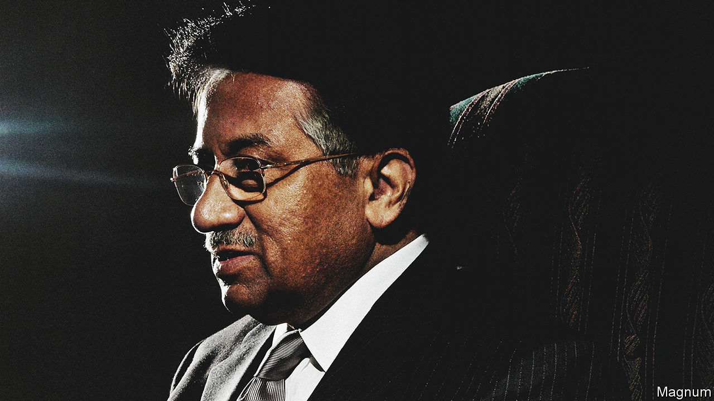

###### Whisky and moderation

# Pervez Musharraf was one of Pakistan’s better dictators 

##### Pakistan’s former military leader died on February 5th, aged 79 

 

> Feb 9th 2023 

When Pervez Musharraf was named army chief of Pakistan in 1998, he was a surprising choice. A hot-headed former artilleryman, known for bravery under fire and occasional indiscipline, he was third on the list of generals that Nawaz Sharif, the then prime minister, was given to pick from. He was also an outlier in a top brass dominated by ethnic Punjabis and Pushtuns. Mr Musharraf hailed from Karachi; his Urdu-speaking family had migrated there in 1947 from Delhi, where he was born. Mr Sharif, it was clear, saw him as a weak army chief he could control.

This was a familiar ploy of Pakistan’s put-up civilian leaders. Zulfikar Ali Bhutto applied the same logic when appointing Muhammad Zia ul-Haq army chief in 1976. Zia promptly removed Bhutto in a coup, hanged him and ruled Pakistan until he was killed in a plane crash in 1988. Mr Sharif had similarly underestimated Mr Musharraf. The artilleryman toppled him in a coup in 1999, had Mr Sharif sentenced to life in prison and ruled Pakistan, as “chief executive” then president, until his resignation in 2008.

He seemed at first like just another bullying . Mr Musharraf revered the army, the institution that generally presumes to run Pakistan, with a passion founded on comradeship and blood. He fought in two wars against India, in 1965 and 1971, earning a gallantry medal and reputation for impetuousness. He barely hid his scorn for civilians, especially politicians, among whom he reserved special contempt for Mr Sharif. He could never forgive the former prime minister for having dared to try to sack him on the eve of his coup. Yet even as Pakistan’s swaggering generalissimo, Mr Musharraf still seemed a slightly oddball choice. 

Zia, an Islamic fundamentalist with a disdain for non-Muslims and Western culture, had pushed the country far to the religious right. Mr Musharraf, though passably God-fearing, seemed not to have got the message. Educated by Catholic priests, at Karachi’s prestigious St Patrick’s High School, he loved rock music, dogs and whisky. He liked Western fashions so much his army comrades called him “Cowboy”. A childhood spell in Turkey, where his father was stationed as a diplomat, helped form these tastes. He retained a lifelong regard for its great reformer, Kemal Ataturk. But mostly he represented the more secular, liberal Pakistan its founder, Muhammad Ali Jinnah, had once imagined the country to be.

His moderation made Mr Musharraf well-placed for the great event of his rule. Zia, with America’s blithe support, had orchestrated a jihadist campaign against the Soviet occupation of Afghanistan. But on September 11th, 2001 veterans of that struggle attacked America, arousing its fury. “Either you’re with us, or you are with the terrorists,” thundered George W. Bush. For Mr Musharraf, unlike many of his comrades, it was not a real choice. 

He provided the Americans access to Pakistani airspace and roads, allowing them to wage war in Afghanistan. He also gave them some, at least, of the al-Qaeda fighters who fled that country into Pakistan. Mr Bush saluted the coupster president as a “strong defender of freedom”. Having cut off aid to Pakistan in the 1990s, Congress showered it with money. It was America’s indispensable ally in the war on terror, and Mr Musharraf its admired leader. 

His courage and moderation were both apparent in this shift. At home, he was denounced as an American poodle and was the target of multiple assassination attempts. Uncowed, he doubled down on his reform programme. He liberalised the media, encouraged pop culture and passed measures to protect women from the chauvinist Islamist legal regime that Zia had built.

With two Indian prime ministers, Atal Bihari Vajpayee then Manmohan Singh, he also launched a bold peace process. Mr Musharraf got it moving with a visit to his birthplace, Delhi, in 2001. And when negotiations got stuck, it was often he who seemed most willing to unstick them. His advisers looked on in alarm as the general riffed, seemingly off-the-cuff, on how to fix this or that territorial dispute. 

Yet his presidency, and with it the peace process, was on borrowed time. The contradictions in his position, as an enlightened despot and moderate leader of an Islamicised army, made him, in the end, an uncertain reformer and unreliable ally. The liberal progress he brought came at the cost of the democratic institutions he suborned. His crackdown on militancy was undercut by the Islamist political parties he used to quash his democratic opponents. And also by the army. He eventually came close to admitting what was all along suspected—that, while fighting militants at home, Pakistan’s generals continued supporting their old allies, the Afghan Taliban, to prevent India gaining influence in Afghanistan.

By 2007 the contradictions had become unsustainable. Pakistan was being ravaged by terrorism. The limited democracy that Mr Musharraf permitted had led to mass protests against him. Calling himself “indispensable”, he briefly suspended the constitution. But the army, and America, had tired of the disorder. When his opponents won an election in 2008 he resigned the presidency and fled to London rather than face impeachment proceedings. 

In his labyrinth

It is partly an indictment of Mr Musharraf’s successors that his dictatorship is remembered fondly by many Pakistanis today. No leader since has come close to repeating the seriousness of his peacemaking with India. He also left some positive marks on Pakistan. His liberalisation of its media is an enduring success. Perhaps most of all, however, he was synonymous with a time when the country was important geopolitically, something few Pakistanis appreciated until the opportunity it presented had passed.

For all his serious failings, the bluff general did try to turn Pakistan’s strategic moment to its advantage. But his reactionary opponents, military and civilian, sponsors of militancy and disorder, squandered the chance. And it may never come again. Whatever the merits of Pakistan’s next dictator, he is unlikely to be feted in Washington, as Mr Musharraf often was.■

