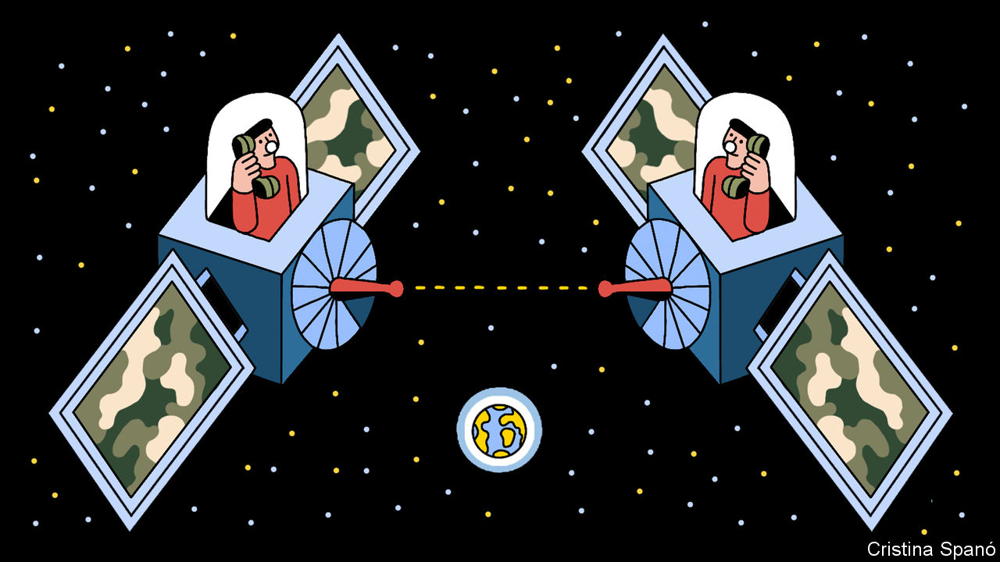

###### Military communications

# DARPA, lasers and an internet in orbit 

##### America hopes to create a new intelligence network in space 

 

> Feb 8th 2023 

Satellites are crucial military infrastructure for . They are also vulnerable to attack and disruption. In November 2021, three months before it invaded Ukraine, Russia fired a missile into a defunct satellite. Then, in October, a Russian diplomat declared even commercial satellites could be legitimate targets.  used by Ukraine have been hacked and jammed. Ground antennae have been attacked.

In light of this sort of thing, America’s military establishment is worried that its satellite network is not up to snuff. But it has a plan. The Space-Based Adaptive Communications Node (Space-BACN, or “Space Bacon”, to its friends) will, if successful, create a laser-enabled military internet in orbit around Earth by piggybacking on a number of satellites that would have been launched anyway.

Space Bacon is a brainchild of DARPA, the special-projects research arm of the Department of Defence, and is an intriguing orbiting echo of the original, terrestrial ARPANET, which evolved into the internet. (It was so named at a point in DARPA’s history when the organisation lacked the initial “D” for “defence”.) The plan is to fit as many newly launched satellites as possibly with laser transceivers that will be able to communicate with counterparts as far away as 5,000km. Satellite owners will pay for these transceivers, but will then receive payments from the American government for their use.

Zipping the light fantastic

Space Bacon promises many benefits. Unlike radio, the normal mode of communication with and between satellites, transmissions by laser beam are hard to intercept and almost impossible to jam. Indeed, adversaries might not even know when a transmission is taking place, a bonus for operational secrecy.

Lasers also offer far higher data rates than radio waves. Some satellite constellations do already use lasers for communication between members, and these achieve about two gigabits per second (about 200 times what radio can manage). DARPA, however, has asked Space Bacon’s contractors to develop equipment that can transmit, in a single beam, 100 gigabits per second. That is enough for several high-definition movies to be sent in that time.

The ability to hand military information from bird to bird like this—and without the constraints imposed by differences in the communication protocols of the satellites providing the piggyback—will greatly simplify matters. Individual satellites can download data only when in range of a terrestrial antenna belonging to their particular network, or via another member of that network, which is likely to be in a similar orbit. A satellite in the Space Bacon system, by contrast, can hand off data to another, possibly belonging to another operator, in a different orbit. And that satellite may, in turn, hand it to yet another, until a suitable ground antenna is within reach.

At the moment, reporting delays caused by lack of network interoperability mean, say, that a tank spotted by a satellite may have driven off by the time its location has been received by anyone who could make use of the information. Space Bacon will more or less eliminate this latency. 

It will also offer one of the vaunted pluses of the original ARPANET design, which the internet inherited. This is automatic rerouting of a message if a node (ie, a particular satellite or ground station) is disabled. Also, by bringing pretty-well every relevant ground station into play, data that are especially sensitive can, as Greg Kuperman, Space Bacon’s programme manager, observes, be routed through antennae in places where attempts to eavesdrop on the final, radio-transmitted, leg of the journey are considered less likely.

The heart of all this is the precision of aim that will be built into Space Bacon’s lasers. Phil Root, head of DARPA’s Strategic Technology Office, says pondering this “blows my mind”. Satellites in low Earth orbits (LEOs, those below an altitude of 2,000km, and the sort which Space Bacon will use to start with) travel at about 7.8km a second, often tumbling as they go. Connecting the optical heads on two of these will be an epic task. Advances have, however, been impressive. Mynaric, a firm based near Munich that is designing heads for Space Bacon, can adjust a laser’s trajectory by just 57.2 millionths of a degree. At a distance of 1,000km, this translates into a beam displacement of less than a metre.

To sweep its lasers smoothly Mynaric uses a system of motor-driven lenses and tilting mirrors. Another contractor, mBryonics of Galway, Ireland, employs electronic signals to alter the light’s phase—minutely adjusting the beam’s direction in a manner analogous to the redirection of photons through a glass lens.

Even with these levels of precision however, initial direct hits on a distant head will probably be rare, says David Mackey, mBryonics’ top technologist. Optical heads attempting to link up will therefore conduct what he calls blind spiral search patterns. When a beam finds its mark, the signal will inform the receiver of the sender’s exact position. Using a different wavelength, to prevent interference, the receiver will then fire a laser back along the same path to confirm the connection. Mr Mackey thinks his kit will complete these orbital “handshakes” in ten seconds.

Existing laser-based satellite communications rely on sensors called photodiodes. Space Bacon’s higher data rates need a different approach. The message-carrying photons will enter a single fibre-optic strand with an opening a mere ten microns across—far smaller than the 100 microns of a photodiode, of which more than one may, in any case, be needed. Mybryonics hopes to pull off this trick using a mirror with a complex curved surface to redirect photons into a device the size of an iPhone that focuses the light and shoots it into the fibre-optic strand.

The Space Bacon system’s specification requires that it draw no more than 100W from its host satellite. This limit poses a problem for the processor needed to translate between the different data protocols used on satellites, for only 40W of that 100 is available to do so.

One firm working on this is Intel, an American chipmaker. It is designing what Sergey Shumarayev, the project’s leader, describes as a “Rosetta Stone-type modem”. Mr Shumarayev says commercially available components have been ruled out for doing this because they are too big and power-hungry. He reckons that if they were used, the result would be as large as a pizza and consume 400W. His team are “trying to shrink the pizza size into a matchbox” using what they call “chiplets”, in lieu of bigger semiconductors.

Bringing home the BACN

DARPA wants Space Bacon to cost a maximum of $100,000 a satellite, the better to encourage participation. It bodes well that Amazon, SpaceX and Viasat, a lesser-known but well-established satellite-communications company, are all designing command-and-control architectures for Space Bacon. 

Amazon plans to launch a broadband LEO satellite constellation called Project Kuiper. This may incorporate Space Bacon transceivers. SpaceX may add them as it expands Starlink, its broadband LEO constellation, from its current complement of 3,500 or so satellites to tens of thousands. Viasat’s existing network is different. It is based on five big satellites in geosynchronous orbits 36,000km above Earth, which will be joined by another three over the next 14 months. The firm also has an extensive network of ground stations to bring to the party.

One command-and-control problem is working out optimal routes for the handing on of data. Craig Miller, head of government systems at Viasat, says this is trickier than solving the travelling-salesman problem, a maths classic. As the network grows, computing the most efficient routes gets harder and harder—and not just because the nodes will be moving. Mr Miller’s team must also assign and take into computational account “variable trust” scores for potential data hops, for some are more vulnerable than others to enemy action.

DARPA plans to select the best subsystems this summer, and hopes to have a prototype ready for testing in LEO before 2025. If all goes well, the network could then be extended to geosynchronous orbits. Allies, Dr Root reckons, might be invited to join. America’s adversaries will no doubt be watching closely. ■


