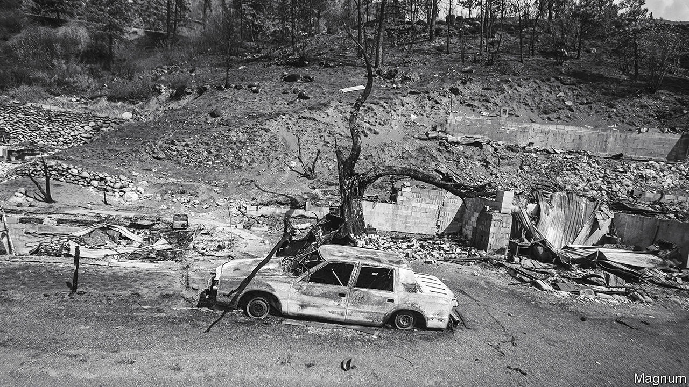
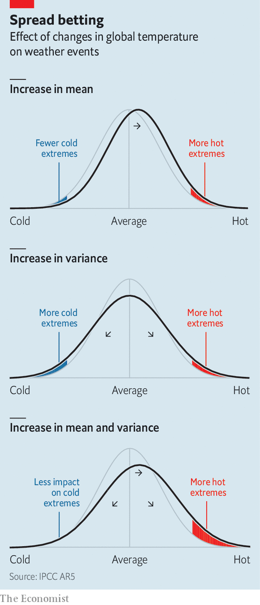

###### Bad weather

# How to predict record-shattering weather events 

##### Meteorologists are trying to work out just how common they will become 

 

> Feb 8th 2023 

The heatwave that struck parts of North America’s Pacific coast in 2021 propelled temperatures in Lytton, a village in British Columbia, to 49.6°C—4.6° higher than the previous record. On the fourth day of this torment the place erupted in flames and was almost completely destroyed (see picture). These events were so out of the ordinary that, in a press conference held some weeks later by climate modellers, they struggled to explain how circumstances had conjured them. 

 


Climatologists reckon the North American  of 2021 was one of the most extreme deviations from meteorological norms ever recorded, anywhere. But others have come close. As the world gets hotter, phenomena once considered rare are becoming common and others, believed impossible, are happening. 

This shift in weather patterns has inspired modellers to pay more attention to the tails of the frequency distributions of meteorological possibility which their models generate (see chart), in search of such unprecedented extremes. One recent exercise, led by Erich Fischer at ETH Zurich, a technology university in Switzerland, and presented at last year’s annual jamboree of the European Geosciences Union, shows how the heatwave that destroyed Lytton could have been foreseen with data available at the time. 

Cite UNSEEN

The approach Dr Fischer used, ensemble-boosting, is one of several developed recently. Another, from Britain’s Met Office, is UNSEEN (Unprecedented Simulation of Extremes with Ensembles). This was first put to work by Vikki Thompson and her colleagues at the Met Office in a retrospective analysis of floods that had drowned parts of the country in 2014, resulting in £451m ($743m) of insurance claims. 

More than 130 years of English records had offered no indication such a biblical deluge was possible. Yet, here it was. As Thierry Corti, a climate-risk analyst at Swiss Re, a reinsurance company, observes, “the risk landscape is evolving. So if you simulate probabilities of a rare event you need to take that against the backdrop of something that’s changing. That makes it much more complex.” To try to understand what had happened, Dr Thompson’s team simulated British winters between 1981 and 2015 many thousands of times, and looked at the spread of possible outcomes, including rare events. 

Into this methodical repetition they added a sprinkle of chaos—the famous flap of a butterfly’s wing, or, more realistically, the revving up of a factory’s engines to add a small and local amount of heat to the atmosphere. By repeatedly simulating the present climate, perturbed each time in minute ways, the Met Office modellers generated a range of virtual winters which included extremes that are possible but have not yet manifested themselves. 

In the case of floods, the group found a 34% chance each winter that rainfall records would be broken in at least one of four broad regions of Britain. They concluded that decision-makers would do well to prepare for new record-breaking inundations “in the next few years”. They were vindicated when their warnings came to pass in the early months of 2020. 

The UNSEEN approach is inspiring others. For example, various groups are now looking at “near-miss” events, in which an extreme drought or flood befalls a region with low population density, thus affecting few people. With UNSEEN and UNSEEN-like methods, it is possible to assess the risk of a similar event striking a neighbouring but more populous area—and with what consequences. 

Others have taken an interest in bits of the future when an extreme weather event would be particularly damaging. The Paris Olympics, to be held next year, will take place during that city’s hottest weeks. A group of meteorologists from various French research institutes therefore wondered just how bad a heatwave manifesting itself then might be. Using yet another approach, they found a chance of temperatures being more than 4°C higher than they were during a catastrophic heatwave in 2003, in which tens of thousands died. 

Since that happened, France has built a “heat plan” which includes an early-warning system and provisions for opening cool spaces if needed. Whether this will be enough to ameliorate the effects of a record-breaker coinciding with the arrival of thousands of athletes and hundreds of thousands of visitors remains to be seen. 

That something could happen does not mean it will, but in some cases, such as the Paris Olympics, either the risk or the consequences are clearly high enough to warrant close attention. Another example is a study published in 2019, by Dr Thompson and her colleagues, which found that, in south-east China, each summer holds a 10% chance of there being a record-breaking hot month. The temperatures warned of were within the range of the records set during last year’s deadly heatwave.

Other research has asked if a region is “overdue” for an extreme event because of the changing climate, or whether its infrastructure or economy is particularly ill-prepared for what could happen. In the case of Kansas, America’s breadbasket, both look true. The state produces 17% of the country’s wheat, and is said to foster ideal conditions for growing this crop. But what pertained before 1900, when wheat farmers were moving in, may not hold now. In today’s climate, heatwaves that were once once-a-century events are likely to occur once a decade, according to a study to be published soon by Erin Coughlan de Perez of Tufts University. 

Model behaviour

Dr de Perez also found that hot weather sufficient to damage wheat’s growth by inhibiting its enzymes is likely to occur in the same years as periods of low rainfall. But the irregular pace of weather change may lull farmers into a false sense of security, for she and her colleagues discovered, too, that recent years have been cooler than expected. “Several regions might have ‘gotten lucky’ in terms of their recent experience of extreme events,” they write. The same study predicts similar, if less pronounced, patterns in Henan, a wheat-producing province of central China. 

Information about low-likelihood but high-impact events is also of interest to insurers (who carry out their own modelling as well) and can help, too, in the design of climate-resilient infrastructure. In the Netherlands, for example, Climate Adaptation Services (CAS), a charity, gathers data on possible consequences of climate change between now and 2050, including detailed maps that the authorities can draw on to test their plans. 

Timo Kelder, an UNSEEN modeller at CAS, says they are thinking about how they might add new stress tests which assess how successful plans would be in the face of the brutal and unprecedented events these studies suggest are plausible. Meanwhile, in Britain’s Met Office, researchers are now looking at another sort of extreme event—the risk of “wind droughts” which would wipe out a lot of the country’s wind-turbine-base electricity supply. It would be ironic indeed if Britain’s huge effort to combat climate change in this way were, itself, to fall victim to a changing climate. ■


