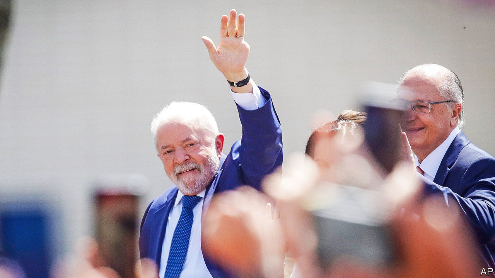

###### Friends with benefits

# Brazil’s new president is visiting Joe Biden to boost relations 

##### But Luiz Inácio Lula da Silva will probably want to keep China happy, too 

 

> Feb 9th 2023 

In the early 20th century the Baron of Rio Branco, Brazil’s foreign minister, vowed to make the United States the country’s main ally and trading partner. Today that second role is occupied by China, which buys  of Brazilian products. Last year Brazil’s goods exports to China were worth a whopping $89bn. But Brazil’s northern neighbour remains deeply important. On February 10th, after we went to press, Brazil’s new leftist president, , was due to visit President Joe Biden in Washington. It will be the first international trip of this term outside Latin America.

Lula (as he is known) has said he wants to discuss, and presumably cement, Brazil’s role “in the new geopolitics” with Mr Biden. But ensuring Brazil’s place in the global order will be a trickier diplomatic feat than it was during his previous two terms as president, from 2003 to 2010. 

For a start Lula needs to smooth relations in the wake of Jair Bolsonaro, his right-wing populist predecessor. Mr Bolsonaro, who was a fan of Donald Trump, did not destroy Brazil’s relationship with the United States, but it became somewhat strained under the Biden administration. He was one of the last world leaders to acknowledge Mr Biden’s victory in 2020, along with Vladimir Putin and Andrés Manuel López Obrador, Mexico’s president. Mr Bolsonaro did not care much what foreigners thought of Brazil. Under his watch, deforestation in the Amazon increased, earning him global condemnation.

Lula also faces a tricky balancing act. Brazilian diplomacy is typically neutral. Governments of both the left and the right have tried to stay out of big disputes. During his first two terms Lula tried to expand Brazil’s global influence while remaining in America’s good books. 

In 2009 he helped give concrete form to the BRICS, a bloc of emerging economies. He opened 35 new embassies, mostly in Africa and Latin America. Even so, Lula had close relationships with presidents such as George W. Bush and Barack Obama. Mr Obama even quipped: “Love this guy. He’s the most popular politician on Earth.” And the United States is the largest foreign investor in Brazil. Its flow of direct investment has held fairly steady in recent years. In 2021 it was $12bn, more than a quarter of all foreign direct investment in Brazil.

Now that relations between China and the United States are more tense it may be harder for Lula to please both countries. In November Mr Biden announced that the US International Development Finance Corporation would invest $30m in TechMet, a mining company, to process cobalt and nickel in Brazil. This is an attempt to act as a counterweight to Chinese investors. His administration has also signalled that it will support Brazil’s attempt to join the OECD, a club of mostly rich countries, once its environmental policy is back on track. 

American foreign policy could also push Lula to take sides. In their meeting Mr Biden may try to convince the Brazilian to openly support Ukraine. In May last year Lula claimed that Volodymyr Zelensky, the president of Ukraine, was “as responsible” for the war as Mr Putin. Last month after a meeting with Olaf Scholz, the German chancellor, in Brasília, the capital, Lula reluctantly conceded that the Russian president “made a mistake” by invading Ukraine. But he refused to send ammunition to the country and criticised the European Union for not doing more to bring about peace talks. By contrast, when Mr Bolsonaro was in office, Brazil condemned Russia’s invasion at the UN security council. 

Meanwhile Lula also faces problems at home. He won the election by a mere 1.8 percentage points. A week after Lula took charge,  stormed Congress, the Supreme Court and the presidential palace. Unrest could return. His government needs to pass  to ward off a fiscal crisis. 

In the past Lula has used foreign policy as a tool to burnish his popularity at home, says Rubens Ricupero, who was Brazil’s ambassador in Washington in the 1990s. Lula is now planning to do one international trip a month; indeed, he is off to China in March. The trick might not work as well this time. ■

