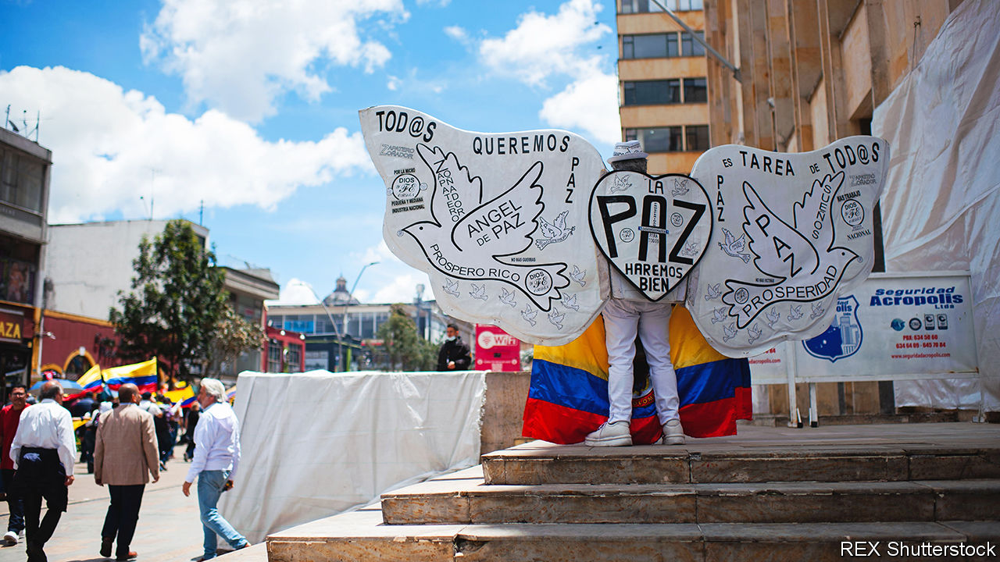
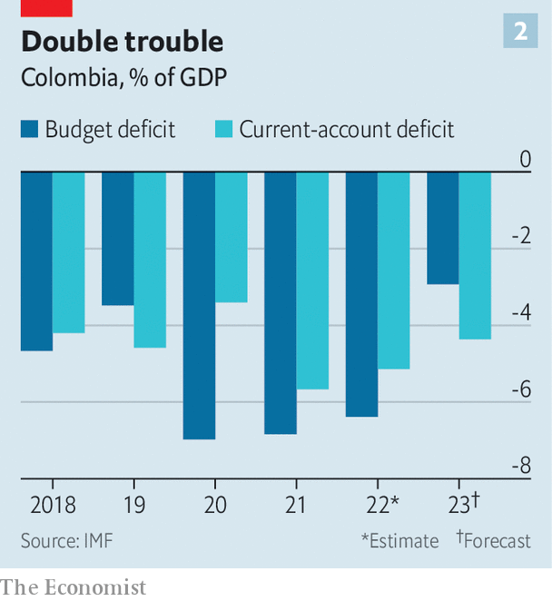
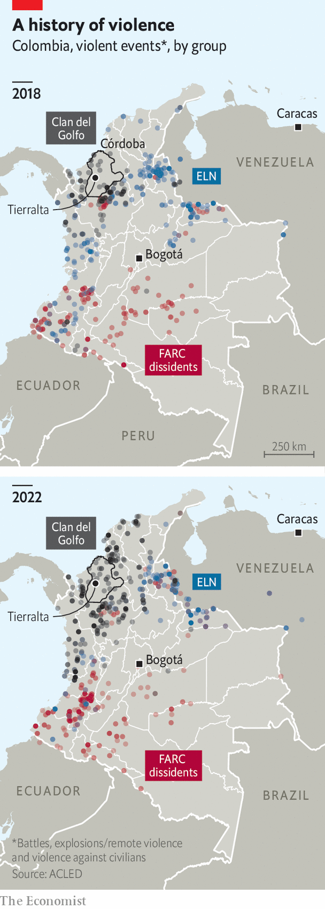

###### The revolutionary v the pragmatist

# Can Colombia’s mercurial president bring “total peace”? 

##### Gustavo Petro, the country’s first avowedly left-wing leader, has big ambitions 

 

> Feb 8th 2023 

At Hacienda Pontevedra, a remote ranch in the coastal department of Córdoba, a few  (small-scale farmers) are camped out in a copse. The ranch once belonged to a drug-trafficker who is locked up in an American prison. But he has agreed with the government of , Colombia’s first avowedly left-wing president, to hand over 1,200 hectares (3,000 acres) of land to 100 landless  who had been growing coca in a national park near Tierralta, the unofficial capital of southern Córdoba.

The  have 32 cows, many hopes and a contract with a government agency which gives them around $7,700 per family to get going. This is a historic achievement, says Cervelion Cogollo, their leader. “We are very happy.” But, he goes on, “we won’t feel fully safe until there is total peace in the whole of Colombia.” 

That is what Mr Petro has promised. Colombia has had liberal governments before. But none has been . Mr Petro, who was narrowly elected last year, divides opinion. For his supporters, his victory represents a historic opportunity to achieve social justice in a country that has suffered half a century of internal conflict, partly over land, and from organised crime linked to drug-trafficking. His critics fear a weakening of the rule of law and economic setbacks.

Mr Petro’s plans are ambitious. As well as land reform, of which Hacienda Pontevedra represents the start, he proposes “total peace” with Colombia’s many illegal armed groups. He also champions an abrupt shift to green energy and radical reforms of health care, pensions and labour laws. The president governs partly by Twitter. His cabinet is an uneasy mix of activists and more centrist figures. 

As a young man Mr Petro was a member of M-19, a nationalist guerrilla group. He was a political activist, not a commander: he never fired a shot. But he was arrested and, he says, tortured. M-19 moulded his political identity. His 16 years as a member occupy almost half of his autobiography published for the presidential campaign. It linked him to Latin America’s revolutionary tradition of populist nationalism. He went on to embrace Hugo Chávez, ’s autocratic president, as a friend. 

Even now, aged 62, Mr Petro courts controversy. During the campaign he said Colombia suffered from “three poisons”: cocaine, oil and coal. In December he claimed that spending on motorways was a waste of money and that they “are only useful to import products and kill off national production” to the benefit of “the owners of big capital”. But Mr Petro has also long been a pragmatic politician. He was elected as a local councillor even while in the M-19. He spent 20 years in Congress and was mayor of Bogotá. Those two sides of him clash. 

Two sides of the same coin

Take his handling of the economy, which is likely to determine the success or failure of his presidency. Iván Duque, his weak conservative predecessor, was shaken by violent protests in 2019 and 2021, the second wave over an attempt to make more Colombians pay income tax. Faced with the pandemic, Mr Duque ramped up spending, triggering inflation. The central bank was slower than others in the region to raise interest rates. The result was a wildly overheated economy and still-rising inflation (see chart 1). The economy will see little or no growth this year.

 


Mr Petro’s finance minister, José Antonio Ocampo, is an academic of the centre-left. By negotiating with conservative groups, he steered a tax reform through Congress which will raise an extra 1.3% or so of GDP per year. That, Mr Ocampo says, will allow the government to pay for Mr Petro’s social programmes while also carrying out a necessary fiscal squeeze. The extra burden of the tax reform falls mainly on oil, gas and coal, and on the rich. 

During his campaign Mr Petro alarmed investors by promising to halt all new exploration of oil, gas and coal, which between them provide around 40% of Colombia’s goods exports and a big chunk of government revenues. The energy and environment ministers are both activists who favour this. Critics say it would make the transition to cleaner energy harder. The problem is that without a big increase in the output of natural gas, of which Colombia probably has a lot, revenues will be lower and costs, and perhaps emissions, will be higher. It makes more sense to produce gas locally than import it as liquefied natural gas, as the government suggests, which would require building ports and new transport facilities.

To meet its target under the Paris agreement of cutting carbon emissions by half by 2030 and to become carbon-neutral by 2050 Colombia needs to double its natural-gas production and expand electricity output fivefold by 2040, says Tomás González, a former minister of energy. Rather than halt exploration for gas, he argues that the government should move faster to cut subsidies on fossil fuels, which Mr Duque allowed to balloon. Last month Mr Petro said he would sideline the independent regulatory agencies that set energy tariffs.

Mr Ocampo insists that private and public investment in gasfields will continue. He sees natural gas as an important driver of future growth, along with tourism and non-oil exports, especially to Venezuela, with which Mr Petro has restored diplomatic ties. “My role as minister is to give confidence to the private sector,” he says. “There will be no nationalisations.” Not everyone is reassured. “Businesspeople are not planning to leave, but they are not planning to invest more,” says Jaime Alberto Cabal, who heads Fenalco, the chamber of commerce. He complains that tax increases and a new 40% import tariff on clothing and shoes will hurt jobs. 

Another controversy concerns Mr Petro’s proposed health-care reform. Colombia’s constitution of 1991 created a universal insurance-based system with subsidies for poorer people, as in France or the Netherlands. The president and his health minister want to replace it with a public, taxpayer-financed scheme. The existing system has problems, such as a lack of competition. But it works. “No Colombian had to sell their home or car to pay covid bills, unlike in the United States,” says Roy Barreras, the president of the Senate. The publicly subsidised private health providers handle 1bn receipts a year. Abolishing them risks chaos. Mr Barreras, an ally of Mr Petro, says that he will work to reform the existing system rather than scrap it.

 


Mr Petro also wants to abolish the private funds that manage workers’ pension contributions, rather than supplement them with a public scheme. Uncertainty about his plans hit the peso, which depreciated by 18% against the dollar between Mr Petro’s inauguration in August and November 7th, a low, though it has since recovered by 8%. The economy is vulnerable to market sentiment. Colombia suffers from twin deficits (see chart 2). 

Recently Mr Petro has talked up his idea of “total peace”. Colombia has had two big peace deals this century. Under an accord with Álvaro Uribe, a conservative president, about 30,000 right-wing paramilitaries laid down their arms between 2003 and 2006. Mr Uribe expanded the security forces and inflicted blows against the Revolutionary Armed Forces of Colombia (FARC), the largest left-wing guerrilla group. As a result, Juan Manuel Santos, his successor, reached a peace deal under which 13,000 members of the FARC demobilised in 2016. 

 


The hope was that peace would allow the state to extend its writ to Colombia’s lawless geographical peripheries, where it is largely absent. Violence did diminish, but then ticked up again. There are two reasons for that. The first is that the cocaine trade continues to be more lucrative than civilian life, prompting turf wars. The second is that the peace agreements were either incomplete or not fully implemented. Mr Duque opposed the accord from 2016, and only partly executed it. Security got worse under Mr Duque, whose policy focused on going after the commanders of armed groups and trying to eradicate coca. It was dogged by his government’s politicisation of the armed forces, setting commanders against each other, and by poor co-ordination. There was a net increase in coca cultivation on his watch. 

And with the exception of 2020, the year of lockdowns, the murder rate crept up. Victims of massacres (defined as killings of three or more people) increased from 38 in 2016 to 162 in 2020. Incidents of forcible displacement of civilians and killings of community leaders all rose sharply, too. The pandemic, which closed schools for 17 months, lead to an increase in recruitment by illegal armed groups, notes Elizabeth Dickinson of Crisis Group, a watchdog. They include the ELN, another guerrilla group; outfits formed by dissident commanders from the FARC; the Clan del Golfo, the largest drug gang, and smaller trafficking groups. Their numbers more than doubled between 2016 and 2021 to 6,700, according to the defence ministry. 

Healing old wounds

Mr Petro has offered talks and a “bilateral ceasefire” to all illegal groups, be they politically inspired or merely criminal. Several, including the Clan del Golfo, have accepted. In November the government began peace talks with the ELN in Caracas. Five previous governments tried and failed to reach an accord with the ELN, a group inspired by Cuba’s communists, run by pernickety old men. Although the ELN has yet to sign up to the ceasefire, this time talks may succeed. The ELN controls territory on both sides of the border between Colombia and Venezuela. It has operated with the consent of Venezuela’s dictatorship. But Nicolás Maduro, Venezuela’s president, “is interested in being seen as a peacemaker,” says a senior Colombian politician who has dealt with him. “The ELN has become a problem for his own forces.” 

Far trickier are talks with the drug gangs. Take Córdoba, where the paramilitaries began in the 1990s and where their peace talks with Mr Uribe’s government were held. “The Clan del Golfo controls Tierralta,” says Andrés Chica, who heads a human-rights organisation in the town. They run everything, from the meat trade to taxis, in addition to the drug business. Many political leaders in the department are their allies. They kill community leaders who cross them. “I am very uncertain,” says Mr Chica, about the possibility of peace talks with them. “People are scared.” 

So far “total peace” is a work of improvisation. Mr Barreras says he will introduce a bill that would provide a legal framework for talks with drug-traffickers who have no political status, offering reduced sentences provided they dismantle their networks. But it would not offer impunity. 

More radically, Mr Petro has come close to calling for the . In the absence of an international agreement on this, however, his government is refocusing its drug policy, putting more effort into interdiction and less into eradication of coca. The idea is to act “against the big proprietors of the drug business rather than against the weak links of the chain,” says Iván Velásquez, the defence minister. This means hitting “the owners and their assets” rather than coca growers.

That will take time. Meanwhile, security analysts worry that there is a disconnect between the policy of “total peace” and the government’s military strategy. “None of the armed groups will give up anything significant unless they are under military pressure,” says Ms Dickinson. The first action by Mr Velásquez, who is a former prosecutor with no security experience, was to purge almost 50 generals from the armed forces and the police. He says he was implementing Mr Petro’s instruction to clear out those accused of corruption or abuses. Critics think the purge has deprived the security forces of knowledge and experience. 

Mr Petro’s team talk of the need to build a broad coalition for peace. Perhaps surprisingly, Mr Petro has forged cordial relations with Mr Uribe, with whom he fought for years, as well as Mr Santos. He has included the leader of the cattle ranchers in the team talking with the ELN. And he also struck a deal with the ranchers, long seen as close to the paramilitaries, under which the government will buy the 3m hectares of land it proposes to redistribute.

Mr Petro remains fairly popular and, for now, has a legislative majority. But how will he behave if he loses these assets? Some detect narcissistic and megalomaniac traits in his personality. He is intelligent, as he says several times in his autobiography. But he can also be dogmatic. His personal behaviour is erratic: he sometimes turns up hours late, or not at all, to official events. One big fear is how he will react if he is frustrated. In those circumstances the reflex of the populist is to lash out against institutional restraints. Colombia’s political institutions and traditions are fairly strong. “It’s a confused government, but not a threatening one, or at least its threats are not credible,” concludes Fernando Cepeda, a former minister. Others are not so sure of that. ■

