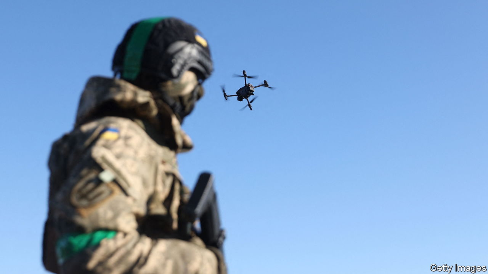

###### The Economist explains

# How drones dogfight above Ukraine 

##### A growing number of drone-on-drone attacks shows how aerial warfare may develop 

 

> Feb 7th 2023 

DURING THE first world war, fighter pilots duelled with pistols and rifles. Today, in the skies over Ukraine, a new type of dogfight is taking place—between drones. In October a video emerged on social media showing a Ukrainian drone ramming a Russian one, causing the latter to crash. It was the first known wartime duel between drones. Since then, Ukrainian forces have shared more videos of drone-on-drone attacks. Russian drones are also attacking Ukrainian ones (though information about those is scarcer). How do drones dogfight, and what impact might this have on aerial warfare?

Both Russia and Ukraine make extensive use of drones for intelligence gathering, reconnaissance and guiding artillery fire. Russia has carried out repeated , often using Shahed-136 loitering munitions . But large military drones of this kind are outnumbered by small, cheap consumer models, known as quadcopters—some of which have themselves become improvised bombers. Downing enemy drones is essential, but can be tricky. Supplies of the kit used to  from the drone’s operator are limited and jammers are often turned off to allow friendly drones to function. Small drones are hard to spot and harder to shoot. Blasting them out of the air is expensive too: a single missile from a  or NASAMS air-defence system can cost $1m or more. Dogfighting with drones provides an alternative mode of attack that costs a few thousands dollars a pop. 

The Ukrainians’ early attacks on Russian drones involved human operators directing the attacking craft to ram the enemy in whatever way they could. But they appear to have refined their technique: now Ukrainian attackers dive. Quadcopters have rotors on top, and their cameras point downwards. A rapid descent on a target from above makes use of this blind spot. Striking the rotor will usually cause at least one blade to break, sending the enemy spinning out of control but leaving the attacker undamaged. There are more experimental approaches, too. A video shared on social media on December 2nd shows a Russian drone dropping a grenade on a Ukrainian one. The grenade does not detonate, but breaks a rotor blade as it passes, downing the target.

Drone dogfights in Ukraine thus far have been improvised. This type of attack only works against small drones: the models being used to down enemy drones typically fly at 45mph (72kph) and weigh less than a kilo, making them too slow to catch big drones and too light to do them much damage. But Ukrainian forces will soon have access to a purpose-built system that can inflict far greater damage. MARSS, a defence startup based in Monaco, is sending its drone interceptors: their networked sensors detect incoming enemy drones and launch counter-attack drones from the ground that use artificial intelligence to identify, track and attack targets without human assistance. They have a top speed of 170mph and are robust enough to survive dustups with small drones. They can also take on bigger targets, such as the Shahed-136 drone, though they would probably be lost in the process. Their price is not known, but they are almost certainly much cheaper than a missile.

Ukraine and Russia are not the only countries pursuing this technology. Anduril, an American tech startup, offers a drone interceptor similar to MARSS’s model. In January 2022 it won a contract worth almost $1bn to supply America’s armed forces. Fleets of interceptor drones may be a solution to mass drone attacks, like those on Ukraine’s power grid. Bomber drones might even gain fighter-drone escorts to protect them. In the aerial battles of the future humans could be relegated to the role of observers. ■


