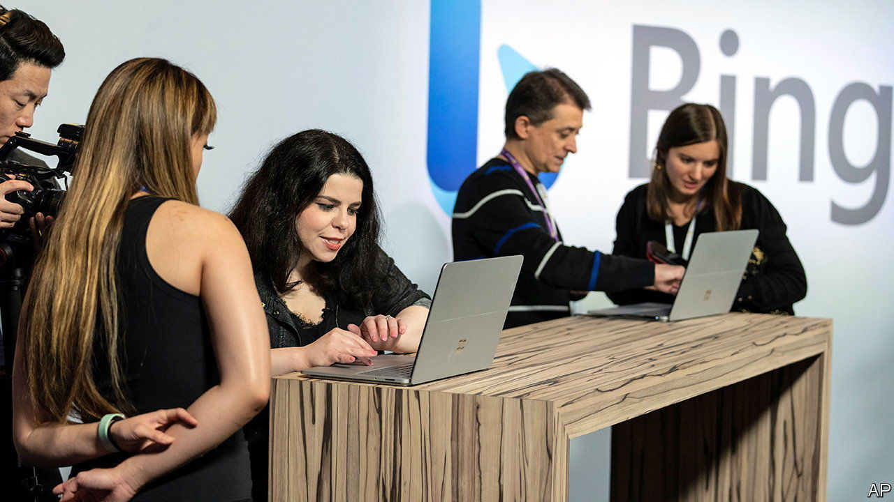
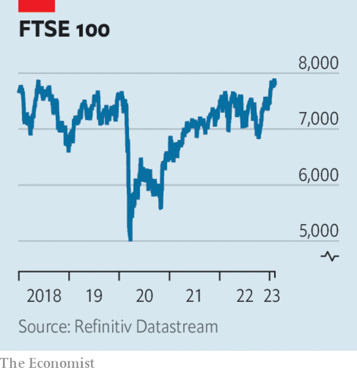

###### The world this week

# Business 

#####  

 

> Feb 9th 2023 

The business of , dominated for over 20 years by Google, was on the cusp of disruption, with various announcements that chatbots based on artificial intelligence are to be incorporated into search engines. Microsoft unveiled a version of Bing with the technology that powers ChatGPT, made by OpenAI, a startup, in which Microsoft is a big investor. Finding itself on the back foot, Google launched Bard, its rival to ChatGPT. However, the company’s share price fell sharply when Bard gave the wrong answer to a question on space telescopes in a video promoting its abilities. 

Game over?

It was a mixed week for , which received another blow to its planned takeover of , a maker of video games. Britain’s competition regulator said the deal would be bad for consumers, and may not approve it. America’s Federal Trade Commission is already suing to block the acquisition. 

Some of the companies in the embattled  reported a rise in profits. That prompted a rally in their share prices after a two-week rout sparked by a short-seller’s claim that the stock was being artificially inflated (Adani denies the allegation). Adani’s controlling shareholders attempted to soothe markets by repaying a $1.1bn loan ahead of schedule. 

 announced a restructuring of its business in which 7,000 jobs will be cut, around 3% of its workforce. It is the company’s first big move since Bob Iger returned as chief executive in November. He said the changes would reshape Disney “around creativity” and make its streaming business profitable. 

The great shake-out continued in the tech industry, as  announced that it would cut 15% of its workforce, or 1,300 jobs. Eric Yuan, the chief executive, said he would take a cut to his salary and bonus. The company’s headcount has tripled in two years, while post-pandemic demand for its video-conference services has slowed dramatically. 

Investors seem to be enthused by the extensive cost-cutting at America’s tech giants. Despite  reporting a 5% year-on-year drop in revenue for the last three months of 2022, which includes the crucial Christmas season, and  posting a sharper-than-expected decline in advertising revenue, the  composite held steady. The index is up by 15% since the start of the year. 

 

Britain’s  hit new record highs, surpassing its previous peak of May 2018. The Footsie outshone its American and European peers last year and has risen by 6% since the beginning of this year. 

The FTSE 100’s gains have come on the back of a surge in the share price , which announced a record annual profit, of $27.7bn. The company increased its dividend and share buy-back programme. But it lowered its target for cutting fossil-fuel production, from 40% by 2030 to 25%. Like others in the industry, BP is squeezed between keeping shareholders happy with high returns from pumping oil and gas and the push towards a net-zero economy. “We’re responding to what society wants,” mused its boss, Bernard Looney. 

 (formerly Total) also reported a record annual profit of $20.5bn, or $36bn on an adjusted basis. The combined profits for 2022 of the five biggest Western oil companies have now reached almost $200bn. 

revenues from oil and gas fell by 46% in January, year on year, according to the finance ministry. With its spending on the war in Ukraine soaring, Russia’s monthly budget deficit ballooned to 1.76trn roubles ($25bn).

 reported an annual loss of SFr7.3bn ($7.9bn), its biggest since the global financial crisis of 2007-09. The Swiss bank was hit by a surge in withdrawals from wealthy clients in October. 

A jury found that  was not liable for losses incurred by a group of shareholders because of the market reaction in 2018 to his tweet about taking Tesla private, which did not happen. Mr Musk said he believed he had secured the funding to buy out the carmaker at the time of the tweet. The verdict vindicates his decision to fight the case rather than settle. 

American employers created 517,000  last month, the highest number for January since 1946 and well above the market forecast. Jerome Powell, chairman of the Federal Reserve, said that given strong data on the labour market and the economy, the central bank may have to prolong interest-rate rises for longer than investors might expect. 

Sans Son3113

 Vision Funds reported another big quarterly loss, of $5.5bn. It is a tough time for the Japanese conglomerate’s investments, which have plunged in value as tech stocks and startup valuations have slid. Its investments in new ventures have all but dried up. Son Masayoshi, the company’s boss, missed his usually exuberant earnings presentation. We hope that he will once again appear, said the chief financial officer, but we don’t know when. 

