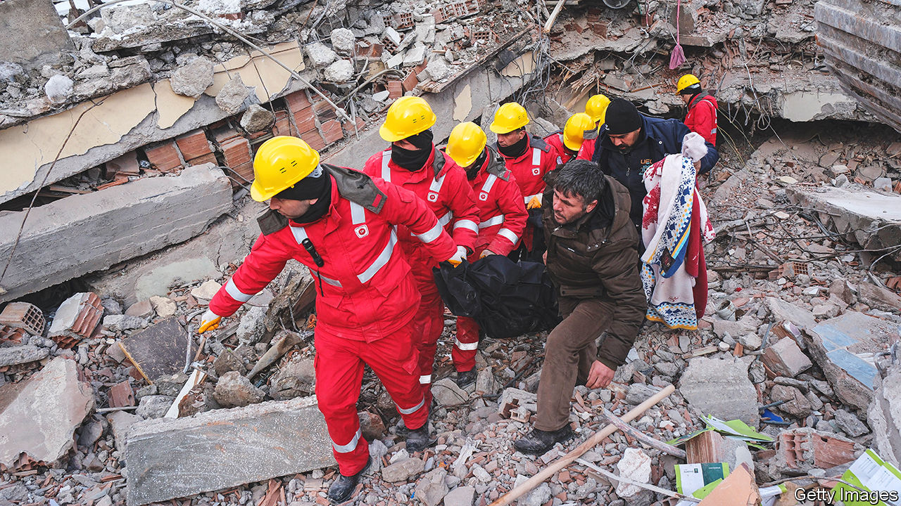
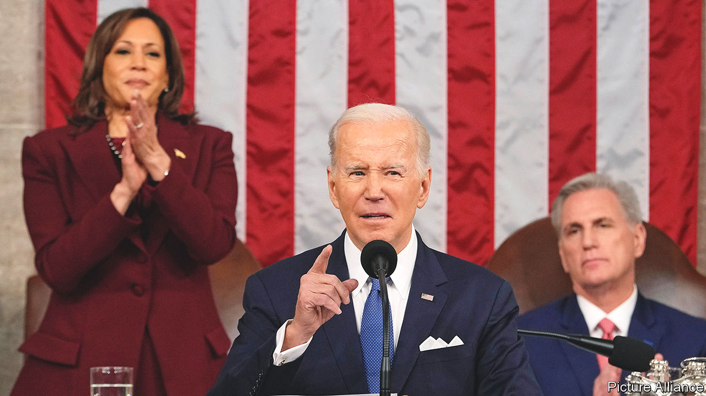

###### The world this week

# Politics 

#####  

 

> Feb 9th 2023 

An  of magnitude 7.8 struck southern Turkey and northern Syria, killing at least 16,000 people. A second powerful earthquake followed shortly after. The toll is expected to rise significantly. It was the world’s deadliest earthquake since 2010, when 220,000 people died in Haiti, or 2011 in Japan, where 21,000 were killed, but mostly by a resulting tsunami. Turkey imposed a state of emergency in the affected areas. 

Parts of northern , devastated by more than a decade of civil war, were struck by the earthquakes. Bab al-Hawa, a crucial border crossing with Turkey that allows international aid into the country, was left unpassable. The UN announced that cross-border aid had been temporarily halted.

Lovely to see you

 , his second trip outside Ukraine since Russia’s invasion. The Ukrainian president gave a speech to Parliament, where he appealed for more combat aircraft, or “wings for freedom” as he described them. Britain promised money to train fighter pilots. Mr Zelensky then headed to Paris and Brussels where he made similar requests. 

In a break from the calendar used by Russian orthodoxy the , which counts around 10% of Ukraine’s population as followers, announced that it would shift the celebration of some feast days to match those of Christians in the West. Its Christmas Day will now fall on December 25th instead of January 7th. 

Sweden’s prime minister, Ulf Kristersson, said he hoped talks with Turkey would resume soon over his country’s application to join , which all member states must agree to. Negotiations came to a halt when a copy of the Koran was set alight near the Turkish embassy in Stockholm. Turkey’s president suggested recently that he will look favourably on the application from Finland, which also wants to join, but not Sweden. 

Rishi Sunak appointed Greg Hands as chairman of the Conservative Party, following the sacking of Nadhim Zahawi over a tax scandal. The  prime minister also created a new Department for Energy Security and Net Zero, and promoted Kemi Badenoch to business secretary. 

Ayatollah Ali Khamenei, the supreme leader of , has reportedly pardoned tens of thousands of prisoners, including many who were involved in recent anti-government protests. The head of the judiciary claimed that many of those arrested after the demonstrations had committed their crimes as a result of foreign propaganda. It is unclear when the prisoners will actually be released.

Tens of thousands of  poured onto the streets of 20 cities for a fifth week of protests against the judicial reforms of Binyamin Netanyahu’s government. 

The number of people killed in violence linked to jihadist groups in  jumped by 48% in 2022, according to the Africa Centre for Strategic Studies, part of the Pentagon. At least 19,109 people were killed, most of them in the Sahel and Somalia, surpassing the previous peak in 2015. 

Sergei Lavrov, Russia’s foreign minister, making his third trip to Africa in eight months, met  military government and promised to provide it with weapons. Russia has been extending its influence in central Africa and the Sahel through weapons sales and contracts for mercenaries from Wagner Group.

A court in  began the trial of , the largest trial under the territory’s national-security law, imposed in 2020. The defendants are accused of involvement in conducting an unofficial primary election aimed at helping government critics gain a majority in the legislature. 

Red balloons

An American fighter jet downed a  off the coast of South Carolina. American officials called it a spy balloon. China said it was merely for weather observation and had gone astray. The discovery of the massive object, which flew over nuclear-missile sites, prompted the White House to cancel a visit to Beijing by the secretary of state, Antony Blinken. 

Two days after America shot down the balloon the Chinese government acknowledged that another balloon, spotted over , was also from China.

 


Joe Biden gave a combative  speech to Congress, his first since the Republicans took control of the House of Representatives. The president was constantly heckled and at times engaged his detractors, for example by accusing some Republicans of trying to undermine Social Security and Medicare. 

Earlier, the House voted, along party lines, to remove from her seat on the Foreign Affairs Committee because of past comments that were deemed to be anti-Semitic. Some say the removal of Ms Omar, who is Muslim, was revenge for the Democrats’ dismissal of two Republicans from committees in 2021 for allegedly condoning violence against Democrats. 

Guillermo Lasso, the centre-right president of , lost a referendum that would have allowed crime suspects to be extradited. Mayoral elections were also held. Politicians linked to Rafael Correa, a former left-wing president, won several races. 

A court in Seoul ruled that the government was liable for atrocities committed by  troops during the  in the 1970s—and that it must therefore compensate the survivor of a village massacre. South Korea was America’s biggest foreign ally in the war. The ruling is expected to open the floodgates to thousands of compensation claims.

The premier of the most populous province of the was removed by a confidence vote after he criticised the federal government for cosying up to China. Last year the country signed a security agreement with China, intensifying concerns in the West about China’s growing influence in the Pacific islands.

Development of a new coal mine was halted on environmental grounds for the first time in . The country’s Labor government said the site in question was too close to the Great Barrier Reef. 

 became the all-time top scorer in America’s NBA basketball league. He made 38 points in a game, surpassing the record of 38,387 points over the career of Kareem Abdul-Jabbar, which had stood since 1989. Mr Abdul-Jabbar, 75, was sitting courtside to witness the achievement.

