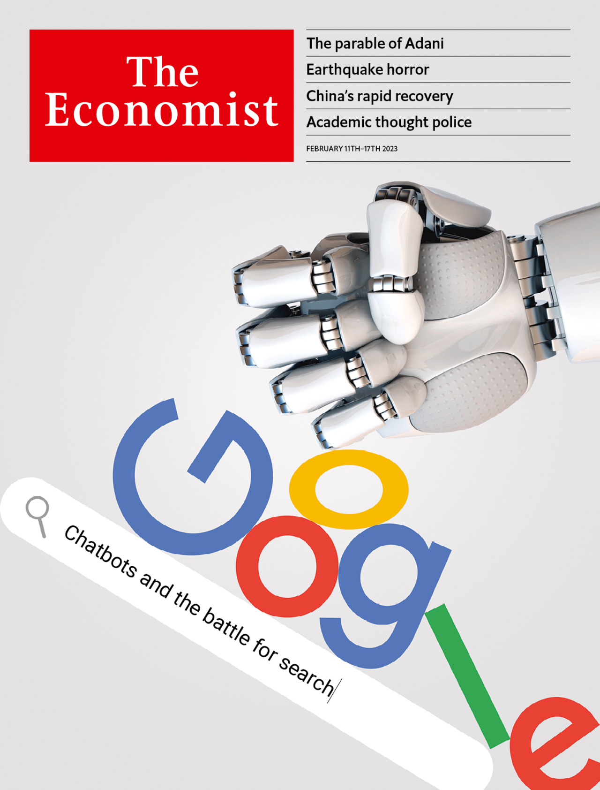
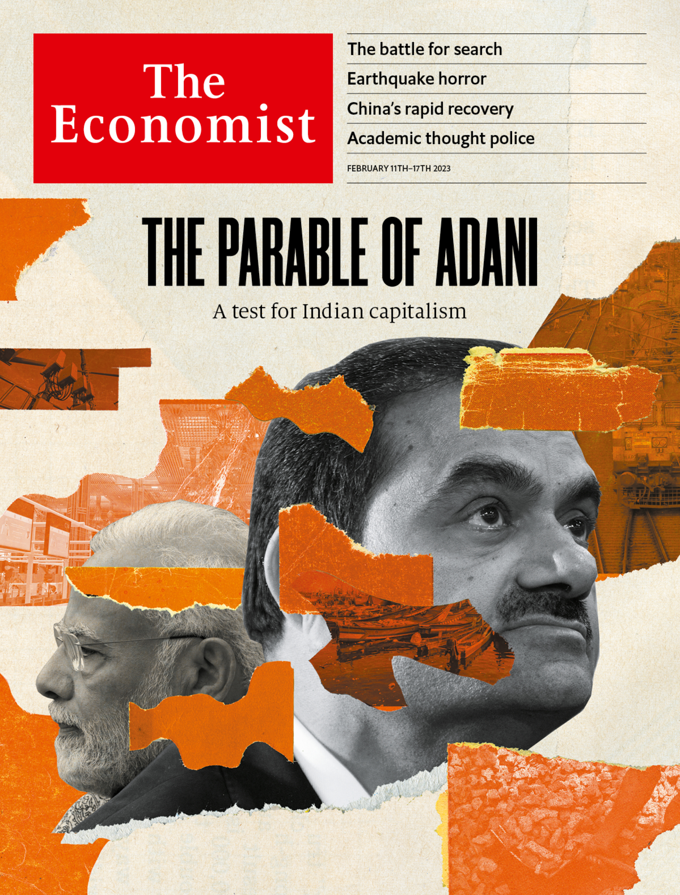

###### The Economist

# This week’s covers 

##### How we saw the world 

> Feb 9th 2023 

WE HAVE TWO covers this week. In most of the world we ponder what the rise of AI chatbots mean for the lucrative business of searching the internet.

 


: 

: 


In Asia, on the other hand, we consider what lessons corporate India, and others, should learn from the woes of Gautam Adani.

 


: 

: 

