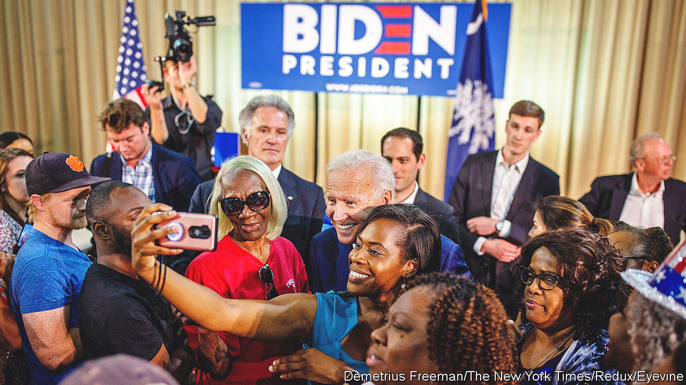

###### Picking winners

# A new primary calendar gives black Democrats an earlier say for 2024 

##### The move is unlikely to change who wins, but might speed up the process 

 

> Feb 9th 2023 

ONE OF THE many ways  is in how it picks nominees for president. In most other democracies, parties select their leaders quickly through a set of selection procedures with tight rules and minimal involvement from the people. In America voters themselves get to pick who runs for president. They do so via a months-long  held independently by each state’s party organisations, with each state lobbying the national party for the coveted first go at casting ballots for the nominees. For decades, Iowa has held that title. But on February 4th, the Democratic National Committee (DNC) handed pole position to South Carolina, previously the fourth state to vote.

Activists have supported a reshuffling of the primary calendar for some time. They claim that letting Iowa and New Hampshire, which votes second, go before more diverse states gives white voters more power. This is accurate; New Hampshire and Iowa are the fourth- and fifth-whitest states in the country. South Carolina, by contrast, has the fifth-highest concentration of black Americans; they make up 27% of the state’s adults, a hair higher than Alabama’s 26%. Given the party’s reliance on black voters, a reliably Democratic group, for their national wins, shouldn’t it prioritise their say?

The question misunderstands the nominating process. It is not as important to go first as it is for  among certain demographic groups and donors. Because South Carolina previously voted fourth, a candidate who polled well with black voters could be confident they would do well later, even if they lagged in Iowa and New Hampshire. 

Such a path is precisely the one Mr Biden followed last time around. Bill Clinton also staged a similarly “surprising” comeback in the 1992 election. In fact, aside from John Kerry’s ill-fated presidential bid in 2004, every eventual Democratic presidential nominee has won the Palmetto-state primary. The Democrats moving South Carolina from fourth to first position is thus unlikely to change who wins its next presidential nomination. But it may speed up the process. An early signal from the state’s black voters may help winnow the field, much as fringe candidates previously dropped out after flops in Iowa and New Hampshire.

The bigger news in the Democrats’ rules change thus is the state that has made the biggest jump in the queue: Georgia.  in 2020 were slated to vote 32nd, long after they might have played a decisive role in the selection process. Next year, Georgia will go fourth. Since Georgia also has a high share of black Americans—higher even than South Carolina—adding it to the slate of early states will tilt the group’s racial composition heavily away from white voters. And though proximate, replacing Iowa with Michigan in the early bunch will significantly decrease the say of , disproportionately represented in the future. 

Ahead of the vote on the DNC’s rules change the chairman, Jaime Harrison, rose to remark that “Folks, the Democratic party looks like America and so does this proposal.” But notably absent from the new bunch of early-voting states are any from the West Coast or mid-Atlantic, the party’s two strongest regions. Texas and Florida, two fast-growing , are also absent. And there are no states from the mountain region—Wyoming, Idaho, Utah, Colorado and Montana. 

The reality of the primary system is that, even when reshuffled, it is not a great way to pick a nominee. It hands veto power to a group of voters who tend to be more ideologically extreme than the electorate as a whole. The Democratic Party has been arguing over which state should go first in selecting its presidential candidates for decades. It may be worth considering an alternative mode of election. Look abroad and it will see many alternatives.■


