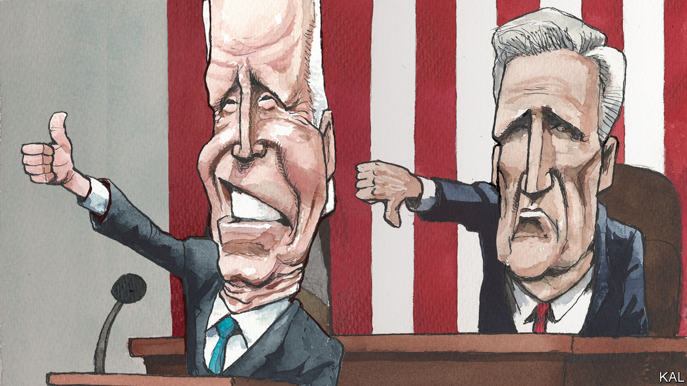

###### Lexington

# History may yet judge Joe Biden’s presidency as transformational 

##### He has cause to boast—but time, along with the Republican House, is working against him 

 

> Feb 8th 2023 

During Donald Trump’s presidency, the  kept a running tally of his lies, ultimately counting 30,573 “false or misleading claims” in four years. It has kept up that work under , finding he lies with less abandon but on occasion with comparable shamelessness.

Fox News is performing its own version of this public service by counting what it calls gaffes, tracking the moments Mr Biden forgets a politician’s name, refers to  as the president or stumbles through a thicket of numbers. 

Its approach raises some epistemological questions: why were the misstatements gaffes, rather than lies, when Mr Biden said his home state, Delaware, had no turkeys, which it has, and has the most chickens in the nation, which it hasn’t? (In fairness to Fox, even a prepared text is not proof for this president against gaffes: in his state-of-the-union address, on February 7th, Mr Biden demoted Chuck Schumer, the Senate majority leader, to the minority, among other slips and puzzling dad jokes.)

A gentle soul might think Fox, in counting its chickens, was being forgiving because of Mr Biden’s advanced age. A cynic would infer cruelty—an effort to boost the gaffe count—for the same reason. And, indeed, in November Fox sounded disappointed at a “slump” to just 11 gaffes during the month, including the two most fowl. “Biden’s November gaffe average: the president hits .500”, Fox reported (he was closer to .367, if you count weekends).

The gaffe is more dangerous than the lie for Mr Biden because it plays to the perception that, at 80, he is too old for the job. Only 23% of Americans say they have “a great deal” of confidence he can manage the White House, according to a poll taken by the Associated Press and the NORC Centre for Public Affairs Research, down from 44% as he took office. Even most Democrats do not want him to run again, though he is clearly preparing to. These harsh views probably feed into, and are reinforced by, a widespread belief that Mr Biden has not got much done. A recent poll from the  and ABC found that 62% think he has accomplished “not very much” or “little or nothing”. 

That perception is at odds with reality, and Mr Biden seized on his state-of-the-union speech as his best opportunity to make the case for his progress against some of America’s biggest long-term troubles: on climate, infrastructure and national security. He pointed to forgotten successes such as rolling out vaccines against covid-19 and underappreciated ones such as sustaining international support for Ukraine. “We’re building an economy where no one is left behind,” Mr Biden said. “Jobs are coming back, pride is coming back because of choices we made in the last several years.”

Yet time is working against this president in more ways than one: Americans will not feel the benefits of his most substantial legislative achievements for years to come. That may explain why, in the /ABC poll, a majority did not credit him even with having made any progress on infrastructure, despite the $1.2trn he persuaded bipartisan congressional majorities to invest in roads, bridges and electric-car charging stations. And most of the new price controls on prescription drugs that Congress put in place last year—a Democratic grail for more than 20 years—will not be felt until at least 2026.

The state-of-the-union performance gives this president his best chance to shine. Gaffes aside, Mr Biden also deftly ad-libbed, pivoting when Republicans booed him for saying some of them wanted to cut entitlements to box them in. “As we all apparently agree, Social Security and Medicare is off the books now,” Mr Biden said, smugly. “We’ve got unanimity.” He called on everyone to “stand up for seniors”—which they did.

Mr Biden is at home in the Capitol, among fellow legislators. The days when he could be an electrifying speaker are gone, but at the lectern in the House chamber—hands clasped prayerfully, voice descending to a husky, insistent whisper—he is a confident, reassuring one, a familiar elder performing a time-honoured national ritual in the time-worn manner. 

Trial balloon

Mr Biden’s calls for unity and bipartisanship also once sounded like echoes from the past. But he has proved such appeals still have political force, and he managed to draw bipartisan ovations during his speech, including for a call for police reform. In a hopeful development, House Republicans shelved a plan to pass a resolution before Mr Biden’s address criticising him for not having acted faster to shoot down a Chinese balloon that crossed America, apparently gathering intelligence. Instead, they are now pursuing a bipartisan resolution aimed at China. “I think our greatest strength is when we speak with one voice to China,” the new Republican House speaker, Kevin McCarthy, told reporters.

As Mr Biden spoke, Mr McCarthy’s heavy-lidded presence over his left shoulder, in place of the Democrat Nancy Pelosi, was a reminder of how much the political terrain has changed. That will probably be to Mr Biden’s advantage if he runs for re-election. Republicans are divided over foreign and domestic policy, and, given his narrow majority, Mr McCarthy will struggle to impose coherence on their agenda, let alone to moderate the demands of his extremists. Some ignored his caution to behave with dignity during Mr Biden’s speech, and their heckling made them seem small.

But the period of Mr Biden’s presidency that played to his strengths as a legislator is largely over. He said recently he has created an “Implementation Cabinet”, a body composed of members of his cabinet “whose job is to just do nothing but let people know what we have already done”. Their time would be best applied to making sure that Mr Biden’s giant investments are well spent. If they are, whether Mr Biden is re-elected or not, history may judge this presidency as transformational. In that sense—the one that matters—time could ultimately be on his side. ■


