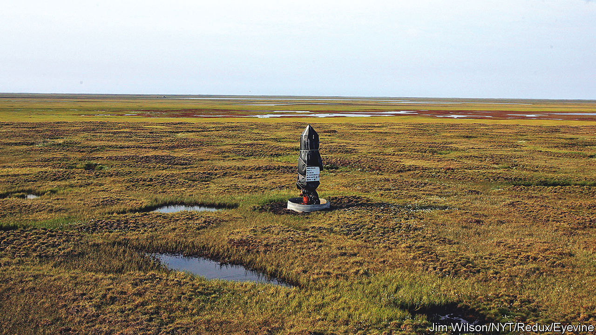

###### Drill, maybe, drill

# Joe Biden is not quitting fossil fuels 

##### This administration has granted more permits to drill than the Trump White House had at the same stage 

 

> Feb 9th 2023 

ALASKA’S NORTH SLOPE, the arctic edge of America’s 49th state, is home to beavers, bears and caribou. Its coastal waters boast bearded seals and bowhead whales. Indigenous people have lived here for millennia. But the region also encompasses the , or NPR-A. On February 1st the Bureau of Land Management (BLM), which helps govern America’s vast federal lands, advanced a colossal drilling project in the reserve. The ConocoPhillips project, known as Willow, could produce 180,000 barrels of crude each day. Environmentalists howl that the project is a “carbon bomb” anathema to President Joe Biden’s green goals. A final decision is expected within the month. 

The Biden administration’s expected approval of Willow may indeed seem contradictory for a president who pledged to ban new oil and gas development on public lands. But  and petrol-price shocks at home have revived a slogan usually associated with Republicans: drill, baby, drill. 

The BLM has granted slightly more permits to drill oil and gas wells in the first half of Mr Biden’s presidency than in the first two years of Donald Trump’s term. The difference is marginal: Mr Biden approved roughly 6,500 permits to Mr Trump’s 6,300, according to an analysis of BLM records. And Mr Trump’s permit approvals in the second half of his term numbered 9,800. But Mr Biden’s initial lead is still striking considering his green agenda, and Mr Trump’s promotion of fossil fuels. Most permits during both administrations were granted in New Mexico, where drilling has gone gangbusters as the shale boom has transformed the Permian Basin. 

But the number of permits issued is just one measure of a president’s domestic energy strategy. A more comprehensive look at Mr Biden’s leasing policies suggests that the permitting bonanza is more of a hangover from the Trump administration’s devotion to hydrocarbons than an intentional policy change. A standard lease to start drilling on public land is ten years. It is common for companies to wait to apply for a permit, which allows them to start drilling, towards the end of a lease. That means the vast majority of permits issued under Mr Biden is on land leased during previous administrations. Compare the number of acres leased under each president, and Mr Biden seems to be the most lease-leery president in modern history. 

The Inflation Reduction Act (IRA), Mr Biden’s signature climate law, also offers mixed messages on the future of fossil-fuel production in America. The IRA raises royalty rates charged to the drillers, but it prohibits the BLM from leasing public land for renewables unless it also offers leases for oil and gas development. Aaron Weiss, the deputy director of the Centre for Western Priorities, which tracks drilling on public lands, says the trade-off was “Joe Manchin’s cost of entry”. The senator for West Virginia was the IRA’s decisive vote, and is in favour of continued drilling.

Coal, oil and gas production on federal lands and waters accounts for about a quarter of America’s total , and nearly a quarter of the country’s greenhouse gas emissions. Recent modelling from Brian Prest, an economist at Resources for the Future, a think-tank, suggests that higher royalty rates will not dent emissions in a meaningful way. Much more effective would be a carbon tax or a ban on new oil and gas leases, neither of which is currently politically feasible. 

Alaska’s politicians cheered Willow’s advancement. The project is expected to bring in at least $8bn in tax revenue and 2,500 construction jobs. The BLM recommends that the Biden administration approve a limited version of the project that avoids drilling near sensitive wetlands and caribou habitats. This is the sort of unsatisfying compromise that may become more common as Mr Biden tries to tackle domestic energy security, increased foreign demand and conservation all at once.■


