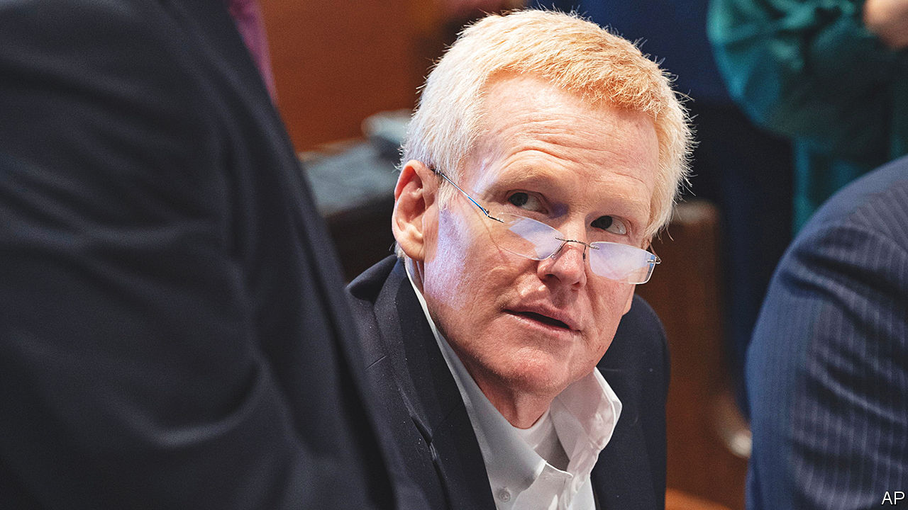

###### Murdaugh most foul

# The Murdaugh trial and small-town power 

##### Alex Murdaugh may be found not guilty of murder. His troubles would not end there 

 

> Feb 9th 2023 

A lone hook dangles where a portrait of Randolph Murdaugh Jr used to hang in the Colleton County courtroom. Murdaugh was the longest-serving prosecutor in South Carolina history, his tenure wedged in between his father’s and his son’s. This multi-generational legal dynasty was revered in Lowcountry, in the state’s marshy south. But now, rather than arguing from the prosecutors’ bench, his grandson sits in the defendant’s seat, accused of slaying his wife and son. The gilt-framed portrait was taken down for the trial.

Prosecutors allege that as a lawyer at his family’s personal-injury practice, Alex Murdaugh stole millions from clients. Some of the accusations he faces are far worse. In 2018, after his housekeeper died by tumbling down a flight of stairs at Moselle, the family’s hunting estate, he is accused of pocketing a $4m life-insurance settlement without telling her children.

Then things got messier. In 2019 Paul Murdaugh, Alex’s youngest son, took his father’s boat for a boozy night-time joyride. The boat crashed into a bridge, killing one of Paul’s teenage friends. Her family sued, alleging that the father had enabled the son’s recklessness. Their lawyer threatened to call Mr Murdaugh’s wife and son to testify against him. A hearing was set for June 10th, 2021. On the morning of June 7th Mr Murdaugh was confronted by his cfo about nearly $800,000 of missing funds. That night his wife and son were found dead outside the dog kennels at Moselle. 

The double murder trial is being held in nearby Colleton County, where the Murdaugh family ties also run deep. Many potential jurors were dismissed for having personal connections to them; multiple judges recused themselves from the case. Mr Murdaugh is being represented by Dick Harpootlian, a current state senator. Even the investigator who checked Mr Murdaugh’s hands for gunshot residue at the scene of the crime knew him. When he approached the dog kennels that night, Mr Murdaugh greeted him by name. 

In Hampton, the town closest to Moselle, things are awfully quiet. Based on the share of people who claim to be visiting one might think that the county, where one in five live in poverty, has a booming tourism industry. But the few dilapidated businesses—among them an empty barbershop, a dress boutique and a diner dishing up gumbo—suggest otherwise. A woman in a coffee shop says she is just driving through and hasn’t heard the Murdaugh name. When she gets up to serve a customer a few minutes later she confesses that it isn’t true. “I’ve got a business to protect,” she says. Others refuse to discuss the case. “There are three things I don’t talk about: politics, religion and the Murdaughs,” an insurance broker says with a wary chuckle. 

Hampton is a town of 3,000. Many locals work in agriculture and live in trailers off the county highway, coming together for church on Sunday. The black community keeps a list of current KKK members. The Murdaughs’ law office, where the accused’s brother still works, towers above the other buildings. The firm is the local bank’s biggest private customer. According to a retired local, they lost just one case in the past 25 years. Many have been helped by them; others relished their success from afar. “Half of Hampton County is Murdaugh kin,” says a town journalist. “Before this the other half claimed to be.”

Some strange laws gave the family power. They amassed wealth thanks to a provision allowing personal-injury cases to be tried anywhere in the state. That opened up the chance to argue more cases before favourable local judges. Legal might brought political power. “I’ll deliver 2,500 votes for you,” Ray Williams, a townie, recalls Mr Murdaugh promising a congressional candidate at a fundraiser. She won. “When Alex tells you to vote for someone, you do,” says Mr Williams. 

Back in court, prosecutors think they have debunked Mr Murdaugh’s alibi. But without forensic evidence the jury may let him off. If he is acquitted, Mr Murdaugh is still accused of over 100 financial crimes. Buster, his lone living son, is in no position to resurrect the family name. He was ousted from law school for cheating. ■


