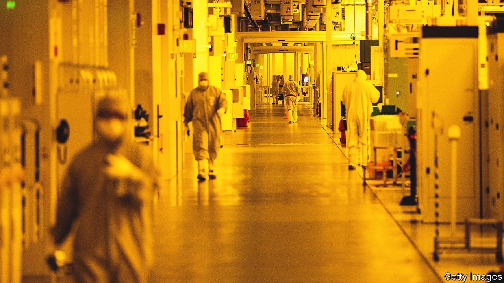

###### Chains of control

# The history and limits of America’s favourite new economic weapon 

##### America has ramped up controls on technology trade with China 

 

> Feb 8th 2023 

AT 11:15am ON October 7th, an American official published 139 pages of regulations on a website called the Federal Register. Across East Asia, from Taipei to Nanjing, semiconductor executives panicked. The American government was claiming jurisdiction over every line of code or machine part that had ever passed through the United States, and over the activities of every American citizen, everywhere on the planet. Companies using American code, equipment or people to make advanced computer chips bound for China had to stop, on pain of breaking the law.

It was a salvo from America’s favourite new economic weapon, the Foreign Direct Product Rule (FDPR). Whereas some sanctions weaponise the ubiquity of the dollar to inflict harm by preventing targets from using it, the FDPR attempts to weaponise the ubiquity of American technology. It lets the government claim jurisdiction over almost every chip factory in the world, because almost every one contains hard-to-replace American tools. , a Taiwanese chipmaker, stopped selling advanced chips to Chinese customers immediately.

FDPR has become one of the most important weapons in America’s arsenal for technological competition with China. One Republican lobbyist calls the Bureau of Industry and Security, the agency that administers it, “the tip of the spear”. Young policy wonks are taking courses to study a subject that would have drawn yawns three years ago: export-compliance law. 

This sweeping form of extraterritorial export control is not new. The concept was written down in 1959. But only in the past decade has FDPR been transformed from regulatory curio into front-line economic weapon. In the early 2010s Kevin Wolf, then at the Department of Commerce, wrote the first two export-control rules to use the idea. They restricted the export of products made with American technology from anywhere in the world to China if they were to be used for military purposes or to build satellites.

Meanwhile, America was also building a case against Huawei, a booming Chinese telecoms-equipment manufacturer which it had long suspected of embargo-busting, and of being a conduit for Chinese government spying. Discomfort with Chinese technological prowess deepened with the arrival of the Trump administration’s China hawks in the White House in early 2017. 

Only in May 2019, after trade talks with China broke down, did the Trump administration turn to export controls . It placed the firm on a list of companies to which it is illegal to export technology from America, known as the Entity List—until then mostly used for shell companies and terrorist fronts. Huawei was now seen as a national-security threat. 

Huawei’s purchases of American-made technology were large enough that companies found it worthwhile to pore over the details. They found that it remained legal to supply Huawei with American technology if it was shipped from outside America. Many tech companies simply carried on supplying Huawei through offshore facilities, following the letter of the law. 

This not only infuriated the Trump administration, it also annoyed companies that manufactured products in America. Huawei’s inclusion on the Entity List discriminated against them. American chipmakers started lobbying for changes. If firms could be prevented from using American technology to supply Huawei from anywhere in the world, operations based in America would no longer be at a disadvantage. By August 2020, with presidential elections looming, officials had worked out the kinks. America published an FDPR which  from American technology—and, in effect, from global semiconductor supply chains. 

Big chip companies all over the world stopped shipping to Huawei. The firm’s revenues plunged by 29% in 2021. Its popular smartphones disappeared from the market altogether. America had found a new way to crimp adversaries which it perceived as a national-security threat. 

It would soon have a chance to test that tool further. In late 2021, as Russia massed forces near Ukraine’s border, the White House asked government agencies for ideas about how to respond in the case of an invasion. The Department of Commerce suggested an expansion of the FDPR: America could do to the Russian army what it had done to Huawei. In February 2022 two new FDPRs cut off Russia’s military-industrial complex from all American elements of global technology supply chains, as part of a huge package of sanctions put in place by America and its allies. 

America says Russian hypersonic ballistic-missile production has been dramatically curtailed for lack of semiconductors, and that Russia has had to turn to Iran and North Korea for supplies and equipment. “Sanctions and export controls are having significant and long-lasting consequences on Russia’s defence industrial base,” the State Department said in October. 

Flushed with success, the White House turned its extraterritorial powers towards China’s semiconductor industry. In Washington, strong bipartisan agreement had developed about the threat posed by China. The national-security adviser, Jake Sullivan, outlined the new strategy in a speech in Washington in September 2022. Particularly for foundational technologies like semiconductors America had to “maintain as large of a lead as possible”. 

The October 7th FDPRs were an attempt to do just that. The new rules are hurting China’s domestic artificial-intelligence companies, and its chipmakers. The hurt will increase if allies impose export controls of their own, replacing extraterritoriality enforced through supply chains with more robust, national-level restrictions that are easier to enforce. Japan and the Netherlands, which host two of the most important chipmaking-equipment manufacturers, reached a deal with America in late January. If both create strong controls of their own, China will be firmly barred from advanced semiconductors. 

Washington is abuzz with talk of its next “target”: what to feed into the FDPR machine? One idea is to take aim at China’s biomanufacturing industry, which makes drugs and their components. Another is to go after manufacturing of advanced batteries, particularly those for electric vehicles.

By attempting to cut China off from advanced semiconductors, America is incentivising China to focus on more mature forms of chip manufacturing, where the choke points are weaker and China already has a large share of the market. These sorts of chips are required in great numbers in electric cars and weapons. If artificial intelligence turns out to be less important than the American government thinks it is, incentivising Chinese firms to take greater control over commodity chips may end up looking like a mistake. Technological development is hard to predict. The supply chains and manufacturing processing that underpin semiconductor production are some of the most complex things humans have ever created. America must hope that its apparent recent success in manipulating them does not prove illusory. ■


