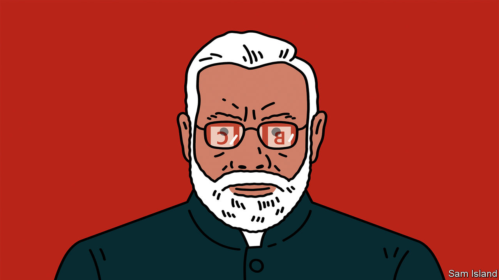

###### Banyan

# After silencing critics at home, Narendra Modi goes after foreign media 

##### Western countries’ failure to come to the BBC’s defence is pathetic 

 

> Feb 16th 2023 

India’s tax police, says the government of Narendra Modi, had good reason to send dozens of officers to raid the BBC’s offices in Delhi and Mumbai this week. The British public broadcaster is alleged to have understated its Indian profits. But nobody believes that explanation for a second—nor are they meant to.

The raid follows the BBC’s airing last month (only outside India) of a two-part documentary, “India: the Modi Question”. It charts Mr Modi’s career-long efforts to demonise India’s 200m-odd Muslims. It examines above all the prime minister’s role in an outbreak of sectarian violence in 2002 in Gujarat, during his time as chief minister of the state, in which over 1,000 died, most of them Muslims. This episode, in which dozens of Muslim women and girls were raped and burned alive by well-co-ordinated Hindu mobs, has long dogged the chest-puffing Hindu nationalist leader. The bbc documentary cites an unpublished report by the British government on the violence. It describes an organised campaign of ethnic-cleansing against Muslims. It holds Mr Modi “directly responsible” for a “climate of impunity” that enabled the violence.

The prime minister is nothing if not thin-skinned. His government invoked “emergency” powers to ban the documentary in India, including on social media. When students tried to screen it at Jawaharlal Nehru University in Delhi, a left-leaning institution that Mr Modi’s Bharatiya Janata Party loathes, the authorities cut the electricity. The ruling party’s spokesman describes the British broadcaster as “the most corrupt organisation in the world”, engaged in “hatred-fuelled work against India”.

The raid was condemned by Indian free-speech groups. Fat lot the government cares. The BBC can expect a long and painful entanglement with its inspectors. Punishment by process is a favourite tactic of the Modi administration when it wants to intimidate or wear out those who dare to find fault with the prime minister or his party. In 2020 Amnesty International was forced to close its India operation after its bank accounts were frozen. Last year Oxfam India and the Centre for Policy Research, a think-tank in Delhi, suffered tax raids. Indian media outfits, journalists and activists who have offended suffer worse. Reprisals, whether carried out by the government or its enraged admirers, have included pulled advertising, detentions without trial and, for Gauri Lankesh, a journalist and critic of chauvinistic Hindutva ideology, assassination.

In the media, an army of corybantic Hindu trolls celebrates such outrages. Each is chalked up as a victory for the Hindu nation they mistakenly consider India, a land of amazing diversity, to be. As Apoorvanand, a columnist for the Wire, a news website, points out, the New-York-based short-seller Hindenburg Research would also be a target for revenge if it had operations in India. Its blistering analysis of the financial arrangements of the Adani Group caused one of India’s biggest conglomerates to lose $130bn in stockmarket value. And Gautam Adani, its founder and main shareholder, is a close corporate ally of Mr Modi. Hindenburg, for the trolls, must therefore be part of the same anti-India conspiracy as the bbc, Amnesty, Ms Lankesh and the rest. Mr Adani, it follows, must be pure.

Some wonder whether Mr Modi might have crossed a line by going after the august BBC, especially in a year when India will be in the spotlight as host of the G20. They underestimate how important fighting shadowy enemies is to his political appeal. After the prime minister’s many victories against his domestic critics, going after foreign ones is the logical next step.

The doubters also underestimate the limpness of Mr Modi’s Western allies. America, Britain and the rest may express some small concerns, from time to time, about minority rights and press freedoms in India. But what matters to them is the vast economic potential of the Indian market and their longing for an Indian bulwark in the West’s struggle for supremacy with China.

Last month Britain’s especially limp prime minister, Rishi Sunak, suggested he did not “agree at all” with the unpublished report’s characterisation of Mr Modi. There has been no full-throated backing in London or Washington for the bbc, let alone for Mr Modi’s far more vulnerable Indian victims. Fair enough, you might say; geopolitics is a rough game. But next time Banyan hears a Western leader congratulating Mr Modi on their countries’ “shared democratic values”, his stomach will turn.■


