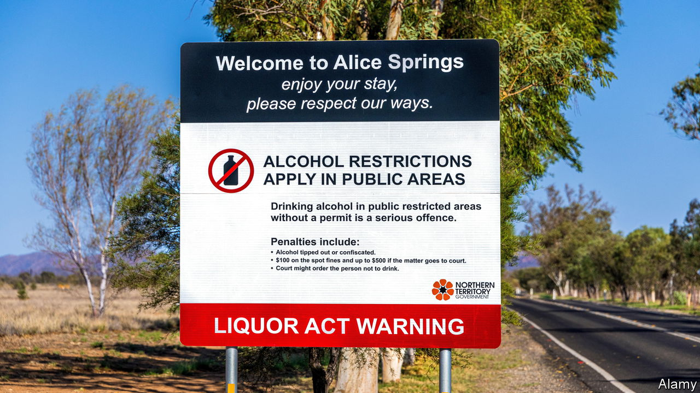

###### Dry season

# Australia re-bans alcohol in some Aboriginal communities 

##### Prohibition is no substitute for fixing Aboriginal people’s terrible social problems 

 

> Feb 16th 2023 

High temperatures are not all that Alice Springs, a town in Australia’s sun-scorched outback, has to defend itself against. A crime wave has forced residents to turn their properties into fortresses. Businesses are battened down with steel bars and cordoned with razor-wire. “It’s been anarchy”, says Robert Phillips, who owns a café that was broken into four times before he threw up defences. Last year Alice Springs saw its highest incidence of “property offences” on record. 

Though the police do not publish race-based data, members of the 60,000-strong indigenous community are said to be largely responsible for surging crime in Alice Springs and across Australia’s self-governed Northern Territory. Over a quarter of the population of the territory, which includes Alice Springs, are Aboriginal people (compared with just over 3% of the national population). They are much poorer than other Australians and more beset by problems associated with criminality, including alcohol abuse. In 2020 the rate of “alcohol-attributable hospitalisations” was 20 times higher for indigenous people in Alice Springs than the national average, according to John Boffa, a doctor working with the People’s Alcohol Action Coalition, a community group. One reason for the crime wave is that alcohol, for many years restricted in the Northern Territory, has become more readily available there.

Most of its remote, indigenous settlements were subject to federal restrictions on the sale and consumption of booze. These were part of a series of special measures, also including bans on pornography and compulsory health checks for Aboriginal children, introduced in 2007, in what was known as the Northern Territory Intervention. The booze ban expired last July, however, and alcohol has since flowed through the territory.

Many, including Aboriginal groups, had warned against relaxing the ban. Yet local politicians had found it hard to defend. Natasha Fyles, who leads the Northern Territory’s Labor government, derided it as “a race-based policy that disempowers” Aboriginal people. The crime wave is now causing a rethink. Earlier this month an official review led by an Aboriginal bureaucrat found evidence that ending prohibition had caused “unacceptable levels of harm” and recommended its revival. Ms Fyles has passed legislation to do that. It will permit remote communities to opt out of the ban only if they can show a plan to manage alcohol consumption, supported by a majority of their residents.

Many Aboriginal people consider prohibition necessary. It should not be viewed as discriminatory but as “a protection for the women and children in those communities”, says John Paterson, the (Aboriginal) chief executive of the Aboriginal Medical Services Alliance Northern Territory. Even so, prohibition will not fix the underlying issues of poverty and marginalisation driving Aboriginal people to drink.

Contrary to a persistent myth, their genetic disposition does not make them more susceptible to alcohol abuse; the conditions in which many live do. In Alice Springs’ dry riverbed, unemployed groups from across Australia’s desert interior sleep rough. Surveys suggest Aboriginal people’s average household income is around half the Australian average. Almost half of young Aboriginal adults are not engaged in full-time work or education.

The federal Labor government, led by Anthony Albanese, promises to tackle the problem by spending A$250m ($173m) on Aboriginal social services, including health care. Such measures are necessary. Like the booze bans, they have previously had only limited success under previous governments, notes William Tilmouth, an elder of the Arrernte Aboriginal nation: “Everything they do is a variation of yesteryear.” Given that as a child he was seized from his family and placed in a mission in the name of assimilation, that is a painful indictment. But it is hard to disagree with. After decades of interventions, the lives of Australia’s Aboriginal people are getting little better and in some ways worse. ■

