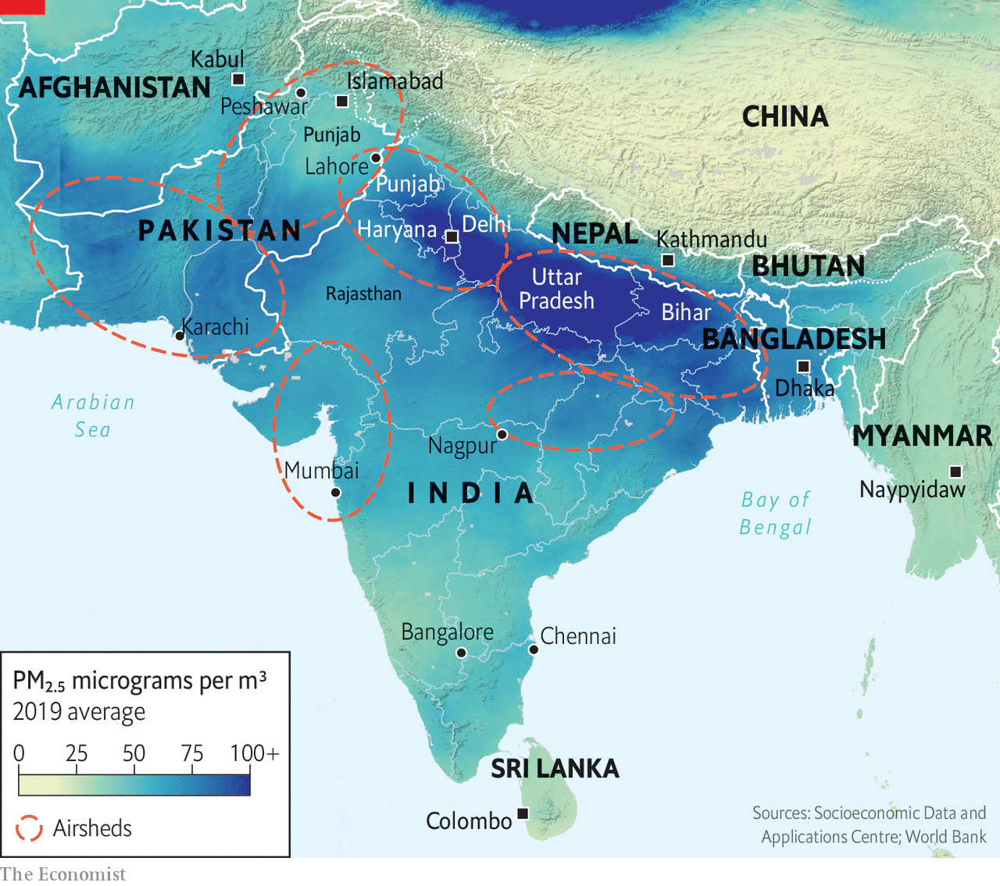

###### South Asia’s filthy air

# India and Pakistan are choking on each other’s pollution 

##### Fixing the problem will require countries that hate each other to co-operate 

 

> Feb 13th 2023 

Indians are accustomed to seeing their streets getting a lick of paint or the odd pothole being filled before a senior politician or foreign dignitary comes to town. But to prepare for a visit from Narendra Modi, the prime minister, on February 10th officials in Mumbai deployed a new tactic. They sprinkled its roads with water.

They hoped to damp down the street and construction dust that contributes to the city’s pervasive smog. For much of this winter, Mumbai’s skyscraper-filled skyline has been almost invisible behind a grey haze of particulate matter. On some days the Arabian Sea city’s air has been worse than that in Delhi, India’s more famously polluted capital. Between November and the end of January, Mumbai, the country’s commercial capital, recorded 36 days with “poor” air quality, a level at which even otherwise healthy people can have difficulty breathing. This represents a grim extension of what was already one of the world’s .

Delhi and nearby cities on the populous Indo-Gangetic Plain, which extends from Pakistan to Bangladesh, have long had the world’s filthiest air. Yet as infrastructure-building and industrialisation accelerate across the region, due in part to a post-pandemic growth spurt, the smog is spreading. According to a new analysis by the World Bank, nine of the world’s ten cities worst afflicted by air pollution are in South Asia. And on February 12th, at the height of the winter smog season, only two of the ten most polluted places in India were in and around Delhi. The rest, including Mumbai, were in western India.

Earlier in the season the Pakistani cities of Karachi, also on the Arabian Sea, and Peshawar, near the border with Afghanistan, both briefly topped a global index of cities with the worst air quality. In Kathmandu, on the northern edge of the Indo-Gangetic Plain, the peaks of the snowy Himalayas that fringe Nepal’s capital are often hidden by yellow-brown haze. 

South Asia’s filthy air takes a terrible toll on the health and economic prospects of millions. High levels of fine particulate matter, known as PM2.5, burrow deep into lungs and enter the bloodstream, increasing the risk of heart and lung disease as well as strokes. Air pollution is estimated to kill over 2m people in Bangladesh, India, Nepal and Pakistan each year. Globally, it reduces average life expectancy by 2.9 years. The corresponding figure for India is five years. On the Indo-Gangetic Plain, according to a recent study, the average Indian life is up to seven years shorter due to air pollution than it would be otherwise.

A study recently published in the , a medical journal, estimated that in 2019 India’s economy lost $37bn, or 1.4% of GDP, to pollution-related death and illness. Another study by the Clean Air Fund, an ngo, and the Confederation of Indian Industry, a trade body, calculated that India lost 1.3bn working days that year due to employees staying at home because they or their family members had pollution-linked illness. Pakistan’s province of Punjab, which accounts for 60% of the country’s output, has seen serious smog-related disruptions this winter; its school holidays were extended, flights diverted or delayed and motorways closed overnight.

Predictably, the poor see the worst of this. The Indo-Gangetic states of Uttar Pradesh and Bihar are among the poorest parts of South Asia—over 115m of their inhabitants live on less than $2 a day—and also the most polluted. Poor people are likelier to use dirty fuels, contributing to high levels of indoor pollution. Meanwhile, “the rich are trying to create a bubble for themselves with air purifiers,” says Karthik Ganesan of the Council on Energy Environment and Water, a think-tank in Delhi. 

Air pollution, which nonetheless affects rich and poor, however unevenly, is a political concern across the region. Yet its governments’ mitigation efforts have mostly been ineffective. India launched its National Clean Air Programme in 2019 with the aim of improving air quality in 102 cities (later increased to 131). Four years on, only 38 are on track to hit their targets. Pollution in many of the rest, including Bangalore, Chennai, Mumbai and Nagpur, has increased. Pakistan, beset by perma-crises, is vacillating over whether to launch its own national clean-air programme. Bangladesh drafted a clean-air act in 2019 but has not passed it. Across South Asia, there has been “very little improvement despite the policies in place to improve” air quality, says Hans Timmer of the World Bank.

There are  for this failure, including the difficulty of regulating industry in a region where government is weak and corruption rife. Yet the biggest reason, the Bank suggests, is that policymakers are mostly trying to abate pollution within the cities concerned, and much of it originates elsewhere.

Take the smoke that arises in India’s state of Punjab every autumn when its million-odd farmers set fire to their stubble fields. It drifts eastwards, enveloping Delhi and other cities of the northern plain. Or the fug of pollution arising from the brick kilns that ring Dhaka, Bangladesh’s capital. “In most cases less than 50% of the pollution is coming from the cities themselves,” says Mr Timmer. In three South Asian capitals—Colombo, Dhaka and Kathmandu—less than a third of air pollution comes from within the city. Around 30% of Indian Punjab’s pollution originates in Pakistan, while 30% of pollution in Bangladesh’s major cities has blown in from India.

 


A better approach is to design and deploy controls across the far-flung zones, known as airsheds, in which air pollution circulates. It has been done successfully in Europe and China, whose capital was once as synonymous with smog as Delhi is today. Beijing’s air is now  chiefly thanks to the creation in 2013 of a powerful airshed-wide authority responsible for the capital, the city of Tianjin and 26 adjacent prefectures. In 2017 PM2.5 levels in Beijing were half those of the previous year.

India is trying to follow this example in and around Delhi. In 2021 it launched a pollution-control agency, called the Commission for Air Quality Management (CAQM), with responsibility for a 55,000-square-km area, encompassing the capital and parts of Haryana, Rajasthan and Uttar Pradesh. It is home to 46m people. Its constituent authorities include Delhi and four states, several central-government ministries, and various universities and ngos. “The idea is not just to bulldoze, but to follow a practice by which everybody is taken into confidence,” says M.M. Kutty, the commission’s chairman.

Though many have criticised the CAQM’s slow pace of progress, the early results are promising. According to official figures, Delhi’s average daily concentration of PM2.5 declined in 2022, the body’s first full year of operation, to 98 micrograms per cubic metre from 105 the previous year. The number of hours of “severe” PM2.5 fell from 628 to 204. Yet more significant progress, the Bank suggests, will require a major expansion of this approach.

Blue sky thinking

It has identified six regional airsheds. They are vast areas, covering multiple urban, provincial and national jurisdictions. Significantly, four of the six span national borders. One stretches from eastern Iran into western Afghanistan and southern Pakistan; another covers much of northern India and western Bangladesh. According to the Bank’s modelling, the more co-ordinated the pollution controls adopted in these expanses, the more cost-effective and beneficial they would be.

The ideal scenario, it suggests, would be for authorities within a given airshed to co-operate on data-sharing and policy formulation, while each working towards a locally determined target. This would allow them to prioritise relatively easy or low-cost forms of pollution control—such as regulating brick kilns—over more difficult or expensive sorts, such as closing coal-fired power stations. The Bank reckons that in this scenario South Asian life expectancies would rise, infant mortality would drop and health-care expenditure would fall. For a cost of $5.7bn, it estimates the approach could bring economic benefits worth $52.5bn by 2030.

The idea of Bangladesh, India and Pakistan—let alone Afghanistan and Iran—working together to such an extent is, the Bank’s authors concede, “far from straightforward”. It might almost seem absurd. South Asia is one of the most unneighbourly, least-integrated regions in the world. It is haunted by a history of war and mutual suspicion. Its cross-border linkages are meagre. Trade within the region is just 5% of its members’ total trade; the corresponding figure for East Asia is 50%, according to the Brookings Institution, a think-tank in Washington, Dc.

Yet if anything could begin to knit the region’s divisions, perhaps the shared goal of helping its people breathe easier might. Air pollution is politically salient across South Asia and the very opposite of zero sum. The subcontinent’s winds blow back and forth; none of South Asia’s polluting countries and cities is permanently upwind. To seriously reduce the blight from which all of them are suffering, they will, in the end, have to co-operate. ■

