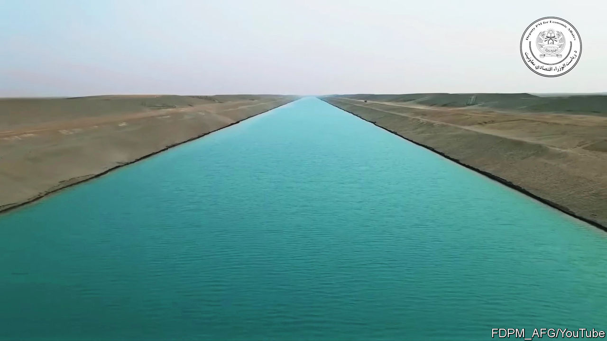

###### Afghanistan

# The Taliban are digging an enormous canal 

##### A mega-project in northern Afghanistan risks raising regional tensions 

 

> Feb 16th 2023 

Taliban officials have started talking up a new canal under construction in the arid north of Afghanistan. A video recently posted on YouTube shows shiny diggers roaring over sand dunes and workers from different ethnic groups toiling together. The Islamist regime says some 5,500 people are working around the clock on the project, using over 3,300 bits of machinery. Once completed, the Qosh Tepa Canal will divert water from the Amu Darya river for irrigation. The river, once known as the Oxus, rises in Afghanistan and Tajikistan, flows into Uzbekistan and is one of the longest in Central Asia. The Taliban expects the project to turn 550,000 hectares of desert into much-needed farmland.

Amid much terrible news from Afghanistan, including the threatened impoverishment of almost its entire population of 40m, the canal is a prominent test of the Taliban’s ability to govern. “Many people doubt we have the capacity to implement this project,” Abdul Rahman Attash, head of the National Development Corporation, has declared. “We will prove Afghanistan can stand up its economy and implement national projects on its own.”

The jihadists have so far done little of that. Since they retook Afghanistan in August 2021 it has been gripped by an economic crisis, in part due to the imposition of sanctions and evaporation of the international aid on which the country had depended. The World Bank reckons its economy contracted by over 20% in 2021. Exacerbated by a severe drought and an unusually cold winter, the crisis has pushed 20m people into acute hunger. 

Global warming, which is especially conspicuous in semi-arid Central Asia, is meanwhile making access to water an urgent concern. Afghanistan’s former president, Ashraf Ghani, revelled in the completion of a dam near the border with Iran to produce irrigation and electricity. Similarly, the Taliban, as Ashley Jackson of the Centre on Armed Groups, an nGO, puts it, are using the Qosh Tepa Canal to project “autonomy, independence and strength”.

The project is not new. Plans for a canal in north Afghanistan have been discussed for decades; feasibility studies were carried out under its former American-backed government. Even so, the Taliban’s progress looks impressive. Satellite imagery supplied by Planet Labs, pBC, an American firm, reveals that over 100km of canal has been excavated in the past 10 months. 

Speedy work is not necessarily good work, however. Najibullah Sadid, an Afghan engineer based in Germany, worries that the canal is not being lined or covered. In that case, much of its water would be lost to seepage in the region’s dry, sandy soil. Besides, digging a ditch is the easy bit of canal construction. Mr Sadid is sceptical that the Taliban can manage the complex engineering work, including building culverts and bridges, that should come next. “They are in a hurry,” he says.

Funding the canal won’t be easy, either. Afghanistan’s finance ministry suggests it will do so from domestic revenues, which have increased thanks to a crackdown on tax avoidance and corruption. It has little alternative. Foreign donors are not lining up to hand the Taliban money for grand projects while the regime is banning women and girls from public life. Yet the canal’s first phase, covering over 100km of its planned 285km length, is expected to cost 8.2bn afghanis ($91m). That is equivalent to about 8% of the domestic revenues Afghanistan collected in the first eight months of 2022. 

Another concern is that, if completed, the canal could cause an increase in regional conflict. It will divert water from the Amu Darya close to the border with Uzbekistan, which relies on the river to irrigate the cotton fields that are its biggest source of jobs. And given that Afghanistan imports much of its electricity from Uzbekistan, it can ill afford to antagonise it. In recent weeks, residents of Kabul have had as little as two hours of electricity a day because the government in Tashkent responded to an electricity shortage at home by cutting exports to Afghanistan. Rising tensions over water would make a difficult relationship worse. ■

