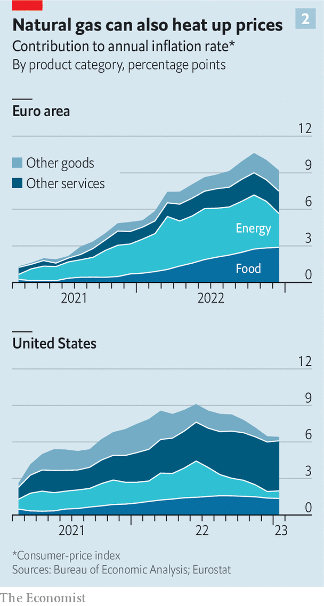
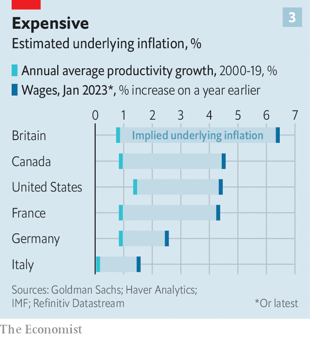
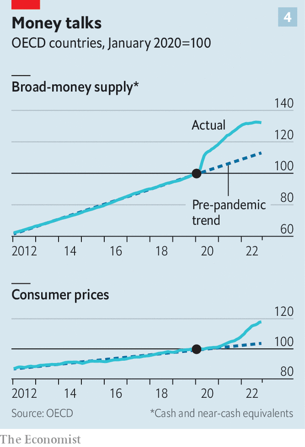

###### A hard road

# Lots of investors think inflation is under control. Not so fast 

##### Tight labour markets suggest that prices may continue to rise faster than markets think 

 

> Feb 16th 2023 

For the past year and a half high inflation has tormented central banks, haunted financial markets and weighed heavily on the minds—and wallets—of the public. By bringing about the sharpest tightening of monetary policy since the 1980s it shattered the previous consensus that rich-world interest rates would stay low for ever. In 2022 that created havoc in asset prices, causing everything from bitcoin to bonds to fall sharply in value. In 2023 it may yet do the same to the real economy: the average economic forecaster thinks that a recession in America is an odds-on bet. When economists write the history of the post-pandemic era, the resurgence of inflation and central banks’ battle with it will be the defining story.

But when will it come to an end? A large number of investors and analysts think the answer could be soon. Central banks, in contrast, worry that wage growth remains too high to declare victory. If the dispute is resolved in central bankers’ favour, it could cause upheaval in the markets. And either way, it raises intriguing questions about how best to predict inflation.

 


The optimists can point to a growing pile of evidence. In 25 of the 36 OECD countries for which there is monthly data, headline inflation is falling. Good news has been rolling in for months (see chart 1). Forecasters had expected Europe’s inflation to be 8.9% in January, but the official preliminary estimate, released on February 1st, was only 8.5%. In the three months to January America’s consumer prices rose at an annualised rate of 3.8%, the lowest reading in two years, according to data released on February 14th.

This time last year central bankers were up at night worrying that the public’s growing expectations of high inflation would become self-fulfilling. But as inflation has fallen, so too have predictions regarding what comes next. The price of inflation-linked swaps suggests America’s consumer price index (CPI) will rise by just 2.9% over the next year. Because the Federal Reserve targets an index which grows more slowly than CPI, investors’ expectations imply the central bank will be closing in on its 2% inflation target in early 2024.

Researchers at the Federal Reserve Bank of Cleveland; Morning Consult, a data firm; and Raphael Schoenle of Brandeis University publish a gauge of public expectations of inflation for the following year that is consistent across countries. Between August and December the median expected rate across rich countries has fallen by about a percentage point. Alternative Macro Signals, a consultancy, runs millions of news articles in several languages through a model to construct “news inflationary pressure indices”. The core index, which is good at predicting official numbers, recently fell below its pre-pandemic level in America. Google-search volumes for “inflation” are falling the world over.

Some economists believe the game is up. “I don’t think people fully appreciate that high inflation in the US and the Euro area is over,” wrote Jan Eeckhout, an economist, in late January. His measure of “instantaneous inflation”, which tries to prioritise the most recent trends, is at a level consistent with the Fed’s target. In another recent analysis Alberto Cavallo of Harvard University looks at real-time price indices, which State Street Global Markets and PriceStats derive from the websites of large retailers, in order to identify turning points quickly. The indices suggest that in many rich countries, including America, Britain and Spain, inflation fever has broken, with a decisive share of the price basket shifting to a lower inflation trend.

Financial markets are celebrating. Unexpectedly low inflation should mean there is less need for central banks to raise interest rates. It should also allow them to prioritise economic growth—ie, make them more willing to cut rates when necessary to see off a downturn. Thus, lower inflation makes a fabled “soft landing”, in which a full cycle of interest-rate rises does not lead to a recession, more likely. 

This is what investors appear to be expecting. The prices of bonds and swaps imply that central banks in most big, rich economies and many smaller or poorer ones will start loosening monetary policy within the next year. This prospect has propelled global stockmarkets, which are expecting the goldilocks combination of a lower cost of capital and healthy growth in earnings. The S&amp;P 500 index of stocks is up nearly 8% this year. Emerging market stocks are up too. On a trade-weighted basis the dollar is down more than 6% since its peak in October, a sign of investors’ renewed appetite for risk.

Record scratch

Unfortunately there is a large hitch. Many policymakers are disowning investors’ optimism. The disinflationary process, warned Jerome Powell, chairman of the Fed, on February 7th, “has a long way to go”. The same day Isabel Schnabel of the European Central Bank warned that underlying upward pressure on prices remained “extraordinarily high”. Central bankers are worried that their economies—and especially their labour markets—are overheating. Though they are slowing the pace at which they raise interest rates, they are wary of repeating the mistakes of the 1970s, during which monetary policy was loosened in response to falling inflation only for prices to surge once more.

The flipside of markets’ optimism is their vulnerability to central bankers’ hawkishness. If inflation does not fall as they expect, interest rates will stay high or rise further. Stockmarkets would face a double whammy, from a higher discount rate, which mechanically reduces asset prices, and an even higher risk of recession. Have investors got carried away?

Answering that question requires understanding where inflation came from. The problem began in 2021 with a demand surge in America, fuelled by pandemic-related fiscal stimulus that reached a cumulative 26% of GDP after President Joe Biden signed the $1.9trn American Recovery Act that year. Vast handouts to households supercharged demand for goods, from home gym equipment to video-game consoles, among consumers who were staying at home more because of the pandemic. 

America’s enormous appetite for imports overwhelmed the world’s supply chains, which were in any case operating less efficiently because of disease-prevention measures and factory shutdowns. Production delays and shortages of crucial inputs such as microchips caused goods inflation to spill over to much of the rest of the world. Then, over time, inflation broadened out, into rents, wages and reopening service industries.

 


In some countries, many workers had retired or otherwise left the labour force during the pandemic, contributing to the imbalance between supply and demand. A rebound in global energy prices in 2021 was compounded by Russia’s invasion of Ukraine a year ago. The prices of oil and especially natural gas soared, in Europe in particular (see chart 2). 

Today’s falls in inflation reflect the easing or, in some cases, unwinding of these forces. America’s demand for goods is still unusually high, but supply chains have adapted. There is a chips glut rather than a chips shortage. From September to December, America’s goods prices gently fell. The oil price is around $85 a barrel, down from a high of nearly $140 a barrel in March 2022. Some workers have returned to the labour force. Even with supplies from Russia all but cut off, Europe’s gas prices have tumbled during a warm winter. 

Some doves say the receding of temporary factors vindicates central bankers’ initial judgment that inflation would be transitory, albeit a year and a half behind schedule. Higher interest rates are typically thought to bite only after a delay of at least a year and perhaps two, a phenomenon Milton Friedman dubbed the “long and variable lags” of monetary policy. On this view it is too soon for higher interest rates to be having much of an effect on the world economy. By the time they bite, inflation will have gone away on its own.

Yet global growth has been slowing. A year ago the IMF forecast it to be 3.8% this year. It has since revised that down to 2.9%. The war in Ukraine is to blame for some of that. But in America, which, as a net energy exporter, has been much less affected by the crisis than Europe, GDP in the final quarter of 2022 was only 1% higher than a year earlier. 

What is more, the latest economic research contests the conventional view of “long and variable lags”. A flurry of recent studies, surveyed by Dario Perkins of TS Lombard, a research firm, suggests that changes to interest rates may have their strongest impact after a delay of just 6-9 months. Researchers at the Kansas City Fed have argued that lags have become shorter over time in part because central bankers have become better at communicating their plans in advance. Joseph Briggs of Goldman Sachs, a bank, says that even Friedman’s dictum has long been misunderstood. Although it may take a while for monetary policy to have its full effect, growth can fall quickly after rate rises. 

The puzzling thing is that the economic slowdown is not visible in labour markets, in which competition for workers remains fierce. Six members of the G7, a club of big, rich countries, enjoy an unemployment rate at or close to the lowest seen this century (Italy is the exception).

 


Despite a series of headline-grabbing lay-offs at big banks and technology companies, America’s non-farm payrolls grew by an enormous 517,000 in January, more than five times most estimates of a sustainable long-term pace, given population growth. Job vacancies grew to 11m in December, nearly twice the number of unemployed. In many countries, but especially in America, competition for workers continues to generate wage growth that is too high to permit inflation of just 2%. In the euro zone wage growth seems to be rising.

This troubles the likes of Mr Powell and Ms Schnabel. They want abundant jobs. But they see excessive wage growth as the best indicator that inflation is likely to remain above target, because of its relevance both to firms’ costs and to household incomes. Policymakers cannot take much comfort from tumbling goods and energy prices if wages threaten to undo the benefit. To make this point Mr Powell has emphasised the tight linkages between wages and a price index that excludes goods, energy and housing. In the past three months this index grew by 4.5% at an annualised rate—lower than headline inflation, but too high for comfort. 

Might wage growth fall without job losses or slower hiring? Investors seem to think so: across America, Britain and the euro area they have recently rewarded companies which do better than average when wage pressures are weak—say, because they have high labour costs relative to sales. But wage growth falling while employment and vacancies remained high would defy the models central banks have used to forecast inflation for decades, as well as simple intuition about the supply and demand for workers. It would represent a second consecutive failure by central bankers, who, having not seen inflation coming, would also have failed to predict its sudden demise.

Yet this sort of “immaculate disinflation” is possible, claim one group of economists: those who study money. In 2020 they were among the few to worry about a burst of inflation. Today they are among the most open to the idea that inflation—of both prices and wages—could go away relatively painlessly. Their argument is that the world economy has been suffering what used to be called a “monetary overhang”, in which it must work off a one-time change to the supply of money caused by a burst of stimulus. Once that overhang has dissipated, things should return to normal, argues Chris Marsh of Exante Data, a research firm. Monetary overhangs, which were experienced after the second world war in the rich world and in many post-Soviet economies in the 1990s, have not typically led to persistent inflation. 

 


Tracking the money supply is deeply unfashionable. Since the 1980s central banks have generally focused on interest rates rather than trying to fix the amount of money in circulation. Money does not even feature in most state-of-the-art models of inflation, which are focused on interest rates, the real economy and inflation expectations. Yet money supply was one of the few indicators to provide advance warning of inflation: across the OECD, a broad measure of it rose by 12% in just six months after February 2020. A recent study by economists at the Bank for International Settlements finds that countries with stronger money growth saw markedly higher inflation, and that incorporating money growth into inflation forecasts would have improved their accuracy.

Recently the broad measure of the money supply has begun to shrink, as monetary policy has been tightened. And the monetary overhang is now smaller than it was: the broad money supply in the OECD is today 17% above its long-term trend, but consumer prices, at 14% above trend, are not far behind (see chart 4).

 


Are doves who argued that inflation was transitory, having lost the battle, therefore about to win the war—and to tear down economists’ models? The trouble is that they could be right about today and wrong about tomorrow. There is nothing to stop a monetary overhang being followed by a more conventional economic overheat. The American and British labour markets in particular are tight enough that they would have central bankers worried even if inflation had been under control for the past two years. The last time America’s unemployment rate was as low as it is today was 1969, when the economy was going through a textbook inflationary surge.

There are also some indications that the American economy is accelerating, perhaps propelled by growing optimism about its trajectory in recent months. For example, some analysts think the housing market, which has been hit by higher rates, is bottoming out. Sales of new homes are rising gently and mortgage applications, though volatile, seem to be recovering.

There is also a risk that, as convoluted as it sounds, some disinflationary forces are themselves transitory. The falling price of energy and goods reduces overall inflation, but will not last for ever. Consider used cars in America. Their prices have been unusually volatile, shooting up in mid-2021 but falling for most of 2022. In January the fall in their price compared with a year earlier reduced the overall consumer price index by nearly 0.5 percentage points. But an index of used-vehicle prices produced by Manheim, a car auction firm, showed prices rising that month (official data still show price falls).

With furrowed brow

Another worrying possibility is of further shocks to energy markets. One worry is that the oil price rebounds as China’s rapid economic recovery from its zero-covid regime gathers more steam. Goldman Sachs estimates that Chinese oil demand is roughly 1.6m barrels a day below trend. Reversion to the trend could boost prices by about $15 per barrel. In Europe there is still a danger that gas prices rebound next winter, especially if it is cold. A recurring energy shock would be another echo of the 1970s, which featured multiple oil crises.

There are signs that investors are conscious of these risks. The Minneapolis Fed calculates from derivatives prices the implied probability that American inflation will average above 3% or, alternatively, below 1% over the next five years. The current readings are about 30% and 20%, respectively. The implied chance of a surprise in either direction is about twice as high as it was before the pandemic. And with good reason: markets were caught off-guard by the return of inflation just as badly as central bankers. The danger now is that they underestimate its persistence. ■

