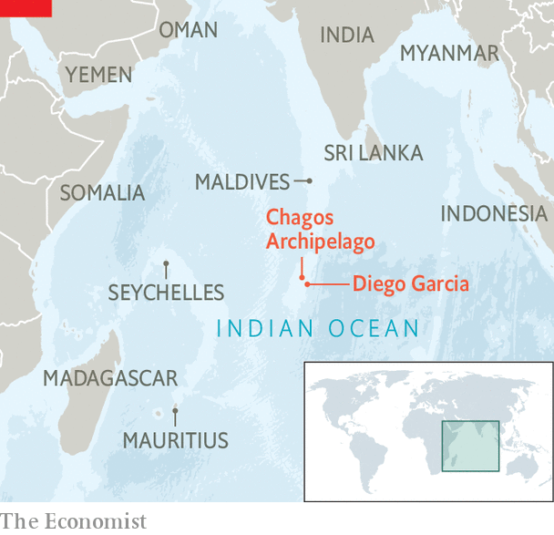

###### Ocean retreat

# Britain could soon give up its last African colony 

##### The Chagos Islands and Diego Garcia may be back in Mauritian hands again before long 

 

> Feb 13th 2023 

By the mid-1960s Britain was well into the process of dismantling its empire. But in 1965, the same year it gave up the Gambia and the Maldives, it also created a new colony. During negotiations with Mauritius over its independence, Britain carved out 58 remote islands, known as the Chagos Archipelago, for itself. These became the British Indian Ocean Territory (BIOT). Between 1968 and 1973 the islands’ population was expelled. 

Behind these decisions lay the cold war. The Chagos Islands were a strategic spot from which to maintain a presence in the Indian Ocean. Diego Garcia, the largest, was loaned by the British to the American government for use as a military base. After the 9/11 terrorist attacks the base was used by America to launch strikes on Afghanistan and Iraq; its importance is likely only to increase as America’s geopolitical competition with China intensifies. 

 


The islands’ inhabitants were initially moved to Mauritius and the Seychelles, where many of them still live. In 2002 Britain granted citizenship to those born in Chagos, and to their children; in 2022 their descendants were included, too. Around 3,000 Chagossians already live in Crawley, close to London’s Gatwick airport; authorities there are braced for up to 5,000 more to arrive now that citizenship has been offered more widely. But Britain has repeatedly denied their right to return to Chagos. That position, and Britain’s claim to the islands, have become ever harder to sustain. 

In 2017 the United Nations voted to refer to the International Court of Justice (ICJ) a case that questioned whether Britain’s decolonisation of Mauritius was complete. Only  backed Britain. In 2019 the ICJ issued an advisory opinion stating that Britain’s continued administration of Chagos constituted a “wrongful act”, and that it had an obligation to end it ”as rapidly as possible”. 

In 2021, adjudicating in a dispute between Mauritius and the Maldives, the International Tribunal on the Law of the Sea argued that “Mauritius’s sovereignty over the Chagos Archipelago can be inferred from the ICJ’s determinations”. The UN has amended its official map of the world, which since 2020 has shown Chagos as an undisputed part of Mauritius. The issue is an irritant in other contexts. When British diplomats tried to drum up support in response to Russia’s invasion of Ukraine, African leaders questioned why Britain should have the right to dislodge Russian forces while illegally occupying Chagos. 

Britain has said in the past that it would cede sovereignty only when Diego Garcia is no longer needed for defence purposes. But the government’s line is shifting. In September, during her brief stint as prime minister, Liz Truss met with Pravind Jugnauth, the prime minister of Mauritius. In November the foreign secretary, James Cleverly, announced that Britain would resolve the “exercise of sovereignty” over the Chagos “on the basis of international law”. 

Two rounds of talks have since been held. The deliberations are secret, but many expect Britain to give up its claim to Chagos. Mauritius has offered reassurances about the “unhindered operation” of the American base; those reassurances include a new 99-year lease. Britain itself could maintain a military presence on Diego Garcia until its current lease to the Americans expires, in 2036. 

A deal of this sort may not be the end of it. On February 15th Human Rights Watch, a charity, released a report accusing America and Britain of crimes against humanity towards the Chagossians; it says the islanders are due reparations from both governments. If Britain does give up the Chagos, it will not be able to , too. ■


