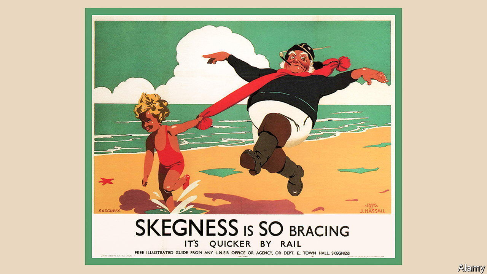

###### Hostel environment

# Britons take against asylum hotels 

##### Home Office hotels provoke a backlash from locals 

 

> Feb 16th 2023 

A Slow rain falls over the Sun Hotel; an unpleasurably brisk wind whips along the Pleasure Beach; the Sea View Pub offers nothing of the kind; and Skegness’s “No.1 Fun Pub” is shut and shuttered. No one is visibly having any fun anywhere. The northern seaside town of Skegness has long been famous for offering pleasures that are at best muted—as even it acknowledges. Its famous slogan, coined in its Edwardian heyday, reads less like a boast than a confession, or perhaps a threat: “Skegness is SO bracing.” 

Skegness is also so cross. Around 200-230 , many from Iran, Iraq and Eritrea, are being housed by the Home Office in five of the town’s guesthouses. This is not unusual: 45,000 asylum-seekers have been housed over the winter in a variety of British hotels, from the Suites Hotel &amp; Spa in Knowsley, Merseyside (“the only 4-star hotel in the North West where everyone gets a Suite!”) to a Hilton in the wilds of north Wales (“A stylish stay in beautiful Snowdonia”). 

The arrangement is a useful stopgap both for a government that is struggling to cope with rising asylum claims, and for hotels that are keen to fill off-season rooms. But it is costly both financially—the government’s daily hotel bill for asylum-seekers is now £6.8m ($8.3m)—and politically. On February 10th far-right protesters gathered outside that hotel in Knowsley; a police van was set alight in the ensuing disorder. Asylum-seekers there have described themselves as “shocked” and “afraid” in the wake of the violence.

The mood in Skegness is much less inflammatory but still unenthusiastic. Skegness is “always the butt of everyone’s jokes”, says Ian Gardner, who runs the Balmoral guesthouse in the town. If people see it as being “overrun” by asylum-seekers then they might “think ‘I’ll try somewhere else this year’”. 

Levels of crossness and quantities of migrants do not necessarily go together. The Home Office has put some asylum-seekers in places such as Snowdonia, Merseyside and Skegness (which has received more since a refugee-processing centre in Kent closed at the end of 2022), but many other areas house far more. “Some constituencies literally have thousands,” says Matt Warman, Skegness’s Conservative MP. Yet because the total number of hotels in the town is small, says Mr Warman, the effect of those few migrants on the public mood is “disproportionate”. 

It is worth being cautious about that word “hotel”, however, with its connotations of crisp white sheets and attentive concierges. That is misleading. Asylum hotels are often closer to prisons with pebbledash. Front doors are shut and locked; net curtains are drawn; a “NO VACANCY” sign flashes in one window. Ring the bell and you will find the door answered not by an eager bellhop but by a security guard in black; he is very unlikely to invite you in for canapés. 

All this is nonetheless too much luxury for some. In Merseyside a far-right group is reported to have distributed leaflets lamenting “5-star hotels for migrants whilst Brits freeze”. In Skegness one elderly lady recalls with satisfaction that she recently steered her shopping trolley into some asylum-seekers who were standing in her way and had not moved upon request. She thinks Britain should “send them all home”. Bracing is one word for it. ■


