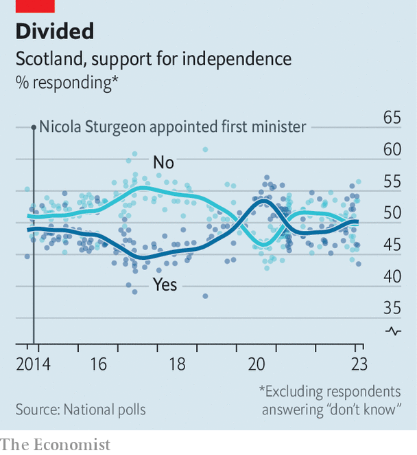

###### Sturgeon goes

# Nicola Sturgeon leaves with Scotland split in two 

##### That is a mark of both triumph and failure 

 

> Feb 15th 2023 

When Nicola Sturgeon joined the Scottish National Party (SNP) as a 16-year-old schoolgirl, the party was a minnow and the prospect of independence a . It held two seats in the Westminster Parliament. No more than a third of Scots supported divorce.

On February 15th, at the age of 52, Ms Sturgeon said she was resigning as first minister of Scotland and as the head of the dominant party in Scottish politics. The SNP has governed since 2007; she has been first minister since 2014. The party holds 45 of 59 Scottish seats in Westminster. In polling it still consistently commands the support of around 45% of the Scottish electorate. The numbers ebb and flow but roughly half of Scots favour independence. It is so much, and yet much too little. 

 


Such a solid electoral bloc in favour of independence is not a given. After the  went decisively in favour of the union, support for breaking away might have fizzled. Instead, Ms Sturgeon ensured the question remained the dominant divide of Scottish politics; SNP membership surged on her watch. 

Scots now hold their views on the constitution more firmly than any party identification, note Ailsa Henderson and her colleagues in “The Referendum that Changed a Nation”, a new study of the consequences of the 2014 vote. It predicts how they feel about much else: rejoining the EU, the performance of the Scottish government and even Scotland’s readiness for another bout of covid-19. Scotland is two nations, riven by one issue. Three-quarters of independence supporters say they could never vote Conservative. Six in ten unionists say they could never vote SNP. 

That big block of entrenched support is Ms Sturgeon’s legacy but it is also her failure. She could not lift support for independence to a level that would force Westminster to accede to demands for a second referendum. A large nationalist movement created an equally large and determined unionist one. Public debate became bitter and toxic; Ms Sturgeon did too little to temper it. In her resignation statement, she acknowledged she was part of the problem: Scottish public opinion about her is too polarised to widen separatism’s appeal. It will require someone else “to reach across the divide in Scottish politics”.

Ms Sturgeon pioneered a form of liberal populism. Liberal, because her idea of an independent Scotland was Europhile and socially democratic—more Scandinavian than British. The SNP has always cast Scotland as essentially different to Tory England. The vote for Brexit in 2016 and the ascent of Boris Johnson to Downing Street seemed only to sharpen the divide. During the covid pandemic, her stable, unflashy leadership saw support for independence temporarily surge and won admirers in liberal England who were tired of Mr Johnson’s chaos. 

But populist, because in the years since the referendum of 2014 the case for Scottish independence has still not been fleshed out. Fundamental questions, such as how an independent Scotland would switch to a new currency, remain unanswered. The movement still relies heavily on appeals to national pride, denunciations of Tory perfidy and the rhetorical ju-jitsu in which Ms Sturgeon is a black-belt. 

That tendency has worsened in the final months of her time in office, as the road to independence became steeper. In November 2022 the Supreme Court in London ruled that the Scottish Parliament could not unilaterally legislate for an . Ms Sturgeon bowed to activists’ pressure for a more radical strategy and announced that the next general election would be a de facto referendum. The SNP was Scotland’s “democracy movement”, she declared. A good many unionists, who had rejected independence in a referendum eight years before, regard themselves as no less democratic. 

More recently, when a bill passed by the Scottish Parliament to make it easier for people to change their gender in law was vetoed by the Scottish secretary in Westminster, Ms Sturgeon accused him of behaving like a “governor-general”. Allusions to colonialism are the preserve of the  of the movement. If Ms Sturgeon had hoped this issue would deepen the rift between Scotland and England, the plan backfired: the gender-recognition measures were opposed by large majorities of both Scots overall and of SNP voters. Her hold on the party weakened. 

She will leave office once a successor has been chosen. There is no obvious heir; she admits herself that her cabinet may have been “eclipsed”. Some 47% of SNP voters, and 57% of all Scots, say they “don’t know” who should follow her, according to a survey conducted in October by Savanta, a pollster. Kate Forbes, the incumbent finance minister, is an early favourite. 

Scotland’s public services ought to be top of their in-tray. Scotland used to score well above other rich countries in the education rankings; now its performance is distinctly average. It has fallen behind England in both maths and English, according to the PISA rankings, where teenagers sit a standardised test. Waits in accident-and-emergency departments are gruelling on both sides of the border.

But the contest to succeed Ms Sturgeon is likely to be dominated by the question of how to break the independence deadlock. The SNP was scheduled to meet for a special conference to fine-tune the de facto referendum plan in March; Ms Sturgeon says that is all now for her successor to decide. A rift may widen between activists who are impatient to push along this path and some MPs who fear the gambit will sorely test the patience of Scots.

The biggest beneficiary of Ms Sturgeon’s decision lives south of the border: Sir Keir Starmer, Labour’s leader. If the SNP is now weakened by the loss of its outstanding political figure, he will hope to convince nationalist voters that a Labour government, rather than independence, is the fastest route to displacing the Tories in Westminster. And if a referendum on Scottish independence appears a more distant prospect, English voters may feel less worried about a Labour government doing back-room deals with the SNP in order to hold power. Sir Keir has paid generous tribute to Ms Sturgeon’s years in office. But a great void has suddenly opened up in Scottish politics, and he would like to fill it. ■


