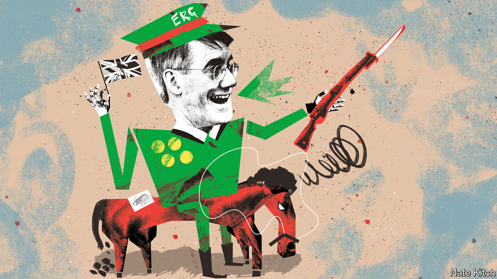

###### Bagehot

# The Brexit Re-enactment Society 

##### By threatening to rip up EU law, Parliament is reliving past blunders 

 

> Feb 14th 2023 

Historical re-enactment is a popular pastime in Britain. Caps, tunics and boots are recreated with loving care; only the paunches and wheezing dismounts of the combatants intrude on the illusion. Fans of the genre should make their way to the public gallery of the House of Lords this month. Their lordships are reluctant participants in a faithful recreation of the events of spring 2017, when, in a headlong charge, Parliament legislated to begin the Brexit process and the invoking of the EU’s exit clause. 

The House of Lords is scrutinising the Retained EU Law (Revocation and Reform) Bill, an extraordinary attempt to scrub out European law at a stroke. Lawmakers know that the bill is dangerous, wasteful and, as Lord Liddle, a Labour peer, puts it, “one of the silliest pieces of legislation ever to come before Parliament”. All the same, it cleared the Commons with only minor technical amendments, and is likely to become law. That sense of vertiginous unease is back. Parliament is again galloping towards an avoidable blunder. Welcome to the Brexit Re-enactment Society. 

The bill is the legacy of Jacob Rees-Mogg, Boris Johnson’s business secretary. Though he now sits on the backbenches, his creation has survived the fall of two prime ministers. The bill seeks to undo a careful settlement. When Britain left the EU, the legal chaos that might have followed was averted through a Herculean effort. The great body of European law was preserved in the domestic statute book and refashioned for a stand-alone country through 80,000 legal amendments. The idea was that Parliament would then gradually lay new British laws over old European ones, as it crafted its own regulatory regimes.

Instead, Mr Rees-Mogg’s bill will liquidate the whole lot. At midnight on December 31st 2023, this body of retained EU law will be revoked; before then, ministers will be granted sweeping powers to preserve what they like or to amend legislation as they see fit. It is like lighting a fire in a library, and handing the librarians a photocopier and marker pen to save what they can.

Since ministers don’t precisely know how many laws are in scope—at least 3,700, but maybe more—scores could be revoked inadvertently. The bill hands the executive broad powers to make laws, with little clue as to how that power might be used. Courts will be encouraged to disregard old case law based on European statutes; the Treasury fears it could lose billions in tax challenges if the definition of “business” is reopened. The proposed law will not be a vehicle for regulatory nimbleness, as ministers claim, but an almighty time-sink. America and Europe will spend the year writing the rules of the future, on semiconductors and artificial intelligence; Britain is poised to bury itself in last century’s laws on pig meat, coal and steel.

Why does such a transparently bad bill stand such a good chance of being passed? Partly because of the vanity of those for whom the battle to leave the EU was the highlight of their careers, and who hanker to relive it. And partly because Parliament itself is imprisoned by the shrill, revolutionary politics of Brexit. The 2016 referendum and the schism that followed traumatised parliamentarians who still fear being accused of defying the popular will. 

Mr Rees-Mogg says that retained EU law is alien, and dismisses critics as opponents of Brexit itself. He has a re-enactor’s eye for detail, and his bill carefully recreates some of the most damaging features of the Brexit process. The use of a blunt deadline is the most obvious. When Britain  in 2017, it set in train a two-year countdown with a gaping legal vacuum at the end of it. That stacked the negotiation to the EU’s advantage and sent British politics into meltdown. A sane country would never allow itself to be put in such a vice again. Yet because ministers regard the end-of-year deadline as a means of shocking Whitehall into action, Britain is poised to inflict this instrument of torture on itself a second time, quite voluntarily. 

The Retained EU Law Bill was propelled through the Commons with a familiar mix of terror and irresponsibility. Rishi Sunak, the prime minister, today reprises the role of Theresa May, by adopting the policies of the Eurosceptic right to whom he owes his majority. As in 2017, moderate Conservative MPs can see a looming crunch but fear splitting their party further. As in 2017, civil servants will be left to pick up the pieces; if they fail, they are the ones who will get it in the neck. As in 2017, a blithe optimism smothers the debate: how hard can sifting a few laws be? To be a gloomster is still the worst sin in the Tory party. 

Theirs is to reason why

Many MPs hope the Lords will do their job for them. They may be disappointed. The Lords are empowered to make amendments and delay bills, and could send the bill into a lengthy tug-of-war with the Commons. Proposed Lords amendments include pushing the revocation date back by years and excluding fields of law from the threat of deletion. But the Labour Party is also wary of being painted as opposing Brexit and has little incentive to save Mr Sunak’s government from a quagmire of its own making. The majority for more radical surgery in the Lords may not be there; Labour’s more modest proposal is to give the Commons a final say before laws are axed. As in 2017, the Lords may find themselves alarmed but paralysed.

That would be a terrible mistake. It is for egregious bills such as this that a revising chamber exists. A parliament that passes a bad law today for fear of being out of step with public opinion from 2017 would find itself at odds with public opinion in 2023. There is no flag-waving crowd of Brexiteers at the gates; a clear majority of Britons thinks the decision to leave was a mistake. Throttling this bill would break the spell of the Brexit years, which causes sound politicians to surrender their judgment. Parliament would start thinking for itself again. Mr Rees-Mogg may wish to recreate yesterday’s cavalry charge. It is time for others to draw in the reins. ■


