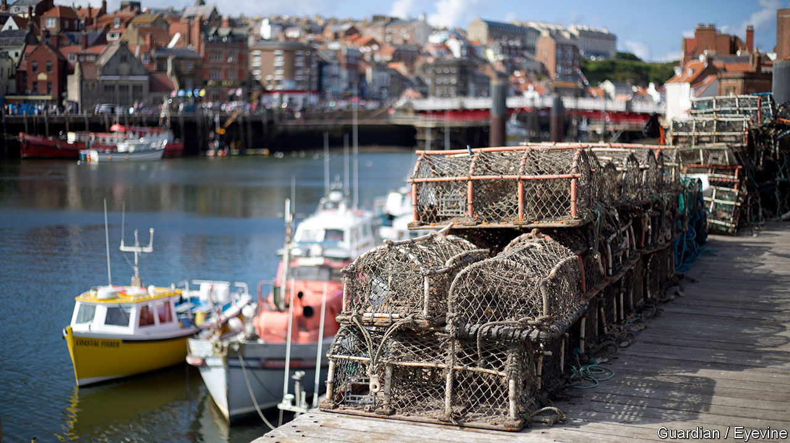

###### A marine puzzle

# The mystery of the twitching crabs 

##### A new pathogen is the most likely cause of a die-off in north-east England 

 

> Feb 16th 2023 

“There’s still nowt to catch,” says Stan Rennie, a 61-year-old fisherman from Hartlepool. “We’ve never seen the like of it.” In October 2021 thousands of crabs—along with lobsters, whelks, razor clams and krill—began washing up dead on the coast of north-east England. Locals such as Mr Rennie, who has fished there since he was 13, call it “the die-off”.

The north-east coast is one of Britain’s main , particularly for shellfish, which are mostly caught close to shore. Several of the ports along a 70-km stretch around the mouth of the River Tees have seen much of this catch vanish. 

Marine die-offs are tricky to investigate, and 15 months in Teesside’s crabs are proving a particularly difficult case to crack. The first theory tentatively suggested by the Department for the Environment, Food and Rural Affairs (Defra) was “algal bloom”—when vast clusters of phytoplankton starve sea life of oxygen. But blooms tend to be seasonal, so could not explain why smaller wash-ups continued throughout 2022 nor why many crabs were found twitching. 

Local fishermen paid for their own study, which produced a second theory: that crabs were being poisoned by chemicals like pyridine, which had been stored in sediment following decades of industrial activity on the Tees and then released by dredging. Labour MPs and councillors accused Ben Houchen, the pugnacious Tory mayor of Teesside, of recklessly expanding the local . Mr Houchen said they were using fishermen as “pawns”. 

Last month Defra published a new report from its “crustacean mortality expert panel”, a group of scientists and industry experts. It concluded that both algal bloom and pyridine were “unlikely” and “very unlikely” causes of the die-off, respectively; it found no evidence of a link to dredging, either. Instead it pointed the finger at a third culprit, a novel pathogen. 

Most experts see the panel as credible; Mr Houchen told his critics to “follow the science”. Dredging restarted this month to create a new quay for the freeport. Yet the mystery is not yet solved. No new pathogen has yet been identified. The Defra study says only that the new theory was “more likely than not”. It also notes that several factors may have combined to “degrade the marine environment”. “Just like with covid-19, we know that marine pathogens are likely to arise in the most degraded places—and that means ex-industrial areas like Teesside,” says John Bothwell, a marine biologist at Durham University. 

If a new disease has emerged, allowing it to spread could be risky. The Defra panel points to the example of Long Island Sound, an estuary near New York, where 11m lobsters died in 1999. Lobstermen there similarly saw pollution as the cause; scientists later found a parasite was responsible. The lobster industry has never recovered. The British government could take steps to improve monitoring and remove infected crabs, some experts say. 

Urgency is lacking, however. Thérèse Coffey, the environment secretary, has said no further analysis will be done by government agencies. Academics are seeking funding for more research, but that takes time. Meanwhile, fishermen like Mr Rennie are left in limbo. On a recent trip he found no crabs but saw unusual numbers of hagfish, a slime-producing grotesque, and sea hares. “The creatures of death have taken over”, he says, “feeding on the…destruction at the bottom of the sea.” ■


