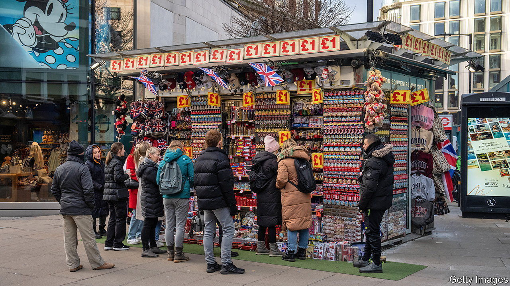
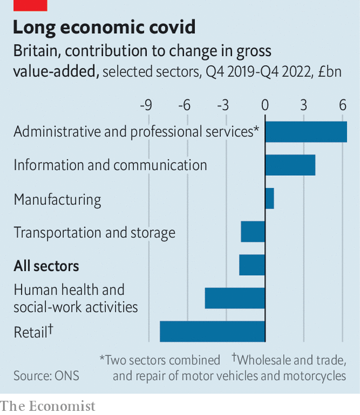

###### All hail the laptop classes

# The shape of the post-pandemic economy in Britain 

##### Tech and professional services have been the big winners. Retail, not so much 

 

> Feb 16th 2023 

Most Britons have tried to put the coronavirus pandemic behind them. Few have fond memories of the loneliness of lockdowns or the struggle to stockpile pasta. Yet the latest GDP growth figures, covering the period up until the end of December 2022, suggest the British economy will be living with the long-term effects of the pandemic for years.

Unlike the rest of its peers in the G7 group of large and rich countries, Britain’s economy was still smaller at the end of 2022 than it was before the first lockdown—0.8% smaller, to be precise, than in the final quarter of 2019. That compares with growth of 1.2% in France and 5.1% in America over the same period.  has run the rule over the GDP numbers between the final quarters of 2019 and 2022. The data show that the damage has been very unevenly distributed (see chart).

 


The big winners have been the laptop classes. The “information and communication” sector grew by 12.3% between the final quarter of 2019 and the same period in 2022, amounting to a £3.9bn ($4.7bn) increase in output after accounting for inflation. The sector includes the IT industry and telecommunications, as well Britain’s film and TV studios. The growth industry has been the IT sector, up by 20.7% since December 2019 as more activity has shifted online. (In contrast, film and TV is 9.5% smaller, largely because audiences have failed to return to the cinema after lockdowns ended.)

Britain’s mammoth professional and support-services industries, encompassing lawyers, accountants, consultants, architects and the like, together grew by £6.3bn. Over a third of that growth was due to a £2.3bn increase in output for “employment activities” alone, a subsector that includes recruiters. Post-pandemic have been good for some. Vets, a much smaller corner of Britain’s services sector, have seen a rise in output of 54%, owing to a tsunami of lockdown puppies. 

Employees in white-collar industries have been the great beneficiaries of the shift to working from home. According to data from the Office for National Statistics (ONS), around 30% of professionals and 49% of administrative and secretarial workers were working only from the office between September 2022 and January 2023. That compares with 81% of sales and customer-service representatives, and 86% of workers in caring and leisure jobs.

The long-moribund manufacturing sector (around 9% of national income) has more than recovered: output is slightly above its pre-covid level. But better performance in some areas, most notably pharmaceuticals, disguises weaknesses in others. A 35% increase in the production of  has more than offset a fall in transport-equipment manufacturing—meaning cars and other motor vehicles—of 31%. Brexit, which has raised barriers to export, is partly to blame for that decline; until recently, carmakers also had to cope with a dearth of semiconductors.

Many of the culprits for Britain’s dismal growth over the past three years have a distinctly pandemic-era flavour. Retail, which accounts for around a tenth of GDP, is the biggest loser. But its laggard status actually owes more to the cost-of-living crisis than to covid-19. During the pandemic the retail sector was helped by online sales and by British households spending their pandemic-era savings on goods rather than in shuttered restaurants and bars. But as retail prices have increased Britons have been spending more but getting less for their money. According to the ONS, the value of retail sales in December 2022 was 13% higher than three years before but retail volumes were 1.7% lower.

A similar phenomenon bedevils the public sector. Unlike many of its peers in the G7, Britain’s number-crunchers attempt to measure the volume of output the sector produces rather than the amount the government spends on it (just as it tries to measure the number of cars rolling off production lines for manufacturing). That statistical difference contributed to an unusually steep fall in British national income compared with its peers during the pandemic; other economies may still be flattered by the comparison as a result.

Although Britain is spending more than ever on health care—£212bn in 2022 compared with £160bn in 2019, by the ONS’s count—it is getting far less for its money. Health-care and social-work output was, after adjusting for inflation, £4.6bn lower in December 2022 than three years earlier. Covid plays its part. Research by Max Warner and Ben Zaranko of the Institute for Fiscal Studies, a think-tank, suggests that there are fewer hospital beds for non-covid patients than before. Patients have more complex health problems due to conditions that went untreated in the pandemic.

Transport, similarly, is showing the lingering effects of coronavirus. Output is down by around 10%. That partly reflects the disruption caused by train strikes but it is also because working from home is more embedded in the British economy than in many of its peers. According to mobility data from Google, the number of Britons in “workplaces” is still 7% below February 2020; in France there is no change from that baseline. That might, ultimately, be to Britons’ benefit, whatever the economic data say. Time saved by skipping the commute is not included in GDP figures.

Not every one of these trends will last. Audiences may yet make a full return to cinemas; retail sales should rise again if inflation continues to fall. Labour-market data, published on February 14th, suggests that a covid-era increase in the ranks of the —those who are out of work and not looking for a job—is beginning to unwind. The laptop classes, however, are here for good. ■


