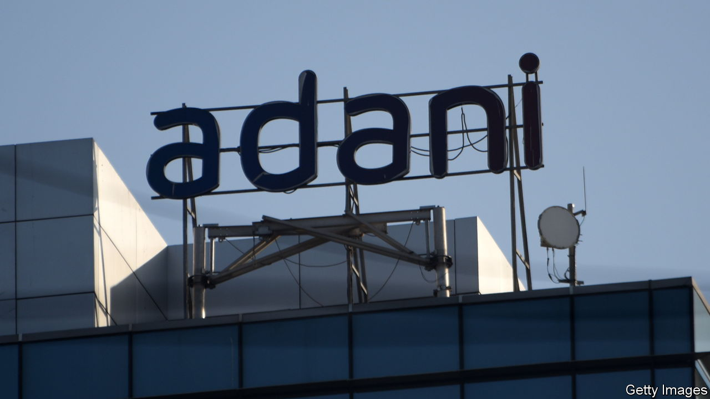
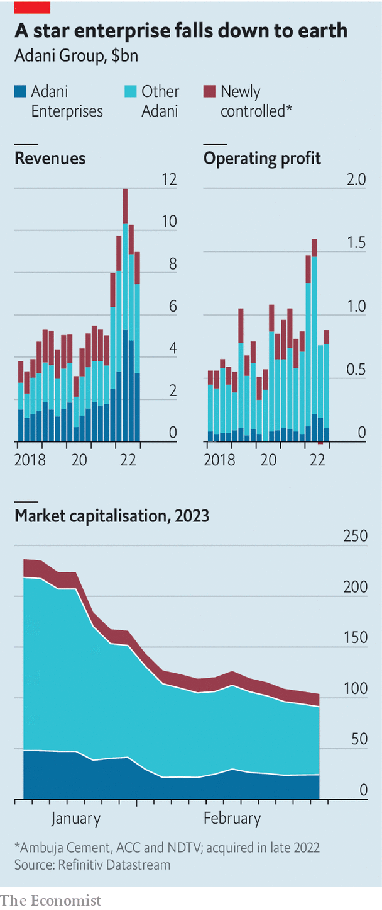

###### Adani in charts

# Adani companies’ decent earnings offer only moderate relief 

##### The Indian conglomerate is still reeling from a short-seller’s attack 

 

> Feb 16th 2023 

 


On February 14th Adani Enterprises reported robust earnings. Its ports-to-power parent conglomerate had a solid 2022. Not solid enough to reassure investors: the Indian group’s market value is down by $130bn since a short-seller accused it of fraud last month (which the group denies). Its rebuttal of the charges has slowed but not arrested the slide. To preserve cash, Adani will reportedly halt some capital spending. ■


