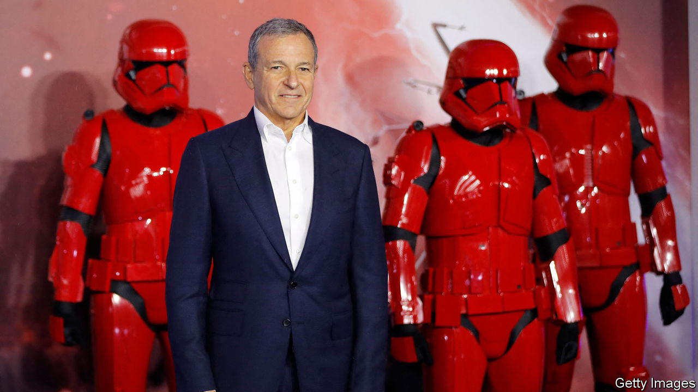
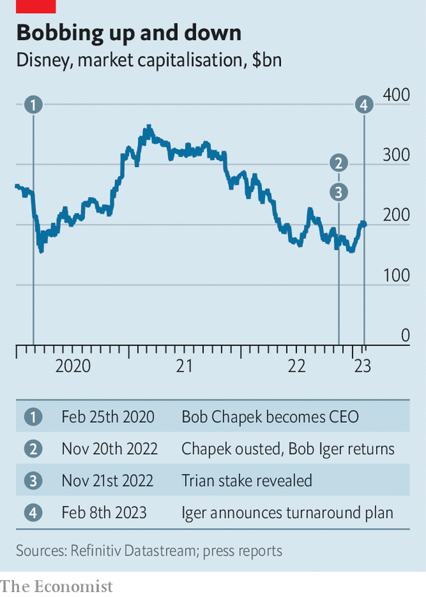

###### The Iger sanction

# Bob Iger makes big changes at Disney 

##### They are not the end of the story 

 

> Feb 16th 2023 

NELSON PELTZ is a man accustomed to winning. So when his hedge fund, Trian Partners, called off a proxy fight for a seat on Disney’s board on February 9th, it was no surrender. A day earlier Bob Iger, Disney’s newly returned CEO, announced sweeping changes to the entertainment powerhouse of the sort Trian had sought. 

A new organisational structure will shift power from bean-counters back to creative teams. That reverses the changes under Bob Chapek, whom Mr Iger hand-picked as successor in early 2020 and then replaced in November. Operating costs will be slashed by $2.5bn, with a further $3bn to be cut from content spending, together equivalent to 8% of expenses; 7,000 staff will go. To stanch financial losses at its Disney+ streaming service, in December Mr Iger raised subscription prices in America by 38%. Disney will sit out the “global arms race for subscribers”, he says. Instead, he hinted that it may license more of its catalogue to competing platforms to juice profits. To top it off, Disney will restart paying out dividends by the end of 2023.

 


For all that, Mr Iger left several key questions unanswered. The first concerns Disney’s long-term plan for streaming, which he has yet to articulate. Mr Iger has said he wants to focus on “core brands and franchises”. Their online home is Disney+. He also wants to avoid “undifferentiated” general entertainment. That is the preserve of Hulu, a streamer two-thirds-owned by Disney. Disney’s arrangement with Comcast, a cable giant that owns the remaining third, is set to expire in 2024. Hulu’s slowing growth and deteriorating margins suggest that the status quo is no longer working. Comcast’s boss indicated in September he would be open to buying Disney’s stake “if it was up for sale”. Mr Iger must decide whether to let go of Hulu’s shows, which according to Parrot Analytics, a data firm, do better than those of Disney+ with older viewers and women, or to fork over around $9bn for Comcast’s stake. 

The second unresolved question for Disney relates to another part of its media empire, ESPN. The sports network has always been an uneasy fit with Disney’s strategy, first laid out in 1957 by its founder, Walt Disney, of monetising creative franchises across several formats and distribution channels. Mr Iger’s decision to split ESPN out as a separate business unit is a tacit recognition of its awkward position. For now, Mr Iger says Disney has no intention of spinning out ESPN. That may change if the firm decides to make another big acquisition, either of Hulu or, say, in the rapidly growing market for video games. Given Disney’s hefty $40bn of net debt, proceeds from the sale of ESPN may be needed to help bankroll any deal.

That is a lot for Mr Iger to sort out in the 22 months he has left on his contract, during which he must also find an abler successor than Mr Chapek. Disney’s market value of $200bn or so is up by 19% since his return, suggesting that investors have more faith in him than they did in the other Bob (see chart). But they may trust him less than they did his younger self: the firm is still worth $60bn less than when he retired in early 2020. ■


