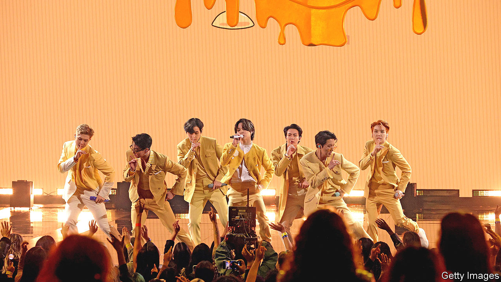

###### K-popoly

# Corporate intrigue at the heart of K-pop 

##### A takeover battle sheds light on the industry’s unusual vertical integration 

 

> Feb 16th 2023 

Fans of South Korea’s wildly successful pop industry are used to the intrigue surrounding new groups, band members’ romances and their misbehaviour. Now a new source of K-pop drama has emerged from an unexpected quarter. On February 10th HYBE, an entertainment house which represents the genre’s biggest name, BTS, agreed to buy a 14.8% stake in SM Entertainment, a rival, from its founder and former chief producer, Lee Soo-man. Mr Lee, who is no longer involved in his firm’s day-to-day business, would be left with roughly 4%, making HYBE its largest shareholder. In pursuit of an even closer tie-up, HYBE simultaneously launched a tender offer to buy another 25% at a similar premium to the shares’ market price that it is paying Mr Lee. SM Entertainment says it will resist any attempt at a hostile takeover. The stage is set for a corporate showdown worthy of any pop feud. 

HYBE and SM Entertainment are the two largest listed K-pop companies, with a combined market capitalisation of nearly $9bn. A full merger would create an industry powerhouse, capturing a large chunk of South Korea’s music-production business. SM Entertainment is particularly strong in talent-scouting. Three years ago it established its own school in Seoul, which now offers three-year courses in everything from vocals and dance to production. HYBE, for its part, dominates music distribution through Weverse, a digital platform that hosts exclusive content such as live-streamed concerts and lessons where BTS members teach foreign fans Korean.

Vertical integration is not unusual in Korean show business. JYP Entertainment, another K-pop house, has a TV-production subsidiary. YG Entertainment, another rival, runs a modelling agency. They take the raw material (an artist) and transform it into the finished products (content), using a finely tuned production process. As Lee Jang-woo of Kyungpook National University observes, this innovation strategy has a lot in common with South Korea’s high-tech manufacturing industry. K-pop firms may learn as much from conglomerates like Samsung and Hyundai as from Western labels such as Warner and Universal. 

For HYBE, combining with SM Entertainment would allow it to diversify away from BTS, notes Douglas Kim, an independent analyst of Korea Inc. This is especially important now that the supergroup has confirmed it will hit pause until 2025, while its seven members undergo the mandatory 18 months of military service. SM Entertainment’s managers may worry that an investigation from Korean trustbusters, who must review any transaction involving more than 15% of shares, could be a distraction. They would rather pursue a partnership with Kakao, a Korean internet giant to which they had just sold 9% of their firm in newly issued shares.

That may not be enough to stop HYBE. SM Entertainment’s share price is up by nearly 50% since the sale of Mr Lee’s stake to HYBE was announced, implying that investors quite like the sound of a union. ■


