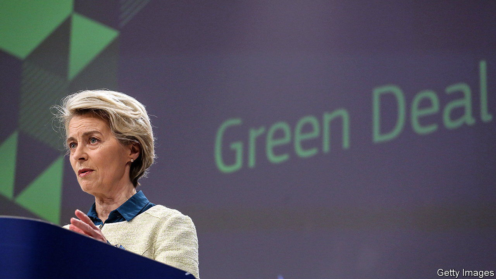
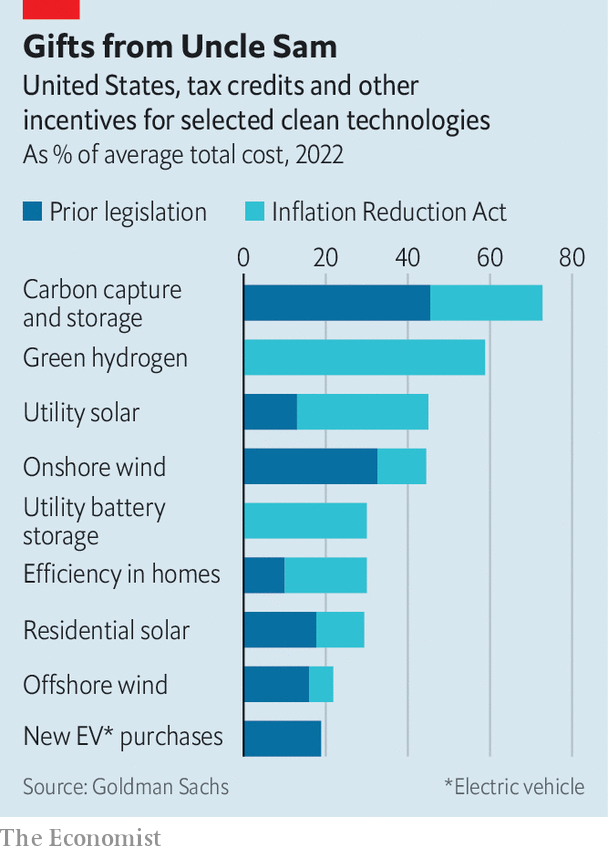

###### Shock therapy

# What European business makes of the green-subsidy race 

##### A lesson from America’s Inflation Reduction Act is that size isn’t everything 

 

> Feb 14th 2023 

Last summer European leaders began hearing a huge sucking sound. The source of the din? The Inflation Reduction Act (IRA), a 725-page law passed in August to speed up American decarbonisation. Europe’s budding clean-tech industry, they feared, would be hoovered up across the Atlantic by the promise of handouts, which amount to around $400bn over ten years. To stop this happening, some EU politicians argued, the bloc would have at the very least to match the IRA’s sums.

So far the noise has turned out to be mostly in the politicians’ heads. Worries about a green exodus have subsided. When the continent’s heads of government gathered recently in Brussels, they did not shower billions of euros more on the —which are already comparable to the IRA in their generosity. Nor did they (for now) further water down rules against state aid, which would have encouraged member states keen to splurge. Instead, they focused on making the system for doling out the cash more efficient. 

 


In the eyes of its European fans, the beauty of the IRA is less its size than its simplicity. Rules are the same all over America. Getting tax credits, grants or soft loans will be straightforward provided a firm meets the criteria, such as investing in a targeted sector. The law sets aside sums for specific technologies, such as solar energy or carbon capture and storage (see chart). Producers of “green” hydrogen, made with renewable power, can get tax credits of up to $3 per kilogram of the gas.

Replicating this set-up exactly would be unthinkable in Europe. The EU may see itself as an ever-closer union, but taxes are still a national affair, which rules out continent-wide tax incentives. If member states want to offer their own credits, or other subsidies, they typically need the approval of the European Commission, whose job it is to ensure a level playing-field in the EU’s single market. To the resulting cacophony of national schemes, the EU has recently added a few bloc-wide grant programmes, such as InvestEU and Innovation Fund, to support clean tech.

The result is jarring, particularly for smaller companies in need of funds to scale up their projects, says Craig Douglas of World Fund, a venture-capital firm, who has long experience in dealing with the EU’s subsidy bureaucracy. To have a chance at tapping one of the many pots, startups often have to hire pricey consultancies to help them write grant proposals. “We would need at least four people full-time to figure this out,” explains Vaitea Cowan, co-founder of Enapter, a maker of electrolysers, machines that produce hydrogen. 

Once an application is filed, it can take months, or years, before a decision is made. In the case of Plastic Energy, which recycles plastic waste, it once took so long that “we had to file again because the delay made us miss a deadline”, reports Carlos Monreal, its boss. Decisions tend to come without explanation. “It’s a black box. There should be a dialogue,” says Henrik Henriksson, CEO of H2 Green Steel, which is erecting a steel mill in northern Sweden powered by green hydrogen. And the EU’s green subsidies are often poorly targeted. Jules Besnainou of Cleantech for Europe, an industry body, notes that most of the money goes not to the continent’s startups, which tend to be more innovative, but to big established firms, which do not always need government support.

The commission’s draft “Green Deal Industrial Plan”, unveiled on February 1st, tries to deal with these shortcomings. The plan is meant to simplify the EU programmes and streamline the approval of national green-finance tools in Brussels. It proposes an “administratively light” auction for green-hydrogen producers: winners will receive a premium, based on their bids, for each kilogram of the gas produced over ten years. The scheme will offer incentives to the tune of €800m ($860m). The IRA has clearly shocked the EU into thinking harder about its green subsidies, says Jeromin Zettelmeyer, who heads Bruegel, a think-tank in Brussels. 

That may be so. Still, those who have read the eight pages dedicated to “speeding up access to finance”, which mention no fewer than a dozen different acronym-rich programmes, may be excused for not holding their breath. Claudio Spadacini, CEO of Energy Dome, an Italian firm which uses liquid carbon-dioxide to store energy, approves of the EU’s moves but still hopes to take advantage of the IRA. Ms Cowan of Enapter, whose firm has just built a factory in Germany, is getting lots of calls from American state governments since the IRA was passed. “They are rolling out the red carpet,” she says. Whoosh. ■


