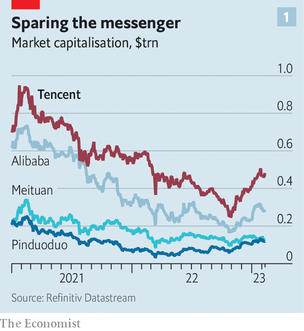
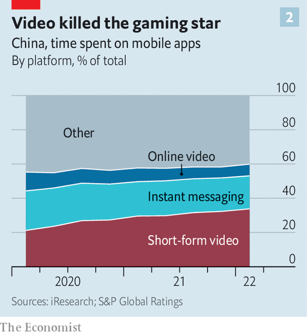

###### Up. Down. And sideways?

# What Tencent’s rebound says about prospects for China’s big tech 

##### A once unstoppable sector is getting used to a new normal 

 

> Feb 12th 2023 

PERHAPS NO COMPANY embodies the ups and downs of Chinese big tech better than its biggest tech firm of all—. Two years ago the online empire seemed unstoppable. More than a billion Chinese were using its ubiquitous services to pay, play and do much else besides. Its , such as “League of Legends”, were global hits. Tencent’s market value exceeded $900bn, and the firm was on track to become China’s first trillion-dollar company. 

Then the Communist Party said: . Xi Jinping, China’s paramount leader, decided that big tech’s side-effects, from distracted teenagers to the diversion of capital from strategic sectors such as , were unacceptable. Tencent was, along with the rest of China’s once-thriving digital industry, caught up in a sweeping 18-month crackdown. Regulators declared video games to be “spiritual opium”, and barred under-18s from playing more than three hours a week. Tencent’s new titles were held up by censors. At the same time, it was forced by trustbusters to tear down the walls of its apps to let other payment processors in. Last year it transferred all $36bn-worth of its stakes in JD.com and Meituan, two e-commerce firms, to shareholders as a dividend—in part perhaps to prop up its share price but possibly also to allay official concerns about its ubiquity. To make matters worse, Mr Xi’s draconian zero-covid policy infected Chinese consumers with a bad bout of thrift. In the third quarter of 2022 Tencent’s revenues declined by 2% year on year, its worst performance on record. By October its market capitalisation had collapsed to less than $250bn. 

 


These days things are looking up for China’s internet companies. Shoppers are “” their way out of zero-covid. Regulators are  firms’ old businesses and giving them room to toy with new ones. And Tencent, whose market value has doubled in the past three months (see chart 1), is once again the embodiment of the changing mood. If you want to understand what all this says about the future of China’s digital economy, look to its humbled champion.

Tencent has no equivalent in the West, or anywhere else outside China. It is part Meta, part PayPal, part Epic Games (in which it owns a big stake), with a bit of Amazon and SoftBank thrown in (Tencent offers e-commerce and cloud services, like the American giant, and, like the Japanese one, has made hundreds of tech investments globally). The disappointing third quarter notwithstanding, it is expected in March to report annual sales for 2022 of more than $80bn. Roughly a third each comes from gaming, business services (which include payments, e-commerce and cloud computing), and social media and advertising. Its pre-tax profit is expected handily to exceed $30bn. If you exclude banks and energy companies, which had a bumper 2022, only a handful of firms in the world did better.

The linchpin of Tencent’s riches is its WeChat super-app. Companies around the world have for years attempted to ape its astute marriage of pay (the transaction economy) and play (the attention economy). Few have succeeded in doing so as seamlessly as Tencent—and none on anything like the same scale. Last month’s  are a case in point. During the weeklong festivities WeChat users sent loved ones 4bn digital  (red envelopes that in the real world come stuffed with cash), and more people tuned in to the annual new-year gala on WeChat’s newish Channels video platform (190m) than on Douyin, TikTok’s popular Chinese sister video app (130m).

 


The new-year blowout hints at where Tencent is headed. The rise of Douyin has, like that of , pushed digital life towards short-video sharing. In the past year the average Chinese spent more hours on such platforms than anywhere else online (see chart 2). Short-video apps are becoming the centre of China’s attention economy—and of its digital-ads business, which generated $35bn in sales in the third quarter of 2022, according to Bernstein, a broker. Between July and September short-video platforms claimed a quarter of those ad dollars; their ad sales jumped by 34%, year on year. 

Tencent is eyeing a slug of that growth. The ranks of Channels users trebled last year, it says. Although it declines to give a total figure, its new-year-gala streaming tally suggests they now number in the hundreds of millions. Tencent occasionally hires big names to draw in new viewers; last June the Backstreet Boys, an American pop group, entertained 44m fans at a Channels concert. But it has adopted a more ecumenical approach to talent than Douyin. Content creators with as few as ten followers can get a slice of Channels’ ad revenues. On Douyin, they need 10,000 fans to start earning money this way. Tencent hopes its strategy will attract more up-and-comers, more viewers—and more advertisers. The firm could bring in another 30bn yuan ($4.4bn) in ad sales within a few years, reckons Robin Zhu of Bernstein.

Tencent is reorienting the “transaction” parts of the WeChat economy around Channels, too. Notably, it is equipping the platform for “social commerce”. This , which combines live-streamed shows with shopping, is expected to fuel $720bn-worth of transactions this year. Here, too, short-video apps are taking market share from incumbents, such as JD.com and China’s biggest e-emporium, Alibaba. 

Tencent used to steer clear of this business, perhaps worried that its entry would hurt the value of its stake in JD.com. Rid of it, Tencent has appeared much more willing to try its luck in online shopping. It will not disclose how much money changes hands on its e-commerce platform. But, it says, the figure ballooned nine-fold, year on year, in 2022. WeChat Pay takes its usual 0.6% cut from each transaction. And despite the government’s edict on letting in rival payments systems, most transactions on WeChat involve WeChat Pay: both Tencent and Alibaba, which operates the other popular service, have made cross-platform payments possible but cumbersome. 

The shift to Channels is crucial for Tencent. The authorities’ anti-gaming stance makes it urgent to look elsewhere for growth. , recently described Channels as “the hope of the company”. Its recent success suggests this hope might not be forlorn. Tencent’s share of revenues from its non-gaming businesses has been edging up. But to thrive in the new normal, where the government has put limits on some digital activities, and stands all too ready to place more, Tencent must deal with three challenges—as will China’s other digital giants. 

The first of these has to do with ensuring a nimble company culture that can adjust to the new reality. As tech founders go, Mr Ma is low-key and laid-back. This has empowered subordinates, such as WeChat’s creator, Allen Zhang, and led to many successful businesses. But it also introduces friction when those subordinates have different ideas. Mr Zhang, for instance, has resisted the app’s encroaching commercialisation, fearing it will spoil the user experience. As a result, WeChat’s home screen has remained unchanged for a decade and accessing videos on Channels requires two taps—not a chore, but a drag compared with Douyin, which plies you with clips as soon as you open the app. The same resistance to change explains why the e-commerce operations, too, will be rolled out only gradually, notes Clifford Kurz of S&amp;P Global, a research firm.

Any foot-dragging could prove a problem, considering that tech firms will find themselves competing with each other more—the second challenge. Mr Xi’s techlash has bulldozed the playing-field in swathes of the digital economy. This is creating new rivalries. Meituan is pushing from food delivery into ride-hailing and e-thrift-stores, which have been the preserve of rivals such as Pinduoduo. Douyin’s owner, ByteDance, will soon launch a food-delivery service of its own and is experimenting with a messaging app that looks strikingly similar to WeChat. Alibaba, Tencent and Baidu, China’s biggest search engine, are all developing artificial-intelligence (AI) chatbots similar to , whose humanlike conversational powers have beguiled Western internet users of late.

The last thing that could trip up Tencent, or its rivals, is politics. Although it has declared the tech crackdown over, the state remains a spectral presence. It is taking small stakes in subsidiaries of the biggest tech titans, including Alibaba and, reportedly, Tencent. As Sino-Western tensions mount, closeness with the state could hurt foreign earnings, for example from Tencent’s international gaming business. At home, cyberspace, media and antitrust agencies have gained new powers—and are willing to wield them. Censorship, always part of Chinese life, is intensifying as , which could mean more delays to Tencent’s games launches. And the danger of the party paralysing a firm’s growth is ever present. On February 9th share prices of Chinese AI firms fell after state media warned that “some new concepts” (like chatbots) were getting too much attention. 

Short videos have so far been spared the party’s rod. Though they face fewer restrictions than games, this could change if Mr Xi concludes that being glued to Douyin or Channels instead, which is how young erstwhile gamers spend two-thirds of their newly free time, is not conducive to moulding good communists. 

Mr Ma has repeatedly stressed how Tencent’s universe of apps “served society” and “assisted the real economy”. Such words should be catnip to Mr Xi and his cadres. Investors are certainly purring. Yet greater competition and fickle government are likely to constrain Tencent’s prospects. In China there is no more room for digital winners—only survivors. ■


