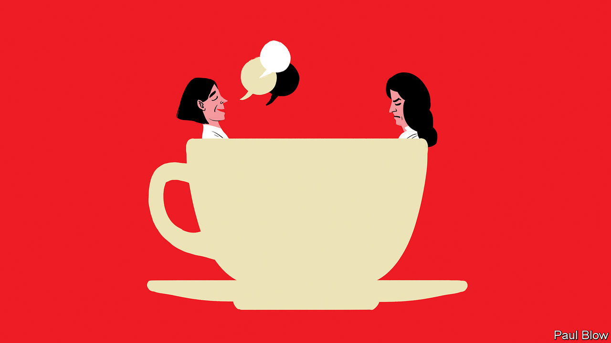

###### Bartleby

# Why it’s time to get shot of coffee meetings at work 

##### A productivity hack for the ages 

 

> Feb 16th 2023 

If people used the time they currently devote to reading books about productivity hacks to do some actual work, their productivity problem would be solved. But occasionally these books contain nuggets of wisdom. In “Time Wise”, Amantha Imber has a short chapter whose title alone gleams with good sense. It is called “Why you need to say ‘no’ to coffee meetings”. That is splendid advice for anyone who can identify with the following situation. 

An email arrives from someone you do not know, asking to meet for coffee. Such requests arrive fairly often. It might be someone starting out on their career who wants guidance on how to progress in your field. It might be a freelancer hunting for work. In this instance the sender, who is called Cassie and got your name from a colleague whom you vaguely know, thinks there may be a way for your two companies to work together. 

You don’t really want to meet Cassie. On the other hand, saying that you don’t want to meet someone, ever, feels a little rude. The meeting is weeks away, and the diary looks clear. You do drink coffee. She might be a useful contact if you want to move jobs. And you have heard of her company: it is just possible something useful might come of a discussion. You ignore instinct and say “yes”. 

The morning of the meeting arrives and you see “Coffee with Cassie” in your calendar. Who the hell is Cassie? You find the email chain, curse yourself for agreeing to meet and wonder briefly about cancelling. Just then an email arrives from Cassie saying how much she is looking forward to coffee. Bollocks. You confirm the time and place, but say you only have time for half an hour. 

You arrive at the coffee shop, and remember you have no idea what Cassie looks like. You introduce yourself to several other people, who are plainly all waiting for similarly aimless meetings, until you receive an apologetic text from Cassie to say that she is running late and will be there in five minutes. The one thing you are determined to get out of this coffee meeting is a coffee, so you order for yourself and find a table. In a victory of hope over experience you have brought a notepad: you write the date and Cassie’s name and company at the top.

You text Cassie to say that you are sitting by the man in the pink sweater, who leaves almost immediately. Ten minutes later you see someone who is scanning the room at sweater height. You mouth each other’s names like guppies in an aquarium. It’s Cassie. She goes to get her own coffee, which takes another five minutes. The coffee meeting is halfway done and there has yet to be a meeting.

Cassie sits down. Ritual demands an exchange of platitudes. You swap information that will be of no use to anyone ever: how late in the day you can drink coffee before it disrupts your sleep, how many days a week you now spend in the office, how she knows your colleague. Then you confirm things that were already known to both of you (what roles you are in) and add unnecessary detail (how long you have been in your job). 

There is now about ten minutes left on the clock. You prompt Cassie to say a bit more about those opportunities she raised back when this seemed like a good idea. She says something about a data set that you might be interested in. You say something about analytics, just because it makes you seem mildly innovative. She volleys back a reference to AI. You suspect that neither of you really knows what is going on. You are aware that the notepad in front of you is still damningly blank, so you write down “data analytics” and “AI” just to signal that this could be leading somewhere. 

Your coffee is drained and the 30 minutes have passed. You say you have to go. While you wait—and wait—to pay, you share a bit more useless information for good measure: where you are both going next, how long Cassie is in town for. You can almost feel your neurons deciding that there are no memories here that are worth forming. You both agree that it has been really good to meet, even though it hasn’t, and that you will be in touch, even though you won’t. 

Not every meeting request is a dud. Giving advice to youngsters, say, is usually the right thing to do (though the types of youngsters who ask for advice are not usually the ones who need help). The problem is the coffee. Ms Imber’s recommendation is to forgo the caffeine and schedule a call during a period of dead time such as a commute. The time may be used fruitfully; if it is not, it will not feel as wasted. In the matter of coffee and meetings, the blend is the problem.■


