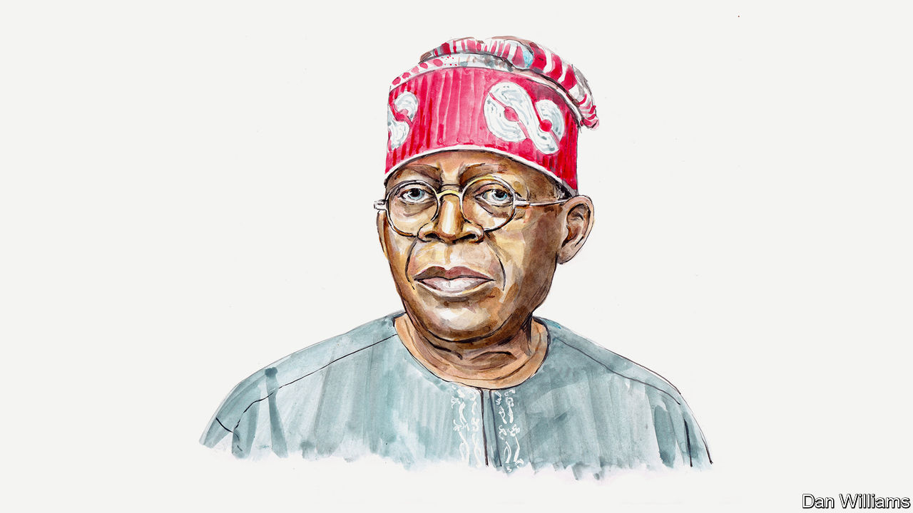

###### Nigerian politics

# Asiwaju Bola Tinubu on why he is running to be Nigeria’s president 

##### He says the country cannot depend on oil revenues for prosperity 

 

> Feb 15th 2023 

NIGERIA FACES strong economic headwinds in the wake of the coronavirus and the war in Ukraine. To compound difficulties, the Central Bank of Nigeria has dismally implemented a demonetisation policy, causing an acute cash crisis just weeks before our elections. Ordinary Nigerians are struggling to buy food and other basics.

The central bank’s governor must immediately restore liquidity in our real economy to alleviate widespread hardship. Moving forward, my country needs sound implementation of prudent economic policies. Only realism and competence will now suffice.

The ideas that form my economic programme have sound empirical foundations. Some are painfully obvious. For instance, without adding value to Nigeria’s resources before they leave our shores, we export our prosperity—our long-standing overreliance on crude oil is emblematic. We need to produce more things at home—food, manufactured goods and refined products—to provide a base for jobs and growth. 

Too often politicians make promises to capture more of the value chain domestically. They then fail to keep them. Only by creating an environment in which private enterprise can succeed will it become reality. This requires consistent policies that reassure the business community; competent government that delivers infrastructure and the public services enabling companies to lower costs; and a monetary framework and regulatory environment that incentivises investment and employment. 

For this vital task, I have a track record my competitors cannot match. During my tenure as governor of Lagos between 1999 and 2007, the state went from being a difficult, often dangerous place to a development success story. We quadrupled state tax revenues, putting those funds directly to work through investing in public services and infrastructure. A legacy of technocratic governance was instituted by enlisting talent from the private sector. Insecurity and crime were tackled through better funding the police force. Investment and the business sector thrived. Today, Lagos would rank among Africa’s ten largest economies and does not rely on oil revenues to fund its budget. 

But we cannot simply replicate Lagos’s transformation nationwide. Nigeria is complex and variegated. Recognising the strengths of each section of the country and providing the bases on which they can all thrive is the path to economic growth. I know what can be achieved when the federal government allows adequate space for regional differences so I want to devolve more powers to the states. They should have greater authority to provide services and infrastructure projects, as well as more control over law enforcement.

Overreliance on oil has distorted Nigeria’s development. A country of over 200m people cannot hinge its development on a single commodity. We must focus on industrialisation and technological innovation, especially since Nigeria is already the top African destination for startup funding. 

Low-interest loans must be channelled—through a mix of governmental institutions and private banks—towards manufacturers and small- and medium-sized ventures. Tax credits and youth employment incentives will ensure the country’s productive capacity is better utilised.

To bolster food security and dampen imported inflation, credit to farmers will be expanded through government-sponsored programs. Commodity boards will be established that guarantee minimum prices for strategic crops to increase certainty and production. At the same time, illegal foreign dumping will be fought so domestic production can compete on an even playing field. Over the next four years the share of Nigeria’s land under cultivation should rise from 44% to 65% through the creation of agricultural hubs. These include a land-clearing programme in partnership with international agri-businesses, development agencies and financial institutions focusing on Nigeria’s 12 river basins. 

Monetary policies that deter investment will be rationalised. For example, the multiple exchange-rate regime—where an official rate in effect available only to importers, exporters, and investors operates alongside a significantly higher parallel rate—must end to better align with market realities.

The squeeze on foreign reserves caused by importing fuel will be eased by increased refinery capacity due later this year, not least by the Dangote refinery located within the Lekki Free Trade Zone (created in Lagos in 2006). Under my presidency, similar zones will be established across the country to give impetus to manufacturing and industrialisation tailored to regional competitive advantages.

We will end the harmful fuel subsidy, estimated to have cost $7.5bn in the first half of 2023. The funds will be more productively used in joint investments with the private sector to create jobs in infrastructure, health care, education and agriculture. 

Nigeria has one of the world’s lowest tax-to-GDP ratios. We need not increase rates, but improve compliance by overhauling the system and deploying information technology to boost efficiency. Tied with effective delivery of public services and infrastructure, a virtuous cycle of buy-in from businesses and citizens will strengthen the social contract and place federal revenues on a more sustainable footing. 

Economic activity will be bolstered by connecting the nation through road, rail, bridges and ports—financed by the rechannelled fuel-subsidy funds, public-private partnerships and manageable public debt. This will help close the infrastructure gap that stymies growth. Moreover, we shall build infrastructure that will endure through climate change and extreme weather. 

Success in government means active stewardship of a flourishing business environment. Private enterprise shall provide the needed jobs and economic growth in Nigeria. I will deliver the platform on which the private sector and average Nigerian can succeed.

_______________


