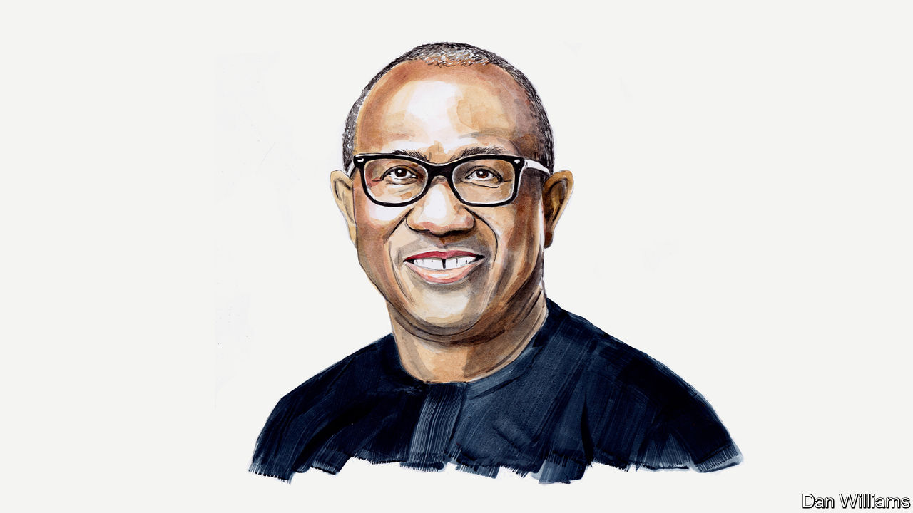

###### Nigerian politics

# Peter Obi on why he is running to be Nigeria’s president 

##### Inspired by young people, he values accountability and prudence 

 

> Feb 15th 2023 

NIGERIA WITNESSED several events last year that shook it to the core. These included militia attacks, abductions and extrajudicial killings. Terrorists stormed a state-run train heading out of Abuja, our country’s capital, and abducted scores of travellers. A militant group staged a daring prison break at a major prison in Abuja. The violence dominated headlines throughout the year, and our security agencies appeared hapless.

At the same time, our state-owned universities were shut for eight months as the union for academic staff faced off with the federal government over decades-old unmet promises. Nigeria’s crude-oil revenue plummeted from a steady average of $3bn a month in 2014 to nothing last year as oil theft rose dramatically. That is devastating for a country as dependent as Nigeria is on crude-oil sales. The structure of our economy makes such theft a matter of national security.

In response to these events, our productivity dropped, investors fled and our growth shrivelled. There’s a direct relationship between the state of our country and the quality of its leadership. Our federal government has failed to secure the country, protect our economy and secure the future of our youth.

With an estimated population of 217m sitting at the heart of Africa, a dominant youthful population made up of the brightest and bravest in the world, unlimited capacity for economic growth and the potential to lead Africa, Nigeria is worth saving. And I believe I am the right person to guide it to recovery.

Last year wasn’t all gloom. We had cheery news headlines created by our youth. Our star athlete, Tobiloba Amusan, made us proud with her record-breaking performances at the World Championships and Commonwealth Games, and an impressive outing at the African Championships. She is among the world’s best athletes and Africa’s number one in track and field. Other young Nigerians amazed with their sporting feats, too.

Nigeria should learn from the passion and dedication of its young people on the field and in the streets. Our youth have protested to show that they are tired of the status quo in leadership and are taking their country back. Their anger is not irrational. For decades, Nigeria’s political class, in collaboration with other elites, has been unimaginably corrupt and reckless with the management of the country. And a generation of politicians with narrow and dismissive views of the younger generation has ruled Nigeria for the past eight years. They have unleashed lethal force on young protesters even as the youth spoke out against the indignities of living in their own country.

The prevailing sentiment, not just among the youth but across all demographics, is that the Nigerian government is not for the people. Yet most of the politicians clamouring to take the helm this year are key players in this rejected establishment. The leaders have behaved in a manner that has eroded public trust, and it’s time to change the politicians who took part in creating this carnage. I have nothing but respect for Nigerians and a special dose for the young among them. We have an imperative to fix what’s wrong with our leadership, beginning with the recruitment process.

In a matter of days, Nigerians will be voting for their next president, who will be tasked with the responsibility of steering the country out of its current devastating predicament.

My message to Nigerians has been consistent. We must return to a culture of accountability, transparency and prudence in public office by adhering to policies and mechanisms that include rules, guidelines, codes of conduct, policies and laws designed to provide checks and balances in our systems. These include the Public Procurement Act and the Fiscal Responsibility Act of 2007, the Code of Conduct Bureau and Tribunal Act of 1991, federal financial regulations and other laws enacted for accountability across different sectors of the economy. Such acts should be, and will be, properly enforced without exception.

We must get our public services and social systems working again by giving local government authorities more independence. They should be empowered to shape and execute public policies in the 774 local government areas in the country. They should focus on improving infrastructure everywhere and expanding access to high-speed internet in both rural and urban areas. To get public systems working, we will have to address the electricity crisis in the country. We will provide a steady electricity supply by upgrading related infrastructure, passing legislation and demanding accountability in the power industry.

We must cultivate our expansive landmass, particularly in northern Nigeria, and bring about the most extensive agricultural revolution the world has ever seen. That will take investment in agricultural technologies and innovation, and the passage of legislation that upgrades and enhances agricultural production in Nigeria. What we need to create is an enabling environment for farmers and the industry to improve yield, increase access to markets and develop sophisticated supply chains.

We must deploy an economic-recovery plan that taps into our vast resources by expanding our internally generated revenues. We should move beyond our dependence on the money from oil and gas and shift from consumption to production. Our focus will be on generating revenue from technology, agriculture, renewable energy and manufacturing while promoting business investments and consumer spending.

We must entrench a culture of productivity by providing business grants and interest-free loans that enable enterprising Nigerians to contribute to our nation’s economic prosperity. They can create and run enterprises and train the next generation to create wealth. We will entrench a culture of productivity by passing laws that allocate resources to enable industries to thrive.

We must persuade our brightest young people not to leave the country by opening up the economy, promoting privatisation and creating entrepreneurial opportunities. Our startups can efficiently serve the African and global markets if we remove restrictions and bureaucracy. We will upgrade and improve our educational systems to ensure that young Nigerians have access to the best teaching and that it is fit for purpose. Science and technology will be critical to our success. We must also open old and new spaces for our women to contribute more.

We must prioritise investment in education and health care in our careful spending of tax revenue. Unaccountability, waste and corruption have left government coffers increasingly empty. That must change. In addition, adequate security and legislative measures will be implemented to end oil theft effectively. Doing all this will provide the needed resources to redress failings in education and health care.

We must tackle our security challenges through a holistic approach in four key areas: digital security, economic security, physical security and social security. The country’s borders will be secured to ensure orderly migration while strengthening local law enforcement and protecting against military threats. We will defend our country and its citizens from cybercrime by upgrading Nigeria’s digital security apparatus and protecting people’s identities.

To ensure economic security, we will protect our financial markets and trade and promote the rule of law. At the same time, we will maintain an approach to competition that creates a level playing field for all and encourages enterprise and growth. Civil liberties and citizens’ rights will be protected. These actions will remedy Nigeria’s security challenges and ensure we transition to a secure society where all can pursue happiness.

My running mate, Datti Baba-Ahmed, and I are committed to providing the kind of leadership that Nigerians yearn for: leadership that believes in the dignity of every Nigerian; leadership with the moral fibre and courage to confront the cabals holding the country hostage; leadership with a well-intentioned strategy for delivering our vision for a united Nigeria that works for all and leaves nobody behind.

Nothing gives us more hope of this possibility than the organic movement for a new Nigeria, driven by its young people, who say that they are inspired by my candidacy and message of possibilities. They call themselves the Obidients, and I am their biggest admirer. ■

_______________


