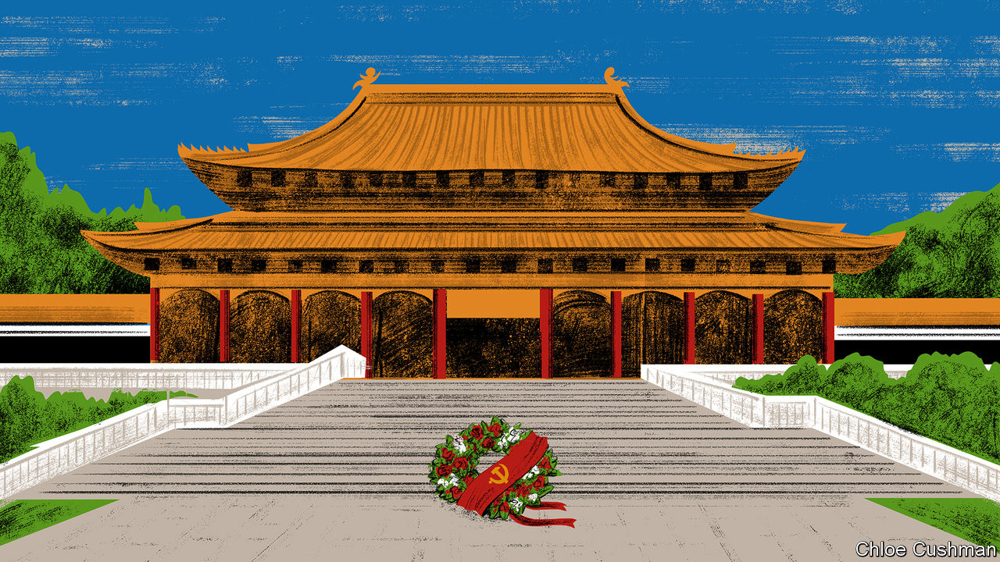

###### Chaguan

# China is losing Taiwanese heart and minds 

##### A Buddhist master’s death robs China of a champion in Taiwan 

 

> Feb 16th 2023 

When China’s Communist Party detects a chance to woo hearts and minds, it is ready to send its cadres to incongruous places. On February 12th such a mission brought dozens of senior officials to the mist-shrouded Dajue Temple, on a wooded hilltop in rural Jiangsu province. Despite the vows of atheism that bind all party members, the officials bowed their heads alongside dark-robed monks and nuns in joint homage to Master Hsing Yun, the founder of a Buddhist order with many followers on both sides of the Taiwan Strait. He died this month, aged 95.

Once, Hsing Yun’s faith made him an enemy of the Chinese revolution. With other monks and millions of fellow mainland refugees, he fled to Taiwan after the defeat of the American-backed Nationalist regime in 1949 by Chairman Mao Zedong’s Red Army. Later, the Cultural Revolution saw fanatical Red Guards ransack the Dajue Temple, where Hsing Yun began his monastic life. From his place of exile in Taiwan, the monk began to amass followers, eventually recruiting millions with a vision of Buddhism that emphasises practical acts of charity over esoteric theories. By the late 1980s his fame brought invitations to the mainland and meetings with leaders in Beijing. Soon afterwards, though, he was banned from China for several more years for helping a high-ranking official defect to the West after the student protests of June 1989.

In the past 20 years one element of Hsing Yun’s teachings came to trump all others for party bosses in Beijing: he saw Taiwan as part of China. He talked of using Buddhism to rebuild ties of faith and kinship across the Taiwan Strait that civil war broke. In 2009 he told the World Buddhist Forum that “Taiwanese are all Chinese.” To sidestep Communist Party bans on proselytising, this charitable-but-canny monk built colleges and libraries in China—and eventually restored the Dajue Temple—in the name of promoting traditional culture, not religion.

For party leaders in Beijing, securing control over Taiwan is their version of a sacred mission. Their strategy involves hearts and minds, and starts with making China vastly stronger than Taiwan, economically and militarily. As a result, it is hoped, many islanders will want to be ruled by Beijing, with a controlled dose of autonomy under the “one country, two systems” formula. Others will understand that defying China for ever—whether by trying to break away or by repeatedly electing the island’s current ruling party, the pro-independence Democratic Progressive Party (DPP)—will bring economic disaster and even attack by the People’s Liberation Army. Alas, to a growing number of Taiwanese, that hybrid appeal sounds unhappily like: “Come home to China, or China will hurt you.” It helps not at all that Hong Kong, another territory promised “one country, two systems”, has seen its Western-style freedoms snuffed out in the name of national security.

Hsing Yun will not be easily replaced. His charitable works earned him respect that bridged Taiwan’s bitter partisan divides. His funeral on the island was attended by President Tsai Ing-wen of the DPP and by the head of the opposition Kuomintang, heirs to the Nationalists who lost China in 1949. At the same time, the monk’s death was mourned by the Communist Party in Beijing. In all, he met three party chiefs, including Xi Jinping, who in 2014 assured Hsing Yun that he had read all the books the monk had previously given him. The Buddhist master responded with a near-benediction, praising Mr Xi’s “Chinese Dream”, a pledge of restored national greatness and prosperity.

Hsing Yun’s power to unify did not survive his death. China tried sending a delegation including serving and retired officials to his funeral in Taiwan, calling their mission private and humanitarian so it did not need permission from DPP authorities (with whom China’s government refuses to speak). When Taiwan denied travel permits to 12 of the group, the Chinese delegation headed to Jiangsu and the Dajue Temple for their own ceremony, accusing the DPP of “politicising” Hsing Yun’s death. Sounding a touch political itself, the Taiwan Affairs Office of China’s State Council urged “all Buddhists in Taiwan to carry on the last wishes of Master Hsing Yun” by striving for “national reunification”.

If love fails, try fear

The mainland memorial drew sincere followers of Hsing Yun, too. Chaguan was at the Dajue Temple on February 12th and met some of them. Several of these Chinese Buddhists displayed unusual empathy for ordinary Taiwanese. But they were fatalistic about the island’s future. A young believer from a nearby city recalled studies in Hong Kong, including an academic exchange on Taiwan. “I’d say 80-90% of Taiwanese people believe that Taiwan should follow the Western model of democracy,” he reported. “Those who identify as Chinese are more people of Master Hsing Yun’s generation.” Full-scale war would be disastrous, said the 30-something. But if the DPP wins again at the presidential election in 2024, he called a smaller conflict within eight years “very likely”.

A retired businessman had driven from Shanghai to pay his respects. He described a spiritual crisis in Chinese society, leading to more interest in religion. He called party officials corrupt liars, growling: “People don’t want to hear about communism. ‘Serve the people’? It’s all fake. What about covid? So many old people died.” He scorned those who call for invading Taiwan, asking: “Why would you ‘liberate’ people who are living better lives than you?” Yet he also deemed Taiwan too weak to ignore the Communist Party, urging islanders to take whatever autonomy they can get. “A small country wanting independence? That won’t work.”

It is a sobering thought, but China’s rulers might settle for a Taiwanese population with a similar mix of views, combining distrust of the Communist Party with a bleak calculation that it is too strong to resist. Hsing Yun and his ilk are passing away. Mr Xi’s China is increasingly quick to use threats to sway the island. From now on it seems that Taiwanese minds, not hearts, are the prize. ■


