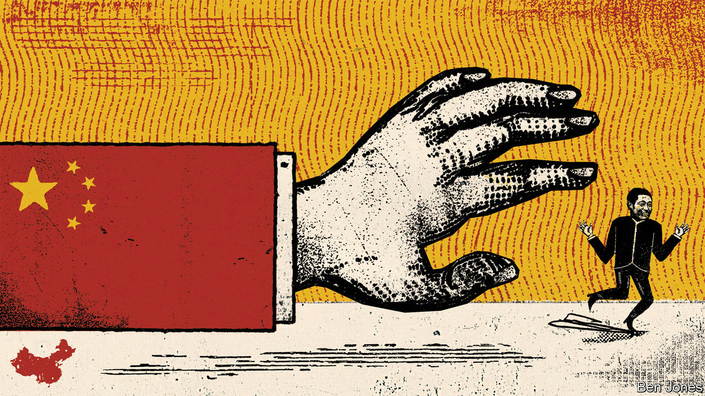

###### The other China surveillance threat

# How China’s police are ensnaring thousands of suspects abroad 

##### Under Xi Jinping, the authorities have been extending their global reach 

 

> Feb 14th 2023 

America’s Federal Bureau of Investigation (FBI) has a web page called “The China Threat”. It is often updated with links to news about the bureau’s efforts to counter it. Top of the list is the FBI’s investigation of a  that was shot down by an American fighter jet off the coast of South Carolina on February 4th. But if you look closely there are plenty of other startling areas of Chinese subterfuge and surveillance. Among the most surprising is China’s pursuit of fugitives beyond its borders. The scale of activity globally is now staggering—involving many thousands of alleged miscreants—and it is increasingly straining relations with the West.

Police forces everywhere try to enlist the help of counterparts in other countries in nabbing those on the run. But China often skirts formalities. Last October Christopher Wray, the FBI’s director, accused China of “interfering with our independent judiciary, violating both our sovereignty and the norms of police conduct to run lawless intimidation campaigns here in our backyard”. Since 2020 the FBI has charged 16 people, most of them Chinese citizens, with involvement in such activity. “We’re seeing the Chinese government resort to blackmail, threats of violence, stalking and kidnappings. They’ve actually engaged criminal organisations in the US, offering them bounties in hopes of successfully taking targets back to China,” said Mr Wray last year.

Many of the cases that the FBI and other Western law-enforcement agencies worry about involve a technique that China calls , or “persuading to return”. It is a euphemism for measures ranging from putting pressure on relatives in China to the deployment of goons to threaten suspects in the countries where they live.

Since Xi Jinping took over as China’s leader in 2012, the use of  has soared. There are two main reasons why. The first is Mr Xi’s war on graft. It has prompted the Chinese police to turn their attention overseas, thousands of corrupt officials having fled abroad. The second reason is expediency. Browbeating suspects into getting on a plane back to China can be a lot easier than enlisting police in other countries to help. Western governments have become increasingly alarmed by what they see as the infringement of sovereignty and abuse of people’s rights that  often entails. 

Launched by China in 2014, Operation Fox Hunt is a worldwide effort to repatriate people it describes as corrupt officials (the FBI says many are also wanted for political reasons). It was expanded in 2015, under the name Operation Sky Net, to cover those involved in financial crimes as well. Sky Net has secured the capture of well over 10,000 people, according to official reports. Not all of them were abroad at the time. Official data are patchy, but a report by Xinhua, a government news agency, gave a breakdown for 2018. It was a typical year, with 1,335 people seized under Sky Net. Of those, more than 29% were apprehended at the border or inside China (some fugitives return to China under new identities). Xinhua’s figures showed that of those targeted overseas,  techniques were used in over half of cases.

In several Western countries, alarm has grown following a report last year by Safeguard Defenders, a human-rights group based in Spain, that Chinese police have been setting up numerous “” abroad. Chinese officials say they are staffed by volunteers from ethnic-Chinese communities. Their declared role is to help Chinese expatriates talk to police in China about bureaucratic matters such as the renewal of their Chinese driving licences. But some of them have been involved in  operations, says Safeguard Defenders (China has dismissed such reports as “malicious hyping”). The Dutch and Irish governments have ordered the closure of offices with alleged links to Chinese police in their countries. In November Mr Wray said he was “very concerned” about the stations. One in New York has been raided by the FBI.

In 2020 the FBI brought its first case against people in America for crimes related to Operation Fox Hunt. Indictment papers against them and others who have since been arrested for similar offences accuse China of covertly sending government agents to America to carry out Fox Hunt operations. If proven, the charges would suggest that these agents like to use a variety of surrogates to do the dirty work of spying on, harassing and threatening fugitives. People recruited to help may include private detectives, relatives and friends of the target, as well as Chinese expatriates keen to show loyalty to the Chinese Communist Party.

Fishing for fraudsters

In the past two years, China has been using  techniques against a new type of Chinese criminal abroad: scammers who use telephones or the internet to con people in China out of money. The numbers targeted are far greater than those in the sights of China’s anti-corruption police, and the methods used to secure their return more overtly brutal. 

Between April 2021 and July last year about 230,000 people suspected of transnational cyber and telecoms crimes were “educated and persuaded to return to China”, according to state media. In the first nine months of 2021  secured the return of 54,000 people just from northern Myanmar, a notorious hotspot for cyber and telecoms crime.

Police in several parts of China have threatened draconian measures against family members of those staying in, or returning from, blacklisted areas abroad who fail to co-operate with investigations. In July the authorities in Wenchang, a city in the island province of Hainan, said the children of suspects would not be allowed to attend any kind of school in Wenchang’s main urban area. Suspects’ spouses, parents and children would be stripped of health-insurance benefits for major medical treatments. None of their direct relatives would be allowed to work for the state. In many places officials have spray-painted the homes of suspects’ relatives with words such as “fraudster’s family”.

In Donghai county on China’s eastern coast, the local police have offered leniency to suspects who return in the next few days from countries that are notorious as bases for scamming. They list Cambodia, Laos, Malaysia, Myanmar, the Philippines, Thailand, Turkey and the United Arab Emirates. After March 1st anyone coming back from those countries will face “severe punishment”. Penalties will include cancellation of household registration, which can render a person stateless, the freezing of bank accounts and the banning of their children—if still in China—from attending expensive schools. Those who have merely violated immigration laws in any of those countries will also be hit. Donghai’s police apparently assume that just being present in the specified countries without the right paperwork is evidence of involvement in transnational crime. 

Unlike America, most of these countries (plus Indonesia, which is named by some governments in China as another scamming hotspot) have close ties with China, including its police force. But China clearly is not content to wait for them to shut down the scammers’ operations by themselves. Online and telephone fraud causes huge public resentment in China—probably more so, day to day, than corruption. So local governments, with prodding from Beijing, are vying to show their toughness with sweeping sanctions against suspects’ families at home. 

Even in China, murmurs of discontent with  methods occasionally surface. Commentary has circulated online calling the punishment of relatives “guilt by association”. Some Chinese legal specialists have questioned the way that police make offers of leniency to those who return: how can they pre-empt what courts will decide? Why should  targets be treated any differently from those who turn themselves in to China’s police without having fled abroad? In an article in 2021 two scholars from Jilin University warned that pressure on police to achieve success in the repatriation of fugitives could easily lead to the use of “inappropriate” methods, including “threatening and terrorising” suspects and putting pressure on their relatives. Such behaviour, they wrote, had affected China’s “rule-of-law image” abroad.

It is unlikely, however, that China will try a different approach. There are no others available that achieve such results. The West’s growing distrust of China is dimming prospects for better co-operation. As a senior American law-enforcement official put it in 2020, China’s fox hunters are becoming the hunted. ■


