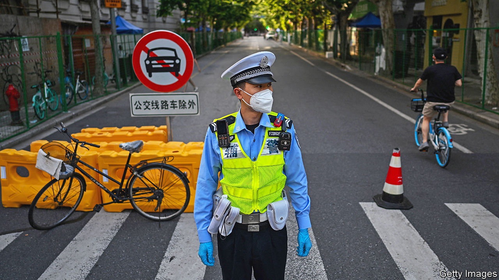

###### Your driving licence, madam?

# How much of a concern are China’s overseas police stations? 

##### Some are linked to efforts to persuade suspects to return to China 

 

> Feb 16th 2023 

A man sits behind a desk in an estate agent’s office on a busy street in Hendon, a north-western suburb of London. He seems irritated by the arrival of yet another journalist wondering whether this small, plain space—typical of high-street property firms—may have links to the Chinese police. It does not, he insists. He says the first he heard of allegations that it might was late last year, when a human-rights group based in Spain claimed that local police in China had set up dozens of “service stations” abroad, including in America, Britain, Canada and France. The address in Hendon was listed. So was that of a food-delivery business in south London and a restaurant in Glasgow. 

The human-rights group, Safeguard Defenders, says there are at least 102 such centres in 53 countries. Like several Western governments, Britain’s has expressed alarm. In late December, the property agent says, British police visited his office to ask about the matter. In New York the FBI searched an office used by a Chinese community organisation. Several other countries say they are also investigating.

The information from Safeguard Defenders draws on numerous reports circulated in China, including on the websites of state-owned media and local governments. They describe how police in three municipalities and one county in the provinces of Jiangsu, Zhejiang and Fujian have opened service stations abroad since 2016.

The reports say the centres are run by ethnic-Chinese residents of the countries concerned and are aimed at helping Chinese abroad with paperwork such as registering marriages with the Chinese authorities and renewing Chinese driving licences. The reports say the bureaucracy is conducted by police in China via video link. The Hendon address is one of 30 listed in a report by , a Communist Party-controlled newspaper in Beijing. The addresses cover 21 countries and are identified as those of police service stations. The newspaper said the list was issued by police in Fuzhou, the capital of Fujian, who gave a news conference in January last year to announce these overseas services.

There are two main questions being asked by Western governments. First, would the stations’ work, even if it is as limited as China claims, violate diplomatic conventions? The other is whether the stations may be breaking other laws, such as by harassing or threatening people who are wanted, or disliked, by the Chinese authorities. (There has been no public allegation of such activity in Britain involving Chinese stations: people at the three listed addresses deny providing services for China’s police.) A spokesman for the Dutch foreign ministry said China had not informed his government about the centres “so that makes them illegal to begin with”.

Safeguard Defenders has found reports in China’s media linking three stations in Europe—in Belgrade, Madrid and Paris—with efforts to persuade suspects to return to China. Police in Nantong, a city in Jiangsu, said last year that stations they have set up abroad have helped with the return of 80 suspects. They have not said where the fugitives were living.

Even if the stations were commonly expected to provide such help, their operations would probably focus mainly on Chinese expatriates from the Chinese jurisdiction to which they are linked. They would be unlikely to have the kind of social or business connections that would enable them to keep tabs on people from other parts of China, especially ethnic minorities such as Uyghurs or Tibetans. But among 1.7m China-born immigrants in Europe, people from Wenzhou and Qingtian—two of the jurisdictions with stations abroad—form the majority.

With such attention now focused on the stations, Chinese officials may become more cautious about using them, particularly in the West. But even if police in China had hoped the centres would play a big role in the pursuit of fugitives or monitoring of dissidents, shutting them might make little difference. Chinese officials cultivate close ties with community leaders in the Chinese diaspora—they have many contacts they can turn to for help. ■


