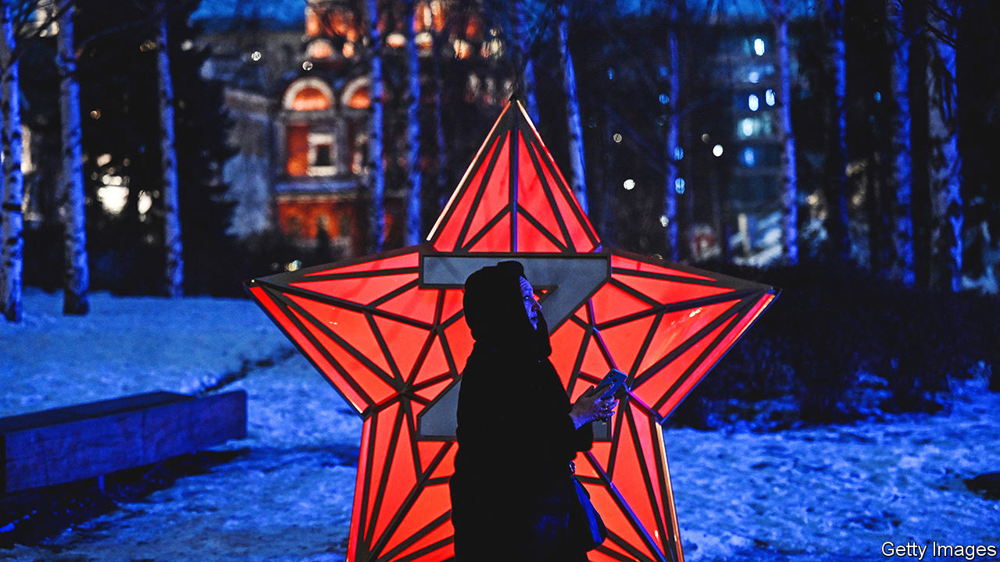

###### Russian culture in wartime

# A portrait of the Russian artist in the age of Z 

##### Repression can stifle a culture. Creating a new one is another matter 

 

> Feb 16th 2023 


In a small underground theatre in the shadows of a railway line in Moscow, a crowd has fallen into what can only be described as nervous hysterics. Individual acts of defiance are unusual in the age of Z (the  in Ukraine and the nationalist mindset that goes with it). A collective endeavour such as this appears to trigger extreme emotions. The play being performed is a comic take on a biblical classic, but the contemporary allusions are not hard to fathom. 

In a Sovietised version of Bethlehem, a paranoid, elderly autocrat is preparing for the slaughter of all young boys aged two and under. The newly born hero of the story—not Jesus in this case, but “Little Sergei”—is saved when a guardian angel warns his parents to leave for Egypt before it is too late. Audience members who have been following social media know that the real-life inspiration for Little Sergei, Serhii Podlianov from Zaporizhia, was far less fortunate. He was killed in November by a Russian missile, aged just two days old. 

Zhenya Berkovich, the play’s writer and director, is a rare breed in today’s Russia: a young creative type declining to take the heavy hints to shut up. Even as Vladimir Putin’s “special operation” struggles to make progress in Ukraine, the fear and conformity it has instilled at home mean that domestically, at least, it is yielding real results. Since February 24th last year, when the  began, authorities have used the crisis to try to yank Russian life from a Western trajectory, meddling in personal space, culture and even schools in a way not seen since the Soviet Union.

In the arts, the result has been a toxic mix of repression and preventive self-censorship. Together with a mass exodus of creative talent, this is arguably the biggest disruption to the course of Russian culture since Stalin’s “cultural revolution” saw off the avant-garde in the benighted 1930s. In a telling indication of autocracy’s limits, however, a push to foment an alternative pro-war culture has been markedly less successful.

Ms Berkovich says she is under little illusion about the reach and effects of her own work, which she describes as a “modest personal survival mechanism”. Theatre touched only a tiny part of the population at the best of times, she says. In the context of Z-Russia, writing a play that “emphasises the miracle of life” was equivalent to no more than a “mosquito dance”. She sympathises with those who think politically engaged citizens should have different priorities now. But it is not a case of choosing between  and conscience: “You should always choose both.”

Not all cultural figures share Ms Berkovich’s fierce anti-war stance. Pragmatic silence is common. A fringe of loyalists such as Valery Gergiev, a conductor, and Vladimir Mashkov, a theatre director, openly embrace the war. At the most grotesque end of the spectrum is a new wave of Z-culture, which the Kremlin has actively promoted. So far the most prominent artist to have broken into the mainstream is the musician Shaman, who has taken to performing hits such as “I’m Russian”—“I’m Russian/I go to the end/I’m Russian/My blood comes from my fa-aa-ther”—for the already war-shocked citizens of Donbas in occupied eastern Ukraine.

Some unlikely figures have also begun dabbling in the arts scene. The warlord Yevgeny Prigozhin—whose  is better known for executions by sledgehammer—has opened a “cultural” and “co-working” space in St Petersburg. On January 21st the dystopian Wagner Centre hosted the opening of a new “anti-colonialist” exhibition by Alexei Chizov, a local artist. 

The aim of the show was to emphasise “Russia’s aesthetic and ethical sovereignty”. But the confusing paintings, which depicted buff soldiers in poppy fields, left most of the visitors perplexed. Were they Wagner soldiers? (Apparently not: they were meant to be American.) One woman wondered aloud if the images were homoerotic, only to be drowned out with shouts of “Provocation!”

The comically middling talents of the pro-war culture legion have somewhat limited its impact. “The grey and talentless are trying to take the place of what the state is forbidding, but nobody wants to see it,” says Anatoly Golubovsky, a critic. The trouble, from the authorities’ point of view, is that “non-conformism happens to be better and more profitable.” And with state funding scarce amid the war, cultural institutions are prioritising the bottom line. 

The directors Dmitri Krymov, Aleksandr Molochnikov and Kirill Serebrennikov are all opposed to the war. But their plays, which are not themselves explicitly anti-war, are commercially successful and continue to be staged—albeit, absurdly, with the directors’ names removed. Bookshops still sell “Summer in a Pioneer’s Necktie”, an LGBT-themed literary blockbuster, notwithstanding a criminal case over its alleged homosexual propaganda. Meanwhile cinemas across Moscow continue secretly to show Western films such as “Avatar”, despite international sanctions and the absence of a local licence. 

Flowers in the cracks

The life that continues in the gaps suggests government control is still some way short of Soviet totalitarianism. “Russian reality is in fact a mix of off-the-scale cruelty and kindergarten idiocy, and sometimes one saves you from the other,” says Ms Berkovich. All the same, the risks of stepping outside what counts as permissible in culture are real, and growing. 

Ms Berkovich has already been threatened with prosecution. Her appearances at festivals have been cancelled at the last minute. An army of trolls has been attacking her on social media. For now, however, the director has decided against joining her creative peers in exile abroad. She sees a purpose in staying in Russia until that becomes impossible: “Putinism isn’t a geography, it’s a time. You can try to close your window to stay warm, but it will still be cold on the street outside.” ■


