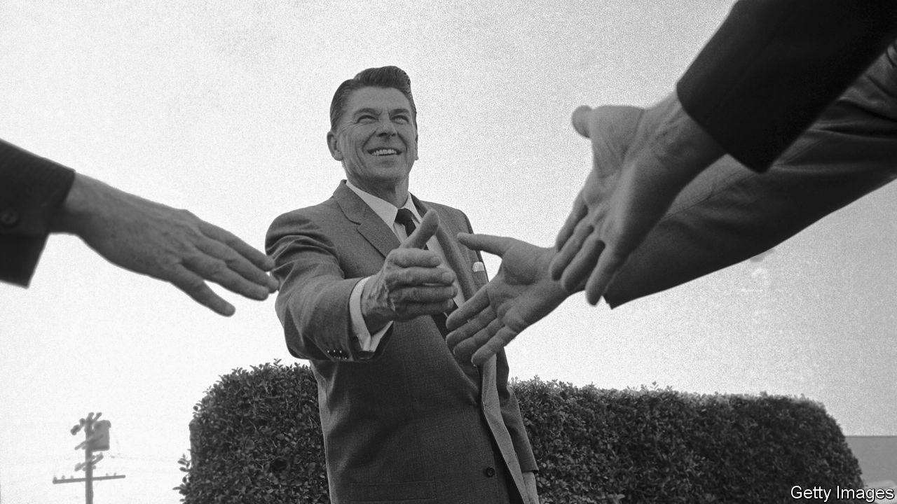

###### Business and capitalism

# American business and propaganda for free markets 

##### “The Big Myth” charts a concerted effort to shape public opinion. But did it work? 

 

> Feb 16th 2023 

 By Naomi Oreskes and Erik Conway. 

“The power of vested interests is vastly exaggerated”, wrote , “compared with the gradual encroachment of ideas.” But what if those ideas were themselves the product of decades of subtle manipulation by shadowy puppeteers? That is the argument of “The Big Myth”, a study of American attitudes to markets and government by Naomi Oreskes of Harvard and Erik Conway of the California Institute of Technology.

They begin with a richly researched account of the efforts of American businesses in the first half of the 20th century to shape public opinion on issues including child labour, utility regulation and, later, the New Deal. The campaign they sketch is closer to propaganda than mere lobbying, encompassing everything from pamphlets and radio shows to a purge of unfriendly textbooks from universities. In this way businesses advanced a vision of market fundamentalism in which any encroachment by the state was a slippery slope towards communism—and free enterprise was inseparable from the other freedoms on which America was founded.

In the end, though, child labour was outlawed, utilities were regulated and the New Deal reshaped America’s economy—suggesting that the bid to convert America to market fundamentalism was by the middle of the century looking like a flop. Greater intellectual credibility was needed, so businesses helped bankroll  and bring out “The Road to Serfdom”, his denunciation of collectivism and central planning. Moral sway was needed, so they collaborated with conservative pastors to persuade American evangelicals that Christianity and capitalism went hand-in-hand. Cultural clout was needed, too, so businesses strove to bring flattering portrayals of industry to cinema and television. 

The result, the authors argue, was a society primed for the Reagan revolution of the 1980s. After that, the book shifts into a critique of the past four decades of free-market economic policy, with particular attention to financial and environmental deregulation, the loosening of antitrust enforcement and free trade. Readers familiar with the debates on these issues will find all this less original than the preceding chapters and occasionally one-sided. Ms Oreskes and Mr Conway prescribe increased “governance” of markets, with few details as to what that means.

Nonetheless, they succeed in chronicling a concerted effort by American business to shift public opinion in favour of free markets. The question remains, though: has it worked? The authors may be right that business helped usher in the golden age of Reaganite economics. Yet America Inc has not exactly secured the people’s love. 

Just 14% of Americans say they have “a great deal” or “quite a lot” of confidence in big business, down from 34% in 1975, according to data from Gallup, a polling firm. That puts it ahead of Congress (7%) but behind the presidency (23%). (Small business enjoys a more favourable 68% of Americans’ confidence.) From the offbeat comedy “Office Space” in 1999, to Lord Business in “” of 2014, American films have continued to portray greedy corporations as villains.

Meanwhile a survey released in 2020 by Edelman, a research firm, found that 47% of Americans felt “capitalism as it exists today does more harm than good in the world”, hardly a resounding endorsement. These days American voters under 40 are about as likely to report a positive view of socialism as they are of capitalism, according to Gallup.

Sensing the , business has changed its tune. The Business Roundtable, an eminent lobby group—and a one-time champion of the view that a company’s only obligation was to its shareholders—stated to much fanfare in 2019 that firms should also look out for their customers, employees, suppliers and communities. On a jaundiced reading, that is simply a new take on an old argument: trust in business and all will be well. ■


