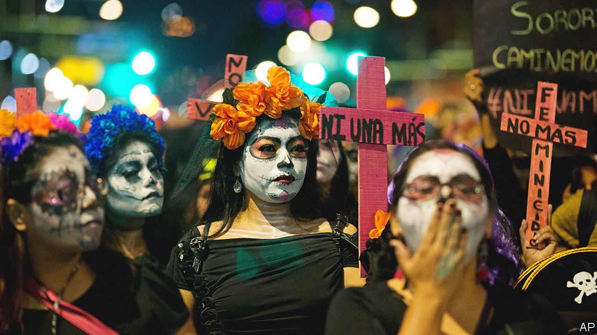

###### Femicide in Mexico

# An author reconstructs the life of her murdered sister 

##### “Liliana’s Invincible Summer” casts light on the plague of gender violence in Mexico 

 

> Feb 16th 2023 

By Cristina Rivera Garza. 

In the early hours of July 16th 1990 Liliana Rivera Garza, a 20-year-old architecture student, was murdered in her flat in Mexico City by her on-off boyfriend Ángel González Ramos. He fled and has never been found. Three decades later—or, to be specific, because the specifics matter, 29 years, three months and two days later—her sister, Cristina, arrived from her adopted home in Houston to do justice in her own way: by writing about Liliana’s life.

In 2019, when the author returned to the country of her birth, Mexico had become more cognisant of  as a phenomenon than it had been in the past. In 2012 the government made murdering a woman because of her gender a specific crime in the federal criminal code. Women’s-rights groups regularly campaign on the topic, plastering murdered women’s names over street signs. Off paper, though, too little has changed. 

Women  are killed at shocking rates by men, usually partners or former ones. But Mexico’s violence stands out. Women there are murdered at more than twice the rate of those in the United States. The level of impunity is grotesque. In 2017 less than 10% of reported murders were resolved in Mexico, compared with over 60% in the United States. Victim-blaming is strong. “If she had waited for marriage to have sex,” people whisper of Liliana. “If she had not had an abortion…” 

Anger at this lack of accountability seethes through Ms Rivera Garza’s book. Her main goal, however, is not an abstract analysis of femicide but to chronicle a life lost to it. She does so movingly.

Liliana is a good subject. She was a talented writer—it runs in the family—leaving an ample archive of notebooks, lists of songs she had listened to, letters sent and unsent and correspondence from friends, often plastered in Hello Kitty stickers. The book weaves these together with police reports, news articles and excerpts of interviews with friends and colleagues.

Ms Rivera Garza’s own writing is absorbing and poetic, only infrequently becoming overwrought. She vividly portrays the talented, adventurous student and her life in the metropolis. Liliana was vibrant and freethinking. She was loyal and direct. She thought deeply about love and relationships and how they shaded into possession. She was “always speaking to us as though she were coming from a place we were only about to set off to,” says a friend.

Too often those who  are considered weak, another facet of the blaming and shaming of victims. Nobody thought that of Liliana. Yet despite her circle of confidants, she kept to herself the grip her sometime boyfriend had on her, along with his possessiveness, jealousy and violence. There were signs, yes, but for the most part no one, not even she, would have imagined he might kill her. That is not unusual. Ms Rivera Garza refers frequently to “No Visible Bruises” by Rachel Louise Snyder, a meticulous study of the often-overlooked risk factors for women being killed by current or former partners.

The book shows powerfully that Liliana’s murder was a tragic waste of life. The reader wants more of her, for her story to continue; but that would have required that she carried on living. Instead the end is given over to the two sisters’ parents. “Liliana lay crosswise in my uterus,” their mother recalls. “I have always believed in freedom because only in freedom can we know what we are made of,” says their clear-eyed father. “Freedom is not the problem. Men are the problem—violent, arrogant, murderous men.” ■


