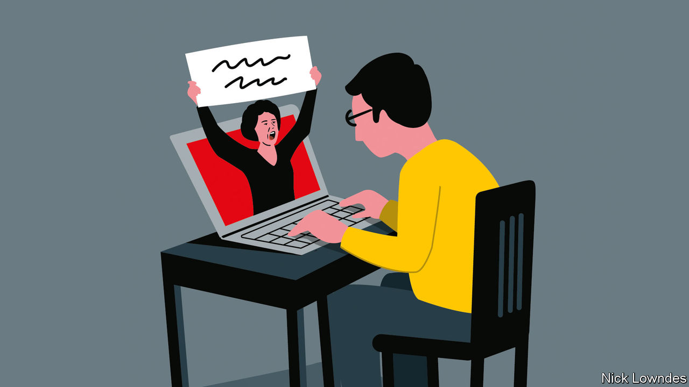

###### Johnson

# If stigma is the problem, using different words may not help 

##### New terms can take on the pejorative undertones of the ones they replace 

 

> Feb 16th 2023 

THE ASSOCIATED PRESS (ap) style book’s Twitter feed is not often a source of hilarity. But the wire service recently tweeted: “We recommend avoiding general and often dehumanising ‘the’ labels such as the poor, the mentally ill, the French, the disabled, the college-educated.” After the tweet went viral, the AP deleted it and apologised for dehumanising “the French”. 

Despite the mockery, the AP advice has solid reasoning behind it: that of “people-centred” language. English (like many other languages) allows the use of an adjective as a noun: the good, the bad, the ugly. But in contrast to some other languages, it is increasingly considered essentialising to refer to “the poor” or “the disabled”, as though they are nothing else. This especially applies to characteristics that might be considered unfortunate. The AP did not apologise to “the college-educated” as it did to the French, but it did not need to; nobody really minds being lumped in either group. The issue is essentialising combined with stigma.

Some people are also troubled by bare group nouns such as “blacks”, “gays” and “Jews”, though these too seem to be on the decline. Fortunately, it is not hard to add another word without clunking up your prose—either “people” or, even better, something descriptive as in “black veterans”, “gay activists” or “Jewish voters”. These make these phrases a bit more three-dimensional, like the people they point to.

These are far from the only ideas flowing into journalists’ inboxes today. Suggestions abound: replace “slaves” with “enslaved people”; “minorities” with “minoritised people” or “racialised people”; “addicts” with “drug users” or “people with a substance-abuse problem”; “obese people” with “people with obesity”; “convicts” or “inmates” with “those who are incarcerated”. And so on.

In each instance, the target is a term that is, or can be seen as, pejorative. The alternative is meant to be less so. But those who encourage these  face several problems.

One is that though a case can be made for each individual change, adopting every one will quickly make a piece of writing lumbering, since every new option is longer than the one it is supposed to replace. It will also make prose seem more unnatural, since the entire point is to replace words in common use with phrases that are not. Good journalism is ideally conversational and accessible, calling for a brisk and compelling style.

Changing the world is hard; changing the language is a lot easier, which is why linguistic engineering can tempt people who may feel they have no other tools at hand apart from their keyboards. But it does not seem to work out as hoped. Replacing a stigmatised word often merely results in the stigma attaching to the new word. “Retarded” was once a polite way of saying “feeble-minded”; it was in long-standing clinical use before becoming a playground insult and, ultimately, deeply offensive. “Special needs” came next, but now “special” is a mean-spirited taunt too. 

In the same vein “handicapped” was a kinder replacement for “crippled”, and “homeless” for “vagrant”. Now “handicapped” is out and “disabled” is in (or, better yet, “person with a disability”). “Unhoused” is gaining ground over “homeless”. This “euphemism treadmill” has been observed since at least the 1970s. Nevertheless, people still hope to remake the world through language. 

Some groups have taken another tack, and reclaimed older terms. “African-American” had a 30-year heyday, but now “black” is back, and even given a capital B by many. Though “hearing-impaired” is still in medical parlance, many “Deaf” people proudly refer to themselves as such, also with a capital D. Other activists have decided there is nothing wrong with being “fat”, and have wholeheartedly embraced the term. As with reclaiming , the idea seems to be that showing pride is likely to be more effective than swapping words.

As for writers,  should humanise whatever it is about, which is why stories often begin with a named person before going into causation and abstraction. If such writing is sharply as well as humanely done, it will be compelling to readers, and may even be of benefit to its subjects. To that end, the language of everyday conversation is likely to be at least as useful as the latest terminology recommended by activists. People-centred writing is indeed a good thing—but there is more than one way of putting people at its heart. ■


