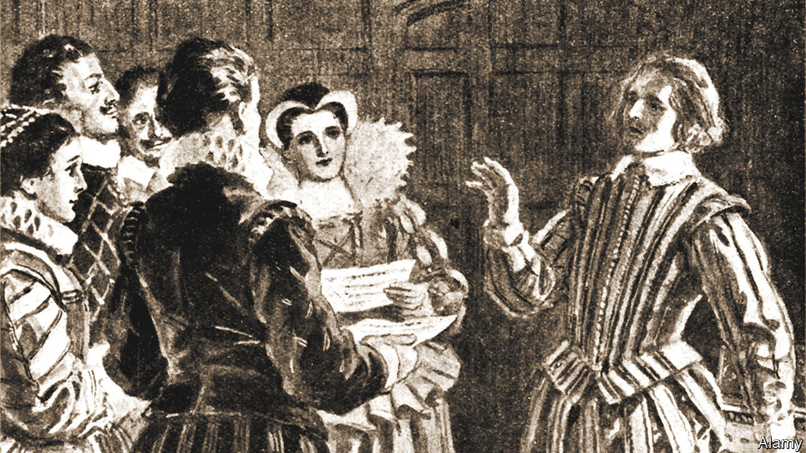

###### Home Entertainment

# William Byrd was a favourite composer of Elizabeth I 

##### Four centuries after his death, his work is being celebrated anew 

 

> Feb 16th 2023 

In 1586 a secret house party welcomed agents of a hostile power to England. Henry Garnet and Robert Southwell, two Jesuit priests, had travelled from Rome to support local Catholics and, they hoped, hasten the return of the true faith to a land ruled by the Protestant heretic . Both would be gruesomely executed, Southwell in 1595, Garnet in 1606. 

Their chief entertainer during that clandestine celebration was William Byrd: not only the finest English composer of his time but a staunch Catholic who stayed alive, prosperous and admired as cell, rack and noose menaced his co-religionists. One of several cases brought against him for “recusancy”—ie, refusal to attend Church of England services—ended in 1592 with a terse note: “Let the trial cease by order of the Queen.”

He died 400 years ago, aged around 83, in 1623. Much is known about Byrd’s life. This prodigiously gifted son of a well-off family made a big noise from an early age. After a spell as organist-choirmaster at Lincoln Cathedral he joined the Chapel Royal as a salaried court musician. By 1575 Elizabeth I had granted him and his older colleague, Thomas Tallis, a joint 21-year monopoly in music publishing. Byrd produced more than 500 pieces, ranging from ravishing church music set to texts in Latin (for private Catholic rites) and English (for Anglican services), to scores of songs and keyboard works. 

His modern biographer, Kerry McCarthy, notes that Byrd figured as one of the Catholic “usual suspects”: often in the frame for a house search or a fine when trouble brewed. Fame, and prowess, protected him . The Archbishop of Canterbury, Richard Bancroft, even gave approval to the “Gradualia” of 1605-07, a magnificent musical calendar of the traditional Catholic year. 

Byrd’s Catholic choral music bridges an English tradition of  and the emerging aesthetics of the European Counter-Reformation. The Anglican “Great Service” superbly embellishes the liturgy of a church he deemed heretical. His songs command every style of his age, from folksy to soulful. Byrd’s spectacular keyboard writing—notably in “My Lady Nevell’s Book”—dazzles and delights.

A spate of recordings will mark the 400th anniversary of Byrd’s death. A new compilation album by Stile Antico, a vocal ensemble, spans the spectrum of his choral styles. The Sixteen, a choir, has recorded Byrd’s exhilarating songbook of 1611, “Psalmes, Songs and Sonnets”, accompanied by Fretwork, a viol consort. Kit Armstrong, a young American soloist, flamboyantly plays pieces by Byrd and his Elizabethan contemporary, John Bull, on a modern piano. 

British concert halls, churches and cathedrals have also scheduled tributes to this many-sided talent, from a 24-hour “Byrd-a-thon” in Oxford to Westminster Cathedral’s commitment to perform all 109 pieces in the “Gradualia”. What Byrd called his “natural inclination and love to the art of music” sustained him through hard times and mortal dangers. This year, it will win fresh converts. ■


