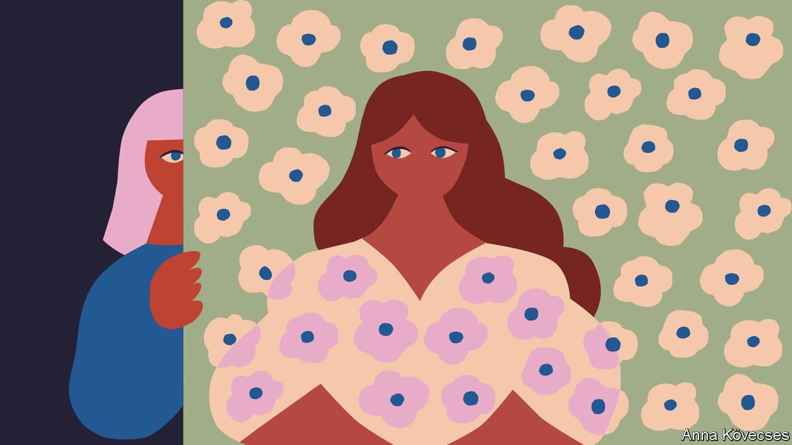

###### Psychological fiction

# “My Nemesis” is a tale of middle age, femininity and desire 

##### Charmaine Craig’s third novel is taut, bristling and psychologically profound 

 

> Feb 16th 2023 

 By Charmaine Craig.

A successful  who writes books about  and the “absurdities of middle age”, Tessa has a crush on a new friend, a philosophy professor named Charlie. Both are married, but there is a charge to their long, wine-soaked, moonlit chats whenever one visits the other, either in Los Angeles or New York. For reasons both self-serving and ostensibly feminist, Tessa takes a dim view of Charlie’s wife, Wah, who is somehow too sincere, too feminine, too subservient and wears “too floral” dresses. “I had the impression…that I could crush her if I so much as reached out too quickly,” Tessa observes. “It wasn’t right for a woman to be so fragile.”

“My Nemesis”, Charmaine Craig’s taut, bristling and psychologically profound third novel, is the story of a seductive friendship that threatens to upend two homes. But it is really about the unwieldy needs and desires of middle age, “with death looming on one side, disappointment on the other, and nothing but a Sisyphean wheel of activities supporting the structure of one’s present”. It is also about the selfish demands of creativity, “the shocks and shames of parenthood”, the sacrifices  and how love can arise from an error of perception.

Tessa is a fascinating solipsist who misunderstands herself, a feminist who holds other women in contempt, and an intellectual aggressor who likes to leave opponents bloodied. “There are times when I can’t distinguish my habit of honesty from brutality,” she concedes. Through Charlie, she experiences the invigoration of desire, which can seem unbearably enticing when life feels short and the days all somehow run together.

All this is a departure for Ms Craig. Her previous novels were lavishly detailed historical epics; “Miss Burma” (published in 2017) was longlisted for the National Book Award and the Women’s Prize for Fiction. Slimmer, punchier and more tightly wound, “My Nemesis” highlights her talent for capturing the minutiae of interpersonal drama. She dilates each moment, noticing, for example, the way Tessa’s adult daughter’s shoulders stiffen “under the reproachful tension of her delicate neck” during a fraught lunch with her mother.

Associating femininity with weakness, Tessa is repulsed by Charlie’s wistful description of Wah as “soft, feminine”. Yet she senses that there is something cruel and petulant about her own efforts to curdle Charlie’s perception of his wife. She recalls a time as a child when a neighbourhood friend asked for help stoning a crow. “It fluttered in a harrowing circle on the ground, calling to us, to anyone, for help,” Tessa remembers. Yet “the more helpless that crow had become, the worthier of death it had appeared to be.”■


