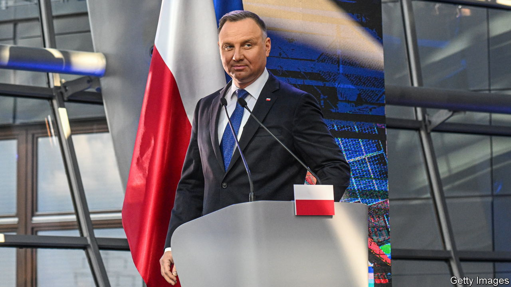

###### Judgment call

# Poland’s rule-of-law conflict with the EU is coming to a head 

##### Brussels must decide whether reforms leave politicians with too much power over judges 

 

> Feb 16th 2023 

WHEN POLAND’S justice system went after Maciej Ferek, a regional-court judge in Krakow, it used a heavy hand. In late 2021 he was suspended, his pay was cut in half and the locks on the courtroom doors were changed to keep him out. His mistake had been to challenge the changes to the judiciary which Poland’s government has made over the past eight years. These have given politicians ultimate control over appointing and dismissing judges, muzzled those who dissent and stacked the Constitutional Tribunal with cronies. 

The European Union thinks Poland’s politicisation of its judiciary violates the rule of law, which is guaranteed in the EU’s founding treaty. After years of dithering, the eu has begun to act, withholding €35bn ($37bn) in grants and loans from its pandemic relief fund until Poland rolls back some of its judicial changes. And the Poles are cracking. On February 8th Poland’s parliament passed a bill that ends sanctions against dissenting judges. It would shift the job of disciplining them from a politically appointed chamber in the Supreme Court, which the European Court of Justice (ECJ) condemned, to a less politicised arbiter, the Supreme Administrative Court. 

It is now up to Poland’s president, Andrzej Duda, to sign the bill. Yet he has first asked for a review from the very Constitutional Tribunal which the government has politicised. Infighting on that court could hold things up for months. Meanwhile, on February 15th the European Commission took Poland to the ECJ again, over a ruling by the Constitutional Tribunal that EU law does not supersede Polish law (which contravenes a founding principle of the bloc). 

Brussels seems undecided over whether the bill goes far enough. Experts say it does not. The problems run far deeper than the bodies set up to whip judges into line. In 2017 the ruling Law and Justice (PiS) party changed the law so that parliament, instead of other judges, could select members of the National Judicial Council (NCJ), which appoints and promotes judges. That renders the NCJ illegitimate, according to the European Court of Human Rights (ECHR). Yet it continues to operate and has promoted some 2,500 judges. Their verdicts are open to procedural challenge; some have been undone. Mr Ferek was suspended for querying the credentials of one such judge. “It is as if the courthouse janitor printed a verdict from my computer and signed it as a judge,” he says. 

Kees Sterk, a former president of the European Network of Councils for the Judiciary, says the NCJ is the key : “You do not need a disciplinary chamber if you have the power to appoint judges.” In a recent case the head of the court of appeal in Warsaw, who is also the top disciplinary officer for judges, replaced three veteran colleagues with less experienced ones for questioning the status of a fellow judge. “That was a  punishment,” says Bartlomiej Przymusinski, the spokesman of Iustitia, a rule-of-law group to which 40% of Polish judges belong. The ECHR has ordered their reinstatement.

Such unjustified transfers, and state media campaigns denigrating judges, have had a chilling effect. “No one in Poland is prosecuting politicians of the ruling camp for corruption scandals,” says Mr Przymusinski. Another consequence has been to further slow the sluggish wheels of Polish justice. According to government statistics, the average first-instance court case took 69% longer to settle in 2021 than in 2015, when PiS came to power. Ironically, the party claimed its reforms would speed things up. Marta Kaminska, a solicitor in Olsztyn, a city 170km north of Warsaw, says the waiting time for a hearing in cases such as divorces has lengthened by a third. 

Other European court systems are losing trust in the Polish one. Dariusz Mazur, a criminal-court judge in Krakow, says that before Dutch and Slovak judges honour European arrest warrants demanding the return of suspects to Poland, they ask him whether the judge who will preside over the case is independent. In 2021 a court in Amsterdam refused to extradite a suspected drug-trafficker for fear he would not get a fair trial in Poland. Politicised courts could spook foreign investors, who may doubt they would be granted a fair hearing against a state-backed company.

Under pressure from Brussels, Poland has reinstated most of the suspended judges in the past few months. But the number of dubiously appointed ones continues to grow. And the government’s bill may create more problems. The Supreme Administrative Court does not have a constitutional remit to discipline judges, and though it is less politicised than the Supreme Court’s disciplinary panel, roughly 30% of its judges have been appointed by the NCJ.

Poland’s main opposition party, Civic Platform, fears that if it votes against the bill it will be blamed for denying Poland its EU funds. Parliamentary elections will be held in the autumn. As for the EU, rule-of-law advocates worry that it lacks political will. The bloc’s justice commissioner, Didier Reynders, has called the bill a “promising step forward”. Ursula von der Leyen, the commission’s president, may hesitate to press a divisive case against Poland at a time when her priority is keeping Europe united against Russia. And the commission seems worried about forcing Poland to scrap measures that have not yet been explicitly condemned by the ECJ, as the disciplinary chamber was. Yet “if you only fire your artillery when you are certain you will hit, you will lose the war”, says Mr Sterk. ■

