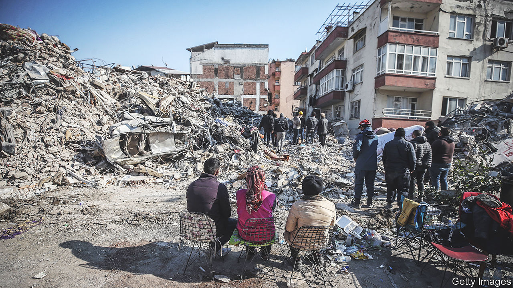

###### Building bad

# Turkey’s earthquakes show the deadly extent of construction scams 

##### The death toll has now reached 42,000, making the quakes the most lethal in the country’s modern history 

 

> Feb 12th 2023 

WHEN THE quake hit, the apartment block in Osmaniye, where Halise Sen had once lived, collapsed like a house of cards, burying her former neighbours under nine floors of concrete. Mrs Sen, the head of the local chamber of architects, looks over the wreckage. “There’s no reinforced steel here,” she says, “so the concrete lost its strength and the columns collapsed, along with the floors, as soon as the ground started to shake.” 

Mrs Sen’s husband, Mustafa, quit the construction sector years ago, and now grows olives and walnuts. Other contractors were undercutting his prices and ignoring building codes. “If we used 100 tonnes of iron in a building, they would use 90 tonnes,” he says. Osmaniye sits near . “I knew we were on the brink of catastrophe,” he says.

That catastrophe struck on February 6th, in the form of two earthquakes, of magnitudes 7.8 and 7.5, the . . At least 36,000 people are dead in Turkey. Another . More than 30,000 rescue workers, accompanied by locals and teams from dozens of countries, are working around the clock to find . 

But the rescue effort now resembles a mass exhumation. Tens of thousands of people are still thought to be buried under the wreckage. In Kahramanmaras, a city of more than 500,000, smoke from fires that broke out as a result of the quake (or were started by people trying to keep warm) envelops mounds of rubble that stretch for entire city blocks. The thickening stench of death covers Adiyaman, more than 100km to the east. A Kurdish family huddles and weeps as rescue teams pull five dead relatives from the debris. A woman faints. 

Across the region, millions of people made homeless sleep in tents provided by the country’s disaster agency, in mosques, schools, libraries or in their own cars. Few dare enter their homes. Some sleep rough. The delayed response and a shortage of equipment compounded the suffering. Teams took days to reach cities like Adiyaman. By then the voices of trapped survivors had given way to silence. 

The real culprits

Shoddy building methods, corruption and bad policymaking, components of an economy powered by construction and rent-seeking, may have caused the most deaths, however. The government of Recep Tayyip Erdogan, Turkey’s president, , analysts say. But so do its predecessors, as well as municipalities, developers and planners. “This is a perfect crime,” says Murat Guvenc, an urban planner. “Everybody has their finger in the pie.”

Turkey has strict building codes, adopted in the wake of an earthquake that killed 18,000 people on the outskirts of Istanbul in 1999 and updated five years ago. Under an urban-renewal scheme thought up by Mr Erdogan’s government, more than 3m housing units have been renewed. 

The problems lie in implementation and oversight. Building permits are easy to acquire, and inspections weak. The companies that are mandated to carry them out are paid by the developers. Projects usually comply with government standards at the start of construction, but not by the end, says Mr Guvenc. When the inspectors leave, developers may reduce the amount of iron they use or cut down on the number of stirrups, the steel loops that prevent beams and columns from buckling under pressure. They may even tack on an extra floor. Then they enter informal negotiations with local authorities. “A lot of money may end up changing hands,” says Mr Guvenc. “We are talking about corruption par excellence.” 

This means the difference between life and death. In Osmaniye, as elsewhere, most of the collapsed buildings date back to before the 1999 earthquake. But scores of new ones have also come down. A luxury housing estate completed only a decade ago in Antakya, south of Osmaniye, has entombed perhaps hundreds of people. The contractor responsible was arrested on February 11th while attempting to leave Turkey. In nearby Erzin county, however, not one building collapsed. The local mayor and his predecessor told local media that they did not allow any illegal construction. Both used the same phrase: “My conscience is clear.”

Construction amnesties, which allow owners to register unlicensed properties in exchange for a fine, made a bad situation much worse. Mr Erdogan’s government passed several such amnesties, the latest in 2018, ahead of general elections. The opposition backed the move, because it was popular with voters. The government reaped the political dividends, while millions of property owners ended up paying into state coffers and assuming the risk. A year later, Mr Erdogan appeared in Kahramanmaras, proudly announcing that the programme “had solved the problems” of 144,000 of the city’s residents. More than half of the country’s housing stock did not comply with building standards, the programme revealed.

“Look,” says Mrs Sen, pointing to what remains of her old neighbourhood, “if these buildings that were legally built and approved by the municipality at the time collapsed, then how can the illegal ones survive?” Things need to change from the top down, says her husband. Politics must stay out of urban development, supervision must dramatically improve and the patronage networks connecting the government and the construction sector must be broken up. “Otherwise,” he says, “ten years from now you’ll see the same scenes you see here somewhere else.” ■

