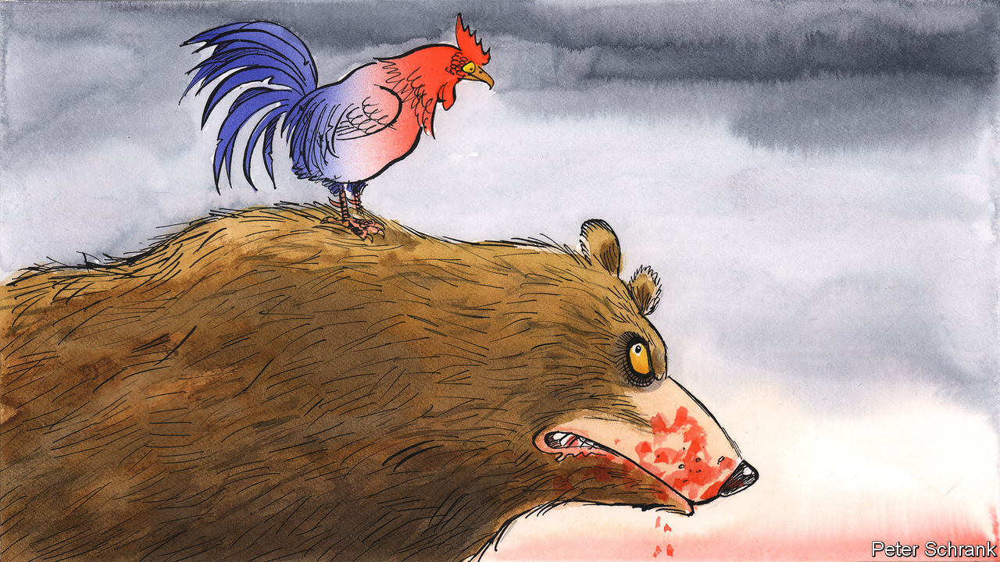

###### Charlemagne

# What’s behind France’s fatal fascination with Russia 

##### A long history helps explain why Paris has found it hard to break fully with Moscow 

 

> Feb 16th 2023 


Voltaire was so enchanted by the emerging Russian empire that he penned gushing letters to Catherine the Great. In the 1760s and 1770s the French Enlightenment thinker and the Russian empress exchanged 197 handwritten missives, all in French, a tongue favoured by the Russian nobility. Voltaire praised Catherine as an “enlightened despot”, and told her: “If I were younger, I would become Russian.” In 1773 she received Denis Diderot, another silk-stockinged , at the Court of St Petersburg. Thus Russia took its place in the French imagination as a like-minded haven of arts and letters, of the triumph of civilisation over chaos.

If Russia’s war on Ukraine exposed Germany’s industrial reliance on Moscow, it has laid bare in France a different sort of dependence: a fatal fascination with Russia. On the far left, this is a relic of the Bolshevik revolution, anti-Americanism and communism. During the cold war, the French Communist Party looked to Moscow, and dropped the hammer and sickle from its membership card only in 2013. On the far right, it stems from admiration for patriotic nationalism and authoritarian leadership. Marine Le Pen’s campaigns have been partly financed by a Russian bank.

Russia’s hold on the French imagination is not confined to the extremes. It reaches well into the parquet-floored salons of the Paris establishment. As a young man, Jacques Chirac, a former Gaullist president who sought a multipolar world to counterbalance American hegemony, translated Pushkin’s “Eugene Onegin” into French. Chirac was given Russia’s highest honour, and in turn awarded Vladimir Putin the . François Fillon, a prime minister from the centre-right, was a regular guest of Mr Putin’s. The day after the tanks rolled in, Mr Fillon gave up board positions at two Russian firms, having apparently seen the invasion of Crimea in 2014 as no obstacle to accepting the posts. 

Those who gravitated to this world comforted themselves with the thought that France’s  was neither dangerous nor grubby, but the fruit of a special cultural understanding. For nearly a decade from 2008 Alexandre Orlov, then Russia’s ambassador to Paris, entertained the Paris elite, and oversaw the construction of a glittering gold-tipped Russian Orthodox cathedral on the left bank of the Seine. When Mr Orlov published his memoirs in 2020, the preface was written by Hélène Carrère d’Encausse, the “perpetual secretary” of the Académie Française. His book, she suggested, would help readers to understand “the disarray” of Soviet Russians at the collapse of their country. 

Of course, in the arena of France’s riotous political debate, as within the hushed corridors of the diplomatic service, rival geopolitical strains compete. A reflexive sympathy for Russia is neither universal nor irresistible. François Hollande, a Socialist former president, cancelled a French contract to deliver two Mistral-class warships to Russia after it annexed Crimea. Bernard-Henri Lévy, a French philosopher for whom no battlefield goes unvisited and no white shirt unironed, has for years urged France to do more to stand up to Russian aggression in Ukraine; his latest film to this end, “Slava Ukraini”, is out on February 22nd. 

Even France’s post-war narrative of strategic equidistance between America and the Soviet Union has its share of mythology. As Benjamin Haddad, one of Emmanuel Macron’s parliamentarians, puts it, “geopolitical fascination for Russia is partly reconstructed with hindsight”: in a crisis, Charles de Gaulle stood with his transatlantic allies. As for the French people, they seem clear: three-fifths tell polls they have a positive opinion of Ukraine’s Volodymyr Zelensky, and fewer than one in ten of Mr Putin. 

This is the backdrop against which France’s diplomacy under Mr Macron should be set. It was to Versailles, where Peter the Great had travelled, that the freshly elected Mr Macron first invited Mr Putin with great pomp, lauding “the Russia that wants to open up to Europe”. More than any other European leader, the centrist French president thought that he could talk Mr Putin out of going to war, even as he massed his tanks on Ukraine’s borders and America’s spooks were warning that invasion was imminent. Almost alone, Mr Macron mused about a day when Russia might be brought into a “new European security architecture”, to keep it from falling into China’s arms. The invasion, the massacres, the bombing of civilians and children: all the unspeakable horrors of Mr Putin’s war have, over time, forced a form of bereavement on the French leader. His charm offensive failed, brutally. 

The shadow of Versailles

This is a critical moment for Mr Macron. He continues to listen both to voices counselling traditional caution and restraint, and to those urging him to take more leadership on Ukraine and to dispel illusions about a future Russia. His quest to embrace the complexity of war and peace will doubtless yield further ambiguity. The French president has not spoken to Mr Putin since September 2022, but says the lines are still open. Only two months ago he was muttering about post-war “security guarantees” for Russia. Mr Macron wants both to back Ukraine at war, and to be a mediating voice at the negotiating table when it comes to peace. 

Yet in recent weeks he has seldom sounded as clear, declaring that France is behind Ukraine “all the way to victory” and delivering more and more heavy weaponry—though not yet promising battle tanks, unlike many of his allies. “I think he has changed, and this time for real,” said none other than Mr Zelensky in  newspaper on February 8th, the day he flew into Paris from London for dinner. When the next morning the two leaders boarded the French presidential plane bound for Brussels, who should be there at the airport for a chat but the white-shirted Mr Lévy. Mr Macron’s ears are open. But ultimately, on diplomacy as on all matters, he is his own counsellor. It might be too much to expect the French president to shed his share of the country’s Russian fascination altogether; but he is moving in the right direction. ■


