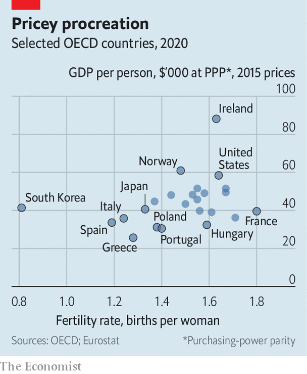
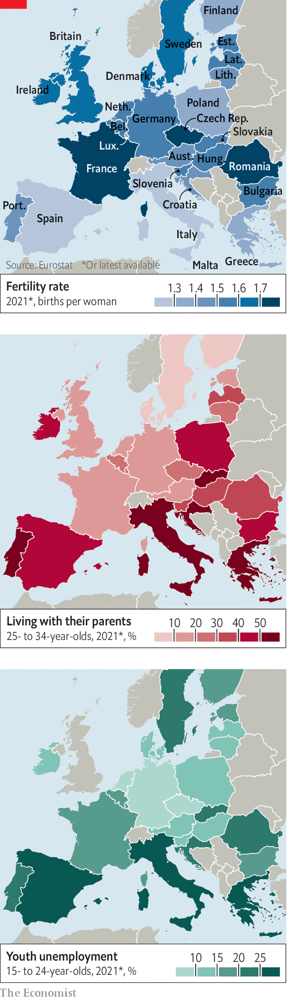

###### Baby gap

# Why there are so few babies in southern Europe 

##### It’s mostly economics 

 

> Feb 16th 2023 

The Museo degli Innocenti in Florence has an unusual name and hosts an unusual display: a collection of small broken objects, mostly medallions. They were split in two when a baby was delivered to Florence’s hospital for foundlings. Half the object, known as a , was kept at the hospital—in reality, a children’s home—while the other went to the mother. Should she wish to reclaim the child, she would have proof it was hers. Many of the children were born out of wedlock. But others were from families without the means to feed another mouth.

The are reminders of a time when Italy had an excess of births. Today, in common with many other European countries, it has hardly any. Its fertility rate (the average number of babies each Italian woman can expect to have) has dropped from 2.66 in 1964 to 1.24 in 2020. In one region, Sardinia, it is below 1. This makes Italy part of a band of ultra-low fertility across southern Europe, from Portugal and Spain (1.40 and 1.19) in the west to Greece and Cyprus (1.39 and 1.36) in the east. As 2.1 children per woman are needed to keep numbers stable, these countries must have more babies, admit more immigrants or see their populations dwindle.

Only the first of these options appeals to Europe’s right-wing populists. So they are keen to find ways to persuade native-born women to have bigger families. Few have put such emphasis on the birth rate as the Brothers of Italy, the hard-right party whose leader, Giorgia Meloni, is the country’s new prime minister. The encouragement to Italians to multiply flows in part from the party’s opposition to unauthorised immigration. “Support for the birth rate and the family” was top of a list of 15 policy objectives in its electoral manifesto.

Constrained by Italy’s huge gross public debt, of around 147% of GDP, Ms Meloni’s government has so far had limited scope for realising its aims. The budget for next year nevertheless includes some changes that the finance minister, Giancarlo Giorgetti, has suggested are just the beginning. They include an increase in child benefits for the first child and for families with more than three children; a modest extension of maternity leave; reductions in the VAT on baby-care products; and changes in the pensionable age so that the more children a woman has, the earlier she will be able to retire.

The new facts of life

In the worldview of the new right, feminism has given rise to generations of women who would rather work and play than raise children. But this narrative ignores two crucial facts. The first is that the most staunchly feminist countries, those in northern Europe, now have some of the continent’s highest birth rates. And the second is that women are often not opposed to having children; they are having fewer than they say they want, mostly for economic reasons.

 


Globally, a fairly robust law has long linked national wealth and birth rates: as countries become richer, birth rates fall. But a group of researchers at the Centre for Economic Policy Research argue that among the richest nations the opposite now applies. In the OECD, a club mostly of rich countries, there is now a positive correlation between GDP per head and fertility, they find (see chart). The most likely explanation for this is complex. As women enter the workforce, they increase economic output with their labour and talent. They may also then vote for governments that spend money making it easier to be both a parent and an employee. Spending on family support also correlates positively with fertility. Generous paid maternity leave is one such policy; and the evidence that supports spending on child care is even stronger. If women cannot easily work in the early years of a child’s life, the work-family trade-off remains ironclad. 

In Malta—once called “more Catholic than the pope” but now boasting Europe’s lowest fertility rate, at 1.13—women are still more than 30 times more likely than men to drop out of work to look after their families. The tension between money, career and family can be acute. Marie Briguglio, a former senior civil servant, chose to postpone having her only child until she was 38. She says it was about the opportunity cost: had she had children earlier her rise through the administration would have been jeopardised. 

 


“I played the lottery every week after my second son was born,” says Inés, a small-business owner in Madrid. Having failed to score the winning ticket, she decided not to have the third child she would have liked. The gap in Spain between the number of children born (1.19 per woman) and the number desired (around two) is one of Europe’s highest. Alicia Adserà, an economist at Princeton, looks for explanations wider than those (like child care, maternity leave, child tax breaks or men’s housework) directly related to family. She says that broader conditions—in particular the jobs market—play a critical role too. 

Spanish women surged into education and work after the “national Catholic” dictatorship of Francisco Franco, who died in 1975. The country built a wave of child-care centres, and today subsidises them with a voucher each month. Spanish maternity leave is relatively miserly (16 weeks) by European standards; but men get the same amount as women. Grandparents provide a great deal of help with children, and for richer families, immigration (especially from Latin America) provides a source of affordable nannies.

But despite all that, Spain lags begin in one crucial area: opportunities for the young. The youth unemployment rate is among the highest in the rich world, at around 35%. A study of the years 2008-16 found Spanish youngsters worked for almost eight years stringing together temporary contracts before landing a permanent one. This delays marriage as well as childbirth; almost half of 25- to 34-year-olds now live with their parents. When Spaniards do finally couple up they have experienced the freedoms of childless adulthood for a decade. Around a fifth of women go on to have no children at all, a big driver of the overall drop in fertility. For those who take the plunge, the average age of women at first birth, at 31, is one of the highest in Europe, along with Italy and Malta. Many stop there; one-child families are so common that , a conservative newspaper, envisioned a future country “without brothers and sisters”. 

The late start to procreation may be a big factor in low overall fertility. At any rate, a paper by Poh Lin Tan of the University of Singapore notes that a raft of economic incentives offered in Singapore to parents has failed to stop the continuing drop in fertility there, to 1.16 in 2018. She says that reducing the age of childbearing is the “lowest-hanging fruit” of policymaking.

But that requires economic opportunities, says Dr Adserà. This can take the form of a large number of stable jobs, for example in the public sector, as in the Nordic countries, she says. (Women are generally over-represented in the public sector.) Or it can take the form of dynamic job markets, where a job lost is reasonably likely to be replaced, perhaps by a better one—as in America, Britain or Australia, which boast higher fertility than southern Europe.

Fix, don’t bribe

But what seems clear is that simple baby bribes—whether they come as one-time bonuses, monthly giveaways or tax credits—are not enough. More generally, says Frank Furedi of MCC, a Hungarian-government-funded think-tank, “pro-natalist policies simply don’t work.” The evidence from Poland seems similar; the government there has run a generous monthly child benefit since 2016, but it has not seen an uptick in babies born. The best countries can do is make combining work and family less difficult. As Georgia Meloni’s government considers new measures for Italy, the political temptation will be to announce “pro-family” policies. But what young couples really want is job opportunities, support and choice. If all are available, more of them may use that choice to have more babies. ■

