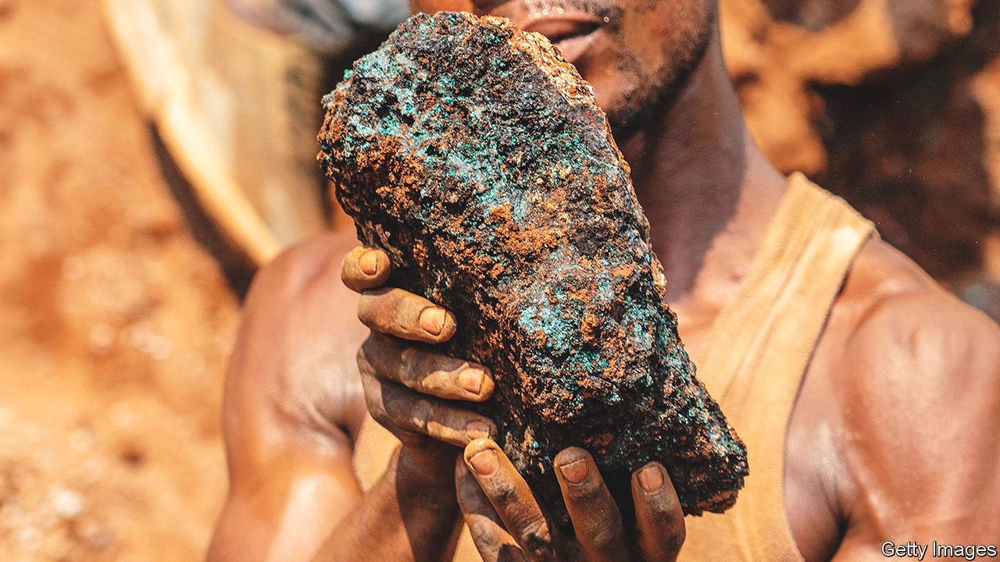
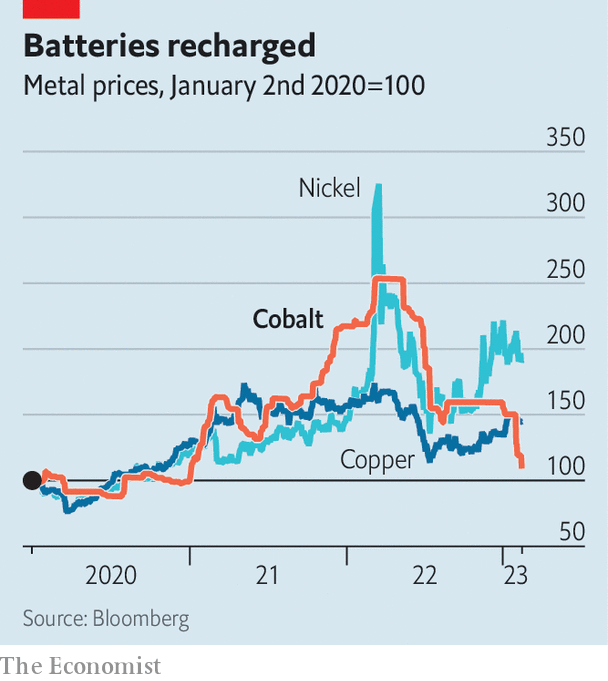

###### Cornucobalt

# Cobalt, a crucial battery material, is suddenly superabundant 

##### How an obstacle to the energy transition disappeared 

 

> Feb 16th 2023 

Just a year ago a global crunch in one metal looked likely to single-handedly derail the energy transition. Not only was cobalt, a crucial battery material, being dug up far too slowly to meet soaring demand, but the lion’s share of known reserves sat in Congo, a country rife with instability, corruption and child labour. Fast forward to today and the price of the blue metal, which had more than doubled between summer 2021 and spring 2022, to $82,000 a tonne, has collapsed to $35,000, not far from historic lows. 

The story is partly one of reduced demand. Most cobalt goes into the battery packs which power smartphones, tablets and laptops. Appetite for these, already strong in the 2010s, exploded during the covid-19 pandemic. It has since waned as people spend less time staring at their screens: as demand for consumer electronics fell, so did that for cobalt. Even a boom in electric vehicles has not been sufficient to counteract this, since manufacturers have done their best to reduce use of the formerly super-expensive metal. 

 


At the same time supply is rising, and fast. Susan Zou of Rystad Energy, a consultancy, forecasts that Congolese production will jump by 38% this year, to 180,000 tonnes. Most striking is a surge in Indonesian exports, which are projected to hit 18,000 tonnes this year, up from virtually none a few years ago. The world could find itself swimming in cobalt.

In other markets low prices would force producers to shut mines. Not for cobalt. The price has already fallen below many miners’ break-even point. Yet Glencore, the world’s biggest, said on February 15th that it may keep output nearly unchanged this year, having cranked it up in 2022; China Moly, a rival, is about to open a new facility that may yield 30,000 tonnes a year (equivalent to 16% of the world’s output in 2022). Big firms can tolerate low prices because cobalt is a by-product of the extraction of copper and nickel, both of which remain pricey. Electric-vehicle makers the world over are courting Indonesia for nickel, kick-starting projects that will also yield cobalt. China Moly’s monster mine in Congo will produce three times as much copper as it will the blue metal.

Prices may still rise a bit this year, as speculators seek to snap up bargains. Beyond 2025, however, another dampener looms. By this time, the first wave of electric-vehicle batteries, which typically last up to eight years, will begin to be recycled, reducing the need for new supply. No matter how fast the energy transition speeds up, the blue gold is unlikely to act as a brake.■


