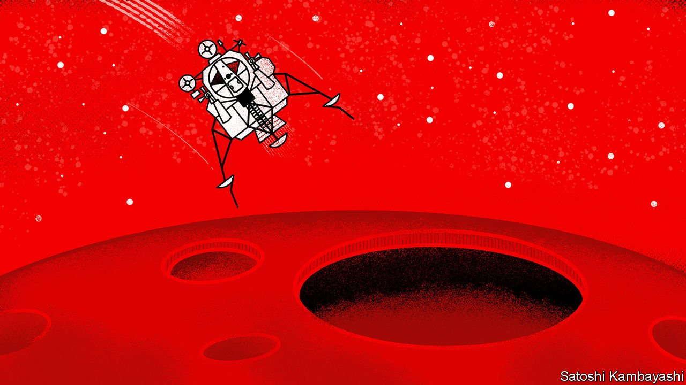

###### Buttonwood

# Investors expect the economy to avoid recession 

##### Unfortunately, they have a terrible record of predicting soft landings 

 

> Feb 15th 2023 

With its trajectories, headwinds and tailwinds, the language of central banking abounds with aviation metaphors. Little surprise, then, that the policymaker’s most heroic feat is named after Apollo 11’s success in the space race. For wonks, a “soft landing” occurs when heat is taken out of the economy without causing it to veer into recession. Yet the phrase’s illustrious origins hide an ignominious reality. The first time such a landing was predicted, in 1973, by George Shultz, America’s treasury secretary, things did not go to plan. A recession began almost immediately; inflation blazed for the rest of the decade. Prices finally cooled under Paul Volcker, a Federal Reserve chairman, but only after interest-rate rises tipped America into successive recessions and the worst joblessness since the second world war.

Though Mr Shultz’s forecast was catastrophically wrong, it was not unusual. As Michael Kantrowitz of Piper Sandler, an investment firm, has pointed out, investors often think a soft landing lies ahead as a Fed tightening cycle comes to an end. That is exactly what is happening this time around. Since October, the s&amp;p 500 share-price index of large American firms has risen by 16%. An index of investment-grade corporate-bond prices compiled by Bloomberg, a data provider, has rallied by 9%. Worries about recession, overwhelming a few months ago, seem almost forgotten. 

If history is any guide, such fears are likely to return. It is not that soft landings are impossible. Since the 1970s, Fed policymakers have managed them precisely twice. In 1984 and 1995, America’s stockmarket began to rally just as interest rates reached their peak. Investors who bought early were rewarded with sustained, multi-year bull markets.

But there have been six other tightening cycles in the past 50 years, and all were followed by recession (even if the sixth, in 2019, was complicated by the covid-19 pandemic). One lesson is that soft landings are rare and hard ones more likely. The more troubling lesson is that, in the early days, the two scenarios are indistinguishable based on how stockmarkets behave. Before each of the hard landings, share prices began to rally, in some cases for up to a year. Then things started to go wrong. The economy sputtered, optimism fizzled and stocks plunged. 

Mr Kantrowitz’s explanation for the similarity between the very different scenarios is that, at least in the early days, hard landings look a lot like soft ones. Both feature interest-rate rises, followed by a pivot as the market prices in future cuts, and shares begin to rally. For the soft landings, this is the end of the story. But for the hard ones, the worst is still ahead: employment weakens, along with housing, and investors take a battering. 

Therefore buoyant share prices today offer little information about whether the Fed’s present tightening cycle will end happily—a matter on which opinion remains sharply divided. More cheerful types, chief among them Joe Biden, America’s president, point to an impressively resilient economy and a labour market that is booming despite the swiftest series of interest-rate rises since Volcker’s era. Others fear, however, that the impact of rate increases is still to come. Edward Cole of Man Group, an asset manager, worries that tightness in the labour market and an excess of household savings—both leftovers from the pandemic—are delaying the pain of monetary tightening that will eventually be felt. The average response of 71 professional economists surveyed in January by the , a newspaper, puts the probability of recession in the next 12 months at 61%.

If the stockmarket is an inadequate guide, other indicators have more predictive power. Unfortunately, they present a less rosy picture. In previous Fed tightening cycles, soft landings were typically preceded by relatively low inflation, and accompanied by looser bank-lending standards. Today’s circumstances are the exact opposite.

The surest recession indicator of all is the gap between ten-year and three-month Treasury yields. Typically this is positive, with long-term yields higher than short-term ones (as investors demand a higher return to lock up their money for longer). The gap has turned negative (meaning investors expect imminent and sustained rate cuts) only nine times in the past half-century. Eight were followed by recessions. The ninth negative spell started last October and continues today. As Fed officials bring the economy in to land, the most reliable part of the dashboard is flashing red.■


