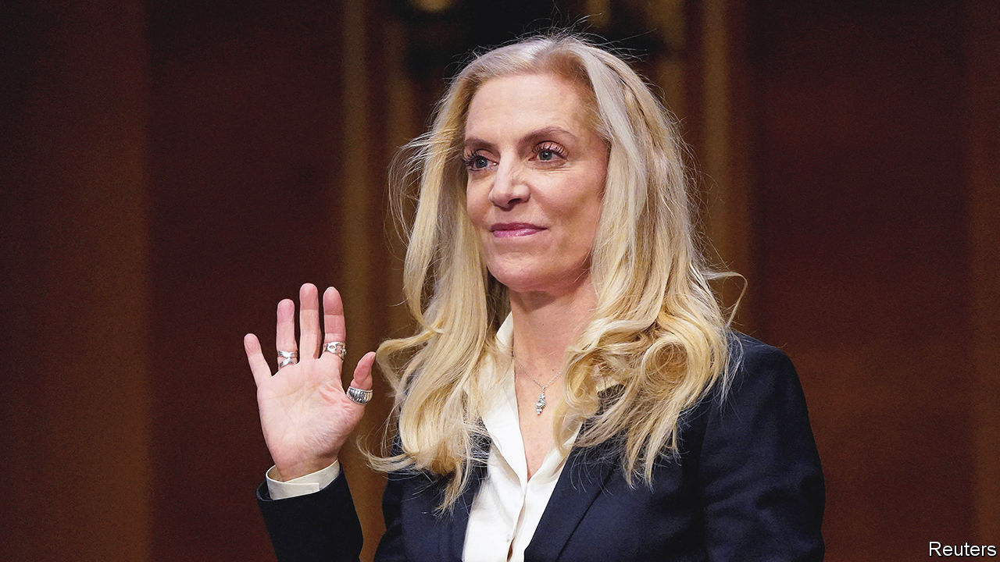

###### Brain gain

# Lael Brainard will take control of America’s economic nerve centre 

##### It is a formidable job 

 

> Feb 15th 2023 

A dimly lit room, with a small meeting table and a desk, may not look like a focal point for America’s economy. But the director of the National Economic Council’s (nec’s) office, in the White House west wing, is a crucial place. Its occupant for the past two years, Brian Deese, has crafted the administration’s response to the covid-19 slowdown, inflation and China. In the coming days Lael Brainard, a board member at the Federal Reserve since 2014, will take over the poky but powerful office.

Amid Washington’s formidable political machinery, at first glance the institution of the nec also seems puny. It is young—founded a mere three decades ago—and has only 30 staff. But it is the clearing-house for White House economic debates, helping the president set strategy. It then co-ordinates departments in the implementation of policy. With power concentrated in Joe Biden’s White House, the nec has gained clout compared with cabinet agencies, notably the Treasury.

Mr Deese steps down at a natural time for a reshuffle, following midterm elections. He had a productive run. Congress passed four big pieces of economic legislation, adding up to trillions of dollars of spending: a covid-recovery package, plus hefty investment in infrastructure, semiconductors and clean technologies.

Legislative success stems from officials working together. But Mr Deese was consistently at the centre of things. “He had a commanding understanding of every issue,” reports Jason Furman, deputy director of the council under Barack Obama. Mr Deese worked with Republicans to secure the passage of the infrastructure bill and with Joe Manchin, an obstreperous Democratic senator, to enact the climate law. 

Yet this legislative success did not always produce real-world success. The pandemic package contributed to inflationary pressure, which America is still struggling to rein in; the administration’s industrial policy has annoyed allies, who see it as protectionism. The task falls to Ms Brainard, an experienced policymaker, to see through the wide-ranging plans and to remedy missteps. “She has the skills to roll up her sleeves and get that done,” says Wendy Edelberg of the Brookings Institution, a think-tank. There is scant prospect of anything more ambitious in the next two years, since Congress is divided. 

Her experience may help President Biden mollify allies concerned by his subsidies. As America’s top financial diplomat under President Obama, Ms Brainard worked well with other countries, a quality that will again be in demand. At the same time, she will also have a role in ensuring that America dodges calamity and raises the debt ceiling. With a background as both a central banker and a Treasury official, Ms Brainard is well placed to navigate the budgetary shoals. She will still need all the heft the nec can offer to get her way. ■


