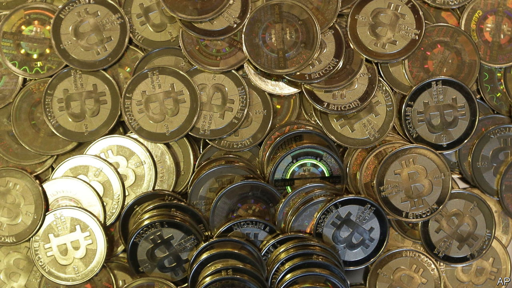

###### The afterFTX

# Scrutiny of major crypto institutions is intensifying 

##### The industry is calling this its “Dodd-Frank moment” 

 

> Feb 16th 2023 

The crypto crowd is hardly known for understating its own importance. Its members dubbed the implosion of ftx, the crypto exchange which collapsed spectacularly in November, the industry’s “Lehman Brothers moment”, a nod to the enormous ramifications of the fall of the investment bank. Now they say the industry is going through its “Dodd-Frank moment”, a reference to the sprawling financial regulations that were put in place after Lehman’s collapse.

In America, if crypto firms are regulated at all, they fall under the purview of various agencies—from the Securities and Exchange Commission (sec), a markets regulator, and the cftc, which oversees commodities, to numerous state bodies. All were ramping up enforcement actions against crypto businesses in 2022, after the go-go years of 2020 and 2021 pushed crypto products into the mainstream. But moves to curtail various crypto activities have now begun to reach a frenetic pace.

On February 9th the sec reached a settlement with Kraken, a crypto exchange. The company agreed to pay a $30m fine and stop offering its staking-as-a-service business, in which customers deposited crypto tokens and the exchange “staked” them on their behalf, in return for rewards (in a manner not dissimilar to a bank offering interest). On February 13th the New York State Department of Financial Services (nysfds), a state financial regulator, ordered Paxos, a firm which issues stablecoins (tokens backed by dollars), to stop issuing a stablecoin it had created for Binance, the biggest crypto exchange.

These actions add to a growing list of enforcements against, or investigations into, crypto firms. In July the sec launched a probe into Coinbase, a publicly listed exchange, investigating whether it listed crypto tokens that were, in fact, securities—a notion the exchange denied. And in August America’s Treasury placed sanctions on Tornado Cash, software which runs on the Ethereum blockchain and mixes individuals’ crypto deposits into a pool before dispersing them again, making it difficult to trace ownership.

To many in the crypto industry these actions are an affront, nothing less than an attempt to choke off a source of financial innovation. But the sum of the authorities’ actions is revealing. First, their priorities have become much clearer. Second, the agencies have worked out methods which they can use to enforce laws or regulations in highly unfamiliar terrain.

One priority is snuffing out instruments that may be used for financial crime. Tornado Cash was allegedly employed by North Korean hackers to launder $450m of stolen crypto. nysfds’s action against Paxos, a firm based in America, also appears to have been motivated by concerns about potential wrongdoing. Binance, which claims it has no headquarters, has been under investigation since 2018 for possibly failing to comply with American money-laundering and sanction rules. Paxos was not required to stop issuing its own stablecoin, the Pax Dollar—just the one it created for Binance. In response, Changpeng Zhao, the exchange’s boss, tweeted that the stablecoin is “wholly owned and managed by Paxos”. Paxos said it “categorically disagrees” with the basis for the sec’s investigation.

Thus the authorities have responded to potential wrongdoing by shutting down interactions with American firms. As Tornado Cash is a piece of software running on the Ethereum blockchain it is not possible to stop it functioning. So the Treasury has identified wallet addresses associated with the software, with which it has barred American institutions, like the exchanges, from operating. Similarly, it is more difficult to restrict the activities of Binance, which is not an American company, than it is to curtail the activities of Paxos, which is registered with authorities in New York.

Regulators’ second priority is consumer protection. This is clear in the actions taken against Kraken. “Whether it’s through staking-as-a-service, lending, or other means, crypto intermediaries, when offering investment contracts in exchange for investors’ tokens, need to provide the proper disclosures and safeguards required by our securities laws,” said Gary Gensler, chair of the sec. He has begun to label previously unregulated offerings as securities, which are regulated by default.

Mark Lurie of Shipyard Software, which works on decentralised exchanges, argues that the boundaries authorities are drawing are “somewhat predictable”. Regulators are applying existing rules and their targets are American institutions. This lack of imagination could hinder innovation, worries Tuongvy Le, formerly an sec enforcement lawyer, now at the crypto arm of Bain Capital, an investment firm. “There really are novel structures in crypto,” she says. Unlike Europe and Singapore, which have come up with new rules, America has so far relied on existing approaches. Still, the introduction of regulation is sometimes welcomed. On February 15th the sec decided to tighten the standards for institutions holding crypto assets. The price of bitcoin surged on the news. ■


